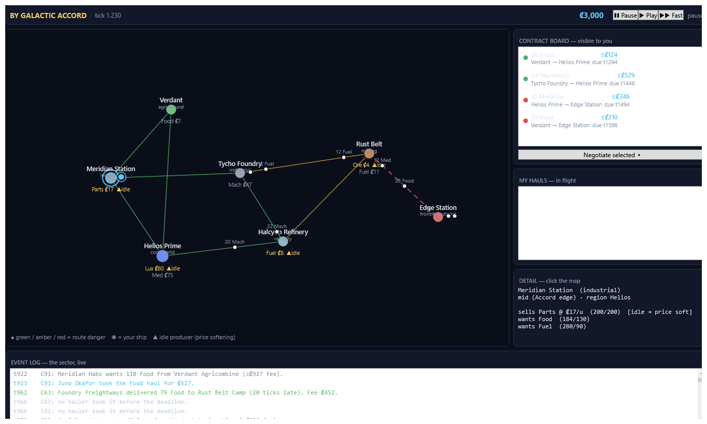

# By Galactic Accord — Vertical Slice (Slice 0)

A contract-based space-trading simulation in a living, player-agnostic universe — the **Slice 0
"core loop"** from [`by_galactic_accord_gdd_v0.2.md`](../by_galactic_accord_gdd_v0.2.md).

> *You take contracts to earn credits. Credits let you upgrade your ship and take better contracts.
> The universe shifts around you based on forces you can influence but not control.*

The world runs whether or not you do. Prices move, companies thrive and bleed out, the frontier gets
supplied or starves — all driven by AI actors pursuing goals through the same contract system you use.

---

## What this is (and isn't)

This implements **Slice 0** as defined by the GDD's own roadmap (§8) — *"the smallest version of the
game worth playing for an hour."* It is a complete, runnable, deterministic simulation with an
ASCII-forward console UI and a headless soak harness.

**In scope (per §6.1):** haul contracts + the clause schema · negotiation with soft tells · 7 goods
with perishable quality decay · 5 ship types · a 7-location sector across a green Accord core and an
amber/red frontier · producers & consumers with a faucet/sink economy · AI shipping companies and
independent pilots · the greedy-utility actor decision algorithm · danger-rated routes with
multi-hop path-finding · **Transit Incidents** (danger ratings with teeth, §6.3) · the discrete-event
engine with a seeded, replayable PRNG · contextual reputation · an information/visibility model ·
an inflation monitor · invariant checks + a soak harness.

**Deferred (per §6.2, §8):** ship variance & degradation · full piracy actors · FTL/exotics · alien
factions · factory chains · bonding agents · the data-broker information market · standing contracts ·
insurance · multiplayer. The architecture is built so these slot in as *elaborations* (e.g. the
Transit-Incident hook is exactly where pirate interdiction lands in Slice 3).

### One deliberate deviation from the GDD

The GDD names **Marten + PostgreSQL** for event storage (§5.1). To keep the slice runnable with zero
infrastructure, this build keeps the *architecture* faithful — an append-only event journal, aggregates
projected from events, a seeded PRNG whose draws are re-derivable, and deterministic replay (§5.5) —
but backs it with an **in-memory event store** instead of Marten/Postgres. Swapping in Marten is a
persistence concern that does not touch the simulation logic. Everything else follows the document.

---

## Running it

Requires the **.NET 10 SDK** (the GUI also needs the Windows Desktop runtime, included with the SDK on Windows).

### The graphical client (recommended)

```bash
dotnet run --project src/ByGalacticAccord.Wpf
dotnet run --project src/ByGalacticAccord.Wpf -- --seed 42
```



A live 2D view of the whole sector on top of the same simulation. Ships move along their routes
carrying labelled cargo, producer **prices** and **▲idle** tells update on the map, the contract
board and your in-flight hauls sit on the right, and a colour-coded event log streams the sector's
life along the bottom.

- **Time control** — `❚❚ Pause`, `▶ Play` (1×), `▶▶ Fast`. The sim **hard-pauses** on an alert such as a transit incident hitting your ship (§3.4).
- **Click** a location to inspect its prices, stock, and demands; click a ship to see what it's hauling and where.
- **Negotiate** — select a contract on the board and hit *Negotiate* to counter / accept / walk against soft tells (§4.1.6); a deal locks escrow and your ship departs.
- Routes are coloured by danger (green / amber / red-dashed); your ship is the ringed marker.
- `--shot out.png [--ticks N]` renders a single still headlessly (no window) — handy for screenshots.

### The console client & headless soak

```bash
# Interactive text client (board / map / ship sheet / ledger / negotiation / log)
dotnet run --project src/ByGalacticAccord.Cli -- play

# Headless soak: simulate N ticks, print economy telemetry, assert all invariants (§5.6)
dotnet run --project src/ByGalacticAccord.Cli -- soak 1000000 --seed 42

# Tests: invariants, deterministic replay, economy health, negotiation, incidents
dotnet test
```

Console commands: `board`, `take <#>` (negotiate), `run [ticks]`, `map`, `ship`, `ledger`, `log`, `retire`.

The skill is reading the economy: an **idle producer** (full warehouse, the ▲ tell) asks less,
widening the haul spread — spot that before the AI haulers do and the lucrative run is yours. Push
into the amber/red frontier for fatter fees and real risk, or grind safe green core hauls.

---

## Architecture

```
src/ByGalacticAccord.Engine/      the whole simulation (no UI, no I/O)
  Domain/        value objects & aggregates: Credits, Goods, Ship, Location, Route,
                 Contract, ContractClause, Reputation, Personality, typed Ids
  Random/        DeterministicRandom — a stable, seeded, journaled PRNG (§5.5)
  Events/        ISimEvent + the discrete-event types (ShipDeparted, TransitIncident*,
                 ShipArrived, ActorHeartbeat, InflationCheck, ...) and the min-heap queue
  Actors/        ActorState, the greedy-utility DecisionEngine (§4.5.3), Negotiation (§4.1.6)
  Economy/       PriceModel, Visibility (§4.6), InflationMonitor (§5.8)
  Simulation/    SimulationContext (the world), Settlement, Invariants (§5.6),
                 IncidentResolver (§6.3), WorldGenerator, EventJournal
src/ByGalacticAccord.Cli/         console front-end: interactive Game + headless Soak harness
src/ByGalacticAccord.Wpf/         2D graphical client (WPF): animated map, board, hauls, event log
tests/ByGalacticAccord.Tests/     xUnit: invariants, determinism, economy, negotiation, incidents
```

### How the loop runs (§4.7.3, §5.4)

The world is a **priority queue of future events** ordered by game tick. "Running" means dequeuing
events as the clock advances; "paused" means stop dequeuing. Nothing happens between events — a ship
in transit has no position, only a scheduled arrival, and position is interpolated only when something
forces it. When an event raises a player decision, the loop **hard-pauses** and hands control to the UI.

A contract's life: a consumer posts a demand → a hauler reads its board, scores candidates by
`utility = expected_credit_delta × risk × personality − opportunity_cost`, negotiates, and commits a
ship → `ShipDeparted` (goods picked up, escrow settled) → `TransitIncidentCheck` (danger-weighted) →
`ShipArrived` → `ContractFulfilled`/`Breached` (escrow released, reputation updated). Everything is a
contract; clauses (late penalty, quality warranty) are evaluated at settlement.

### Determinism & invariants

Every stochastic draw comes from a seeded, stable PRNG and every iteration that consumes randomness is
over a stably-ordered collection, so **a seed fully reproduces a run** (`DeterminismTests`). The soak
harness and test suite continuously assert the §5.6 invariants:

- **Credit conservation** — `total == initial + Σfaucet − Σsink`, exact to the cent.
- **Escrow reconciliation** — `Σheld == Σlocked − Σreleased − Σforfeited`, never negative.
- **Cargo conservation** — goods picked up == delivered + lost + in transit.
- **No orphan contracts** — every active contract is carried by an in-transit ship that will arrive.

### Tuning

Balance lives in [`SimulationConfig`](src/ByGalacticAccord.Engine/Simulation/SimulationConfig.cs) and
the canonical good/ship/world tables — *tuning, not design* (§3.6, §5.6), meant to be moved while
reading soak telemetry. A representative `soak 1000000` run keeps total credit supply within a few
percent of baseline, fulfils tens of thousands of hauls, supplies the frontier, and holds every
invariant — the economy neither collapses nor runs away.

---

## Mapping to the GDD

Nearly every Slice-0 system cites its section in code comments. Highlights: the Galactic Accord as the
enforcement-context spine (§2.3, §4.1.3) lives in `AccordReach`; the contract data model and clause
schema (§4.1.1, §4.1.5) in `Contract`/`ContractClause`; the negotiation reservation-price model
(§4.1.6) in `Negotiation`; the actor decision algorithm (§4.5.3) in `DecisionEngine`; the
information/visibility model (§4.6) in `Visibility`; the time model and hard-pause (§3.4) in the run
loop; the Transit-Incident resolution of the danger-rating contradiction (§6.3) in `IncidentResolver`;
and the legibility-first UI (§5.7) in the console screens.
