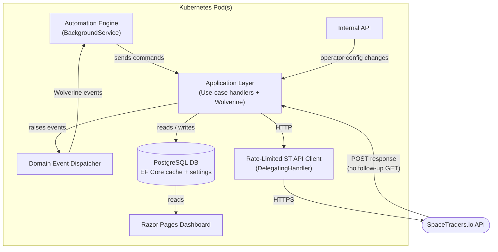

# SpaceTraders Autonomous Agent – Implementation Plan Overview

> This document describes the **target architecture**.
> Current implementation is a foundation subset (typed API client, persistence, bootstrap/sync services, basic Razor Pages dashboard).

## Solution Structure (current projects)

```text
SpaceTraders.sln
├── SpaceTraders.Domain
├── SpaceTraders.Application
├── SpaceTraders.Infrastructure.SpaceTradersAPI
├── SpaceTraders.Infrastructure.Persistence
├── SpaceTraders.API
└── SpaceTraders.App
```

## Plan Index

| # | File | Topic |
|---|------|-------|
| 01 | [01-domain.md](01-domain.md) | Domain model – entities, value objects, domain events |
| 02 | [02-rate-limiter.md](02-rate-limiter.md) | Rate-limiter & resilient HTTP client |
| 03 | [03-persistence.md](03-persistence.md) | Local cache & settings (EF Core + PostgreSQL) |
| 04 | [04-application-events.md](04-application-events.md) | Wolverine event bus – commands, events, handlers |
| 05 | [05-automation-engine.md](05-automation-engine.md) | Autonomous agent – ship assignment & fleet expansion logic |
| 06 | [06-api.md](06-api.md) | Internal REST API for configuration & status |
| 07 | [07-ui.md](07-ui.md) | Razor Pages monitoring dashboard |
| 08 | [08-kubernetes.md](08-kubernetes.md) | Kubernetes deployment, health checks, ConfigMaps |
| 09 | [09-milestones.md](09-milestones.md) | Phased delivery milestones |
| 10 | [10-error-handling.md](10-error-handling.md) | Error handling, resilience & pod-restart recovery |
| 11 | [11-testing.md](11-testing.md) | Testing strategy – unit, integration, API |
| 12 | [12-local-dev.md](12-local-dev.md) | Local development setup & troubleshooting |
| 13 | [13-performance.md](13-performance.md) | Performance – indexing, query patterns, fleet scaling |
| 14 | [14-security.md](14-security.md) | Security – secrets, RBAC, network policies, token safety |
| 15 | [15-adr.md](15-adr.md) | Architecture Decision Records |
| 16 | [16-sequence-flows.md](16-sequence-flows.md) | Sequence diagrams – agent bootstrap & trade cycle |

## High-Level Architecture



## Key Design Decisions (target)

1. **Wolverine** as the internal event/command bus.
2. **PostgreSQL + EF Core** for the local cache.
3. **API responses as source of truth** for mutating calls.
4. **Dead-reckoning** for navigation.
5. Polling focused on Market/Shipyard data where needed.
6. Agent bootstrap flow for first-run token registration.
7. Rate limiter as `DelegatingHandler`.
8. Automation engine hosted services.
9. Runtime settings in DB and exposed via internal API.
10. No secrets in code.

---

## See Also

- [GLOSSARY.md](../GLOSSARY.md)
- [15-adr.md](15-adr.md)
- [16-sequence-flows.md](16-sequence-flows.md)
- [09-milestones.md](09-milestones.md)
