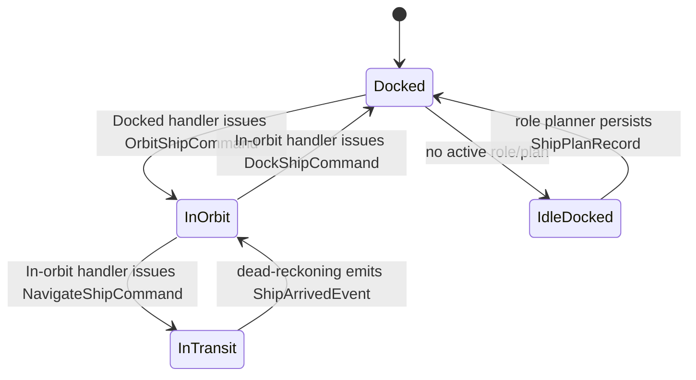

# 05 – Automation Engine

> Target automation update: use [Ship Event Command Plan](ship-event-command-plan.md) for new ship automation work.
> The older assignment/state-machine sections below describe historical implementation context and should be migrated to state-gated event handlers with persisted ship plans.

## Goals
- Run continuously without human intervention.
- Orchestrate the full game loop: sync state → decide → act → repeat.
- Tolerate pod restarts by persisting all state and resuming in-flight assignments.

---

## 5.1 Hosted Services Overview

| Service | Role |
|---------|------|
| `GameLoopService` | Master orchestrator – periodic sync + event publication |
| `ShipStateEventService` | Publishes current-state ship events and recovery events for active ship plans |
| `ScoutService` | Periodically scouts unknown or stale waypoints/markets |
| `ContractWatchService` | Monitors contract deadlines and fires warning events |
| `ApiDispatcher` | Drains the priority request queue (see §02) |

All are `BackgroundService` implementations registered in DI.

---

## 5.2 GameLoopService

```
Every 5 s (tight loop, cheap because no API calls):
  1. For each CachedShip with IsInTransit == false AND ArrivesAt was set:
     → call ApplyArrivalIfDue(), save to DB, publish ShipArrivedEvent
  2. Check Automation.Enabled setting → if false, skip steps below

Every 30 s:
  3. For each ship with Assignment == null or Assignment stale → publish ShipAssignmentCompletedEvent

Startup only (once):
  4. SyncAllShipsCommand, SyncContractsCommand, SyncAgentCommand
```

No periodic API polling for agent credits, ship state, or contracts – those are kept current via POST response application.

---

## 5.3 Ship Event Automation

Each ship advances through state-gated events instead of a state machine:



`ShipPlanRecord` is stored in PostgreSQL so role intent survives restart. It stores the chosen role, immediate objective, waypoints, goods, units, and role-specific JSON details. It does not store a procedural `StepIndex`.

### Assignment Execution Steps

**Trade Assignment:**
1. Navigate to `BuyWaypoint`
2. Dock
3. Buy N units of TradeSymbol (up to cargo capacity & trade volume)
4. Navigate to `SellWaypoint`
5. Dock
6. Sell all units
7. Publish `ShipCargoSoldEvent`

**Mine Assignment:**
1. Navigate to asteroid waypoint
2. Enter orbit
3. Loop: `ExtractResourcesCommand` until cargo ≥ 90 % full
4. Navigate to best sell market (from TradeOpportunity)
5. Sell all
6. Publish `ShipCargoSoldEvent`

**Contract Fulfillment Assignment:**
1. Navigate to purchase waypoint for required good
2. Buy required units
3. Navigate to contract delivery waypoint
4. Deliver
5. If all goods delivered → FulfillContract
6. Publish `ContractFulfilledEvent`

**Scout Assignment:**
1. Navigate to each unvisited/stale waypoint in current system
2. On arrival → `RefreshMarketDataCommand` or `RefreshShipyardDataCommand`
3. Publish `MarketDataRefreshedEvent` / `ShipyardDataRefreshedEvent`
4. After all waypoints visited → Publish `ShipAssignmentCompletedEvent`

---

## 5.4 ScoutService

```
Every ScoutRefreshIntervalMinutes:
  1. Find waypoints in current systems with no Market record OR LastObservedAt > threshold
  2. For each: if no ship currently scouting → assign nearest idle ship (Scout assignment)
```

---

## 5.5 ContractWatchService

```
Every 5 min:
  1. Load all active, accepted, unfulfilled contracts
  2. For each:
     - If Deadline - Now < 24 h AND no warning sent → publish ContractDeadlineApproachingEvent(24h)
     - If Deadline - Now < 6 h  AND no 6h warning   → publish ContractDeadlineApproachingEvent(6h)
     - If Deadline - Now < 0    → abandon contract, log, mark failed
```

---

```
Every 5 min:
  1. Load all active, accepted, unfulfilled contracts from PostgreSQL
  2. For each contract:
     - If Deadline - Now < 24 h AND no 24 h warning sent → publish ContractDeadlineApproachingEvent(warning: "24h")
     - If Deadline - Now < 6 h  AND no 6 h warning sent  → publish ContractDeadlineApproachingEvent(warning: "6h")
     - If Deadline - Now < 0                             → mark contract failed in DB, log, publish ContractExpiredEvent
```

Wolverine handlers that react to these events:
- `ContractDeadlineApproachingHandler` – raises the priority of any ship on a contract fulfillment assignment to `Critical`; if no ship is assigned, dispatches `AssignShipCommand` with `Priority.Critical`.
- `ContractExpiredHandler` – frees any ship currently assigned to the contract and triggers `AssignShipCommand` to reassign it to the best available trade route.

Warning state (to avoid duplicate notifications) is tracked by a `HashSet<(string contractId, string warningKey)>` in memory, reset on service restart (acceptable – at worst one duplicate warning per restart).

---

## 5.6 Decision Engine (TradeAnalyser)

Pure logic service with no I/O, called by handlers to score assignments:

```csharp
public sealed class TradeAnalyser : ITradeAnalyser
{
    // Score a trade route: profitPerJump * reachabilityFactor * supplyFactor
    public IReadOnlyList<ScoredTradeOpportunity> ScoreRoutes(
        IReadOnlyList<TradeOpportunity> routes,
        Ship ship,
        AgentSettings settings);

    // Given a ship's position, find cheapest refuel waypoint
    public WaypointSymbol? FindRefuelWaypoint(
        IReadOnlyList<CachedWaypoint> waypoints,
        WaypointSymbol currentPosition);

    // Decide whether to accept a contract
    public bool ShouldAcceptContract(
        Contract contract,
        Agent agent,
        AgentSettings settings);
}
```

---

## 5.7 Startup & Recovery

On pod start:
```
1. Run EF Core migrations (PostgreSQL)
2. AgentBootstrapService: load or register agent token (see §03 §3.4)
3. SyncAllShipsCommand → GET /my/ships (only startup GET for ships)
4. SyncContractsCommand → GET /my/contracts
5. SyncAgentCommand → GET /my/agent
6. Load all active `ShipPlanRecord` rows from DB.
7. For each planned ship:
   - If ship is in transit (`ArrivesAt` in future) → wait; `GameLoopService` will emit arrival when due.
   - If ship arrived while offline → emit `ShipArrivedEvent` / `ShipInOrbitEvent`.
   - If ship is docked → emit the matching docked role event or `ShipIdleDockedEvent`.
   - If ship is in orbit → emit the matching in-orbit role event or `ShipNeedsDockingEvent`.
8. Start all hosted services
```

After startup, no periodic GETs for ships/agent/contracts. State is maintained exclusively via POST response application and dead-reckoning.

---

## 5.8 Graceful Shutdown

When `IHostApplicationLifetime.ApplicationStopping` fires (e.g. SIGTERM from Kubernetes):

1. `GameLoopService` stops the dead-reckoning loop and does **not** start any new assignment cycles.
2. In-flight Wolverine handlers finish their current **atomic step** (e.g. a single API call), then exit.
3. Updated ship cache and `ShipPlanRecord` data is saved before exiting so recovery resumes from current state and intent.
4. `ApiDispatcher` stops accepting new requests; drains any already-dequeued request.
5. Wolverine flushes the durable outbox to PostgreSQL.
6. Total expected shutdown time: < 30 s (extend `HostOptions.ShutdownTimeout` if needed).

See also `10-error-handling.md §10.8`.

---

## 5.9 Folder Structure

```
SpaceTraders.Application/
└── Automation/
    ├── GameLoopService.cs
    ├── ShipStateEventService.cs
    ├── ScoutService.cs
    ├── ContractWatchService.cs
    └── ShipPlanning/
        ├── ShipRolePlanner.cs
        ├── TradeRouteService.cs
        ├── MinerPlanService.cs
        └── ScoutPlanService.cs
```
