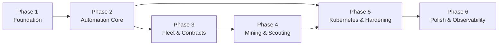

# 09 – Phased Delivery Milestones

> This document tracks the **target roadmap**. Some foundational items are already implemented in the current solution.

## Current Status

> **Active phase: Phase 6 – Polish & Observability**

| Phase | Status |
|-------|--------|
| Phase 1 – Foundation | ✅ Complete |
| Phase 2 – Automation Core | ✅ Complete |
| Phase 3 – Fleet Expansion & Contracts | ✅ Complete |
| Phase 4 – Mining & Scouting | ✅ Complete |
| Phase 5 – Kubernetes & Hardening | ✅ Complete |
| Phase 6 – Polish & Observability | ⬜ Not started |
---

## Philosophy
Build vertically – each phase delivers a running, useful application, not just layers.

---

## Phase 1 – Foundation (~2 weeks)

**Goal:** The app boots, connects to SpaceTraders, stores data in PostgreSQL, and shows the dashboard.

**Related docs:** [01-domain.md](01-domain.md) · [02-rate-limiter.md](02-rate-limiter.md) · [03-persistence.md](03-persistence.md) · [12-local-dev.md](12-local-dev.md) · [11-testing.md](11-testing.md)

### Tasks
- [x] Domain entities & value objects (`01-domain.md`)
- [x] Rate-limiting `DelegatingHandler` chain with dual token bucket (`02-rate-limiter.md`)
- [x] `SpaceTradersApiClient` expanded: `SellCargo`, `BuyCargo`, `Navigate`, `Dock`, `Orbit`, `Extract`, `PurchaseShip`, `AcceptContract`, `DeliverContract`, `FulfillContract`, `GetMarket`, `GetShipyard`, `Refuel`
- [x] **All POST/PATCH handlers apply response data directly to cache** – no follow-up GETs
- [x] EF Core + PostgreSQL (Npgsql) setup
- [x] `AgentBootstrapService` – register agent from config if no token in DB
- [x] `IAgentTokenProvider` singleton; `SpaceTradersApiClient` uses it for bearer auth
- [x] `dotnet user-secrets` configured for local dev (AccountToken, connection string) – see `12-local-dev.md`
- [x] Wolverine registered; `SyncAllShipsCommand`, `SyncContractsCommand`, `SyncAgentCommand` handlers
- [x] Wolverine retry & dead-letter policy configured – see `10-error-handling.md §10.2`
- [x] `GameLoopService` skeleton – dead-reckoning tick + startup sync only
- [x] Razor Pages dashboard: Overview + Ships list (read-only)
- [ ] Docker image builds locally
- [x] Test projects scaffolded (`SpaceTraders.Domain.Tests`, `SpaceTraders.Application.Tests`) – see `11-testing.md`

**Definition of Done:**
- All tasks above checked off.
- `dotnet build` succeeds with zero warnings treated as errors.
- All unit tests pass (`dotnet test --filter "Category!=Integration"`).

**Acceptance criteria:**
- App starts, bootstraps agent token, syncs ships/contracts/agent, displays them in dashboard.
- Selling cargo updates credits without any additional GET.

---

## Phase 2 – Automation Core (~2 weeks)

**Goal:** Ships trade autonomously; credits grow.

**Related docs:** [04-application-events.md](04-application-events.md) · [05-automation-engine.md](05-automation-engine.md) · [06-api.md](06-api.md) · [07-ui.md](07-ui.md) · [11-testing.md](11-testing.md)

### Tasks
- [x] Full domain events wired through Wolverine
- [x] `ShipWorkerService` with Trade assignment state machine
- [x] `AssignShipAfterSaleHandler` – assigns best trade route on cargo sold
- [x] `TradeAnalyser` – scores routes from MarketData cache
- [x] `TradeOpportunity` table computed and refreshed
- [x] All persistence repositories implemented (`SettingsRepository`, `TradeOpportunityRepository`, etc.)
- [x] Settings store with default seed values
- [x] `/settings` Razor Pages Settings page
- [x] Activity log persisted and shown in `/log` page
- [x] Integration tests for persistence layer (Testcontainers) – see `11-testing.md §11.4`
- [x] Handler unit tests covering no-GET-after-POST rule – see `11-testing.md §11.3`

**Definition of Done:**
- All tasks above checked off.
- All handler unit tests pass, including the no-GET-after-POST assertion.
- Settings page loads and persists changes.

**Acceptance criteria:**
- All ships loop trade routes without manual intervention.
- Activity log shows every decision.
- Settings can be changed from the UI.

---

## Phase 3 – Fleet Expansion & Contracts (~2 weeks)

**Goal:** Agent buys ships when profitable; contracts are accepted and fulfilled.

**Related docs:** [05-automation-engine.md](05-automation-engine.md) · [07-ui.md](07-ui.md)

### Tasks
- [x] `FleetExpansionDecisionHandler` – buy ship when credits allow
- [x] `PurchaseShipCommand` + handler
- [x] `InitialAssignmentHandler` – new ship gets Trade mission (Scout first is planned for Phase 4)
- [x] `ContractWatchService` + deadline events
- [x] Contract fulfillment assignment type
- [x] `AcceptContractCommand`, `DeliverContractCommand`, `FulfillContractCommand` handlers
- [x] Contracts page in dashboard
- [x] Market explorer page

**Definition of Done:**
- All tasks above checked off.
- Fleet expands to at least 2 ships in a test run.
- At least one contract accepted and fulfilled end-to-end.

**Acceptance criteria:**
- Fleet grows automatically up to `MaxShips`.
- Profitable contracts are auto-accepted and fulfilled.

---

## Phase 4 – Mining & Scouting (~1 week)

**Goal:** Mining drones increase raw income; unknown markets are discovered.

**Related docs:** [05-automation-engine.md](05-automation-engine.md) · [07-ui.md](07-ui.md)

### Tasks
- [x] `ExtractResourcesCommand` handler
- [x] Mine assignment state machine
- [x] `ScoutService` – assigns ships to unvisited waypoints
- [x] Shipyard data refresh and caching
- [x] Ship detail page with cargo and fuel progress bars

**Definition of Done:**
- All tasks above checked off.
- Mining drone extracts and sells ore in a full loop without manual intervention.
- Scout completes a full system sweep within 30 minutes of startup.

**Acceptance criteria:**
- Mining drones extract and sell ore autonomously.
- All markets in the starting system are discovered within 30 minutes of startup.

---

## Phase 5 – Kubernetes & Hardening (~1 week)

**Goal:** Runs unattended on Kubernetes; survives pod restarts; zero unnecessary API calls.

**Related docs:** [08-kubernetes.md](08-kubernetes.md) · [10-error-handling.md](10-error-handling.md) · [14-security.md](14-security.md) · [11-testing.md](11-testing.md)

### Tasks
- [x] All Kubernetes manifests (`08-kubernetes.md`) – `k8s/` directory with namespace, configmap, postgres, deployments, services, ingress; `Dockerfile.api` and `Dockerfile.app`
- [x] Startup recovery – resume in-flight assignments from DB; detect arrived ships via `ArrivesAt` – see `10-error-handling.md §10.3`
- [x] `/health/*` endpoints fully implemented (`/health/live`, `/health/ready`, `/health/startup`)
- [x] `ContractPriorityHandler` – emergency reassign on deadline approaching (≤ 6h remaining)
- [x] `ShipFuelLowHandler` – auto-refuel for docked ships below 20 % fuel; `GameLoopService` publishes `ShipFuelLowEvent`
- [x] `ApiUnavailabilityHandler` + auto-resume probe (`ApiAvailabilityProbeCommand`) – see `10-error-handling.md §10.5`
- [x] `IApiAvailabilityState` singleton tracks API reachability; `RetryHandler` marks unavailable/available
- [x] Internal API key auth middleware (`X-Api-Key` header; `SPACETRADERS_INTERNAL_API_KEY` config key)
- [x] Internal REST API endpoints: `/status/*`, `/settings/*`, `/control/*`
- [x] `.gitignore` entries for `k8s/secret.yaml`
- [x] `README.md` complete with deployment instructions + user-secrets setup
- [x] API integration tests via `WebApplicationFactory` (`SpaceTraders.API.Tests`) – health probes, auth, status/settings/control endpoints

**Definition of Done:**
- All tasks above checked off.
- `k8s/` manifests apply cleanly to a local cluster (e.g. Docker Desktop Kubernetes).
- Kill-and-restart pod test passes: all in-transit ships resume within 30 s.
- No secrets present in git history (`git log --all -p | Select-String "AccountToken"` returns nothing).

**Acceptance criteria:**
- Kill the pod, restart it – all ships resume their assignments within 30 seconds (no extra GETs for ships in transit).
- Health probes correctly gate traffic.
- No secrets in git history.

---

## Phase 6 – Polish & Observability (Ongoing)

**Goal:** Operator confidence; easier debugging; production-ready metrics and alerting.

### Tasks
- [ ] Structured logging with `Serilog` → stdout JSON (Kubernetes-friendly)
- [ ] Credit history sparkline (in-memory circular buffer, 360 entries = 1 h at 10 s intervals)
- [ ] Alerts: publish Slack/webhook notification on credit drop > 10 %, contract failure, fleet cap reached
- [ ] API rate-limit dashboard gauge with historical chart
- [ ] Refactor `ShipWorkerService` to use Stateless library for cleaner state machines
- [ ] Integration tests against SpaceTraders sandbox environment
- [ ] Prometheus metrics endpoint (`/metrics`) via `prometheus-net`
- [ ] Grafana dashboard definition (JSON) – credits/hour, trades/hour, API calls/minute, error rate
- [ ] Leader-election for `GameLoopService` via Wolverine's built-in support (required before `replicas > 1`)
- [ ] Horizontal pod autoscaler manifest (`k8s/hpa.yaml`) once leader election is in place
- [ ] Activity log pruning job – delete entries older than configurable retention period (default: 30 days)

**Definition of Done:**
- `dotnet run` in Production config emits valid JSON logs parseable by Grafana Loki.
- `/metrics` endpoint returns valid Prometheus text exposition.
- Grafana dashboard JSON imports without errors.
- Leader election verified: only one pod runs `GameLoopService` when `replicas: 2`.

---

## Dependency Graph

---

## Package Reference Summary

| Package | Used in | Purpose |
|---------|---------|---------|
| `WolverineFx` | Application | Event/command bus (planned) |
| `WolverineFx.Persistence.Postgresql` | Application | Durable outbox on PostgreSQL (planned) |
| `FluentValidation.DependencyInjectionExtensions` | Application | Command validation (planned) |
| `Npgsql.EntityFrameworkCore.PostgreSQL` | Persistence | PostgreSQL EF Core provider |
| `Microsoft.EntityFrameworkCore.Design` | Persistence | Migrations tooling |
| `System.Threading.RateLimiting` | Infrastructure.ST API | Token bucket (planned) |
| `Scalar.AspNetCore` | API | OpenAPI UI (planned) |
| `Microsoft.Extensions.Diagnostics.HealthChecks.EntityFrameworkCore` | API/App | DB health check (planned) |
| `Serilog.AspNetCore` | API/App | Structured logging (Phase 6, planned) |
| `prometheus-net.AspNetCore` | API | Metrics (Phase 6, planned) |
| `Stateless` | Application | Cleaner ship state machines (Phase 6, planned) |
| `Xunit.SkippableFact` | Test projects | Skip integration tests when Docker is unavailable (planned) |
