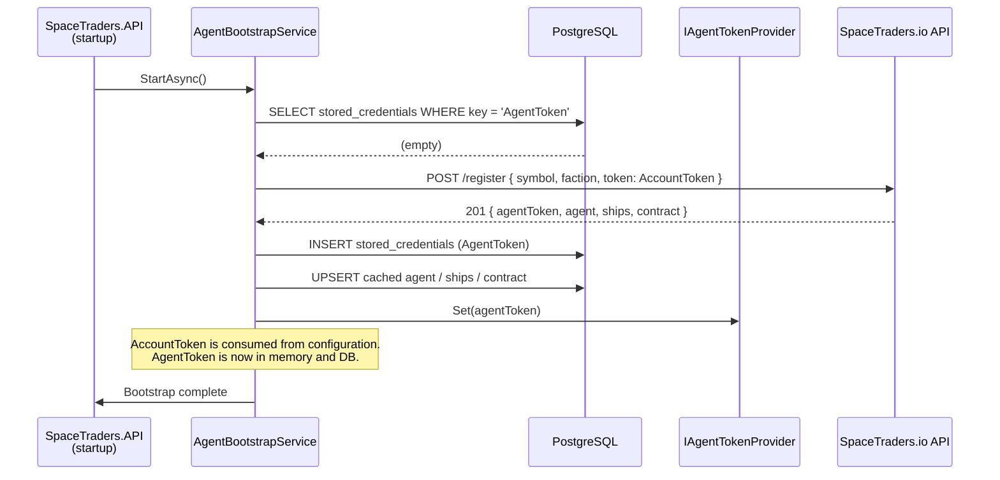
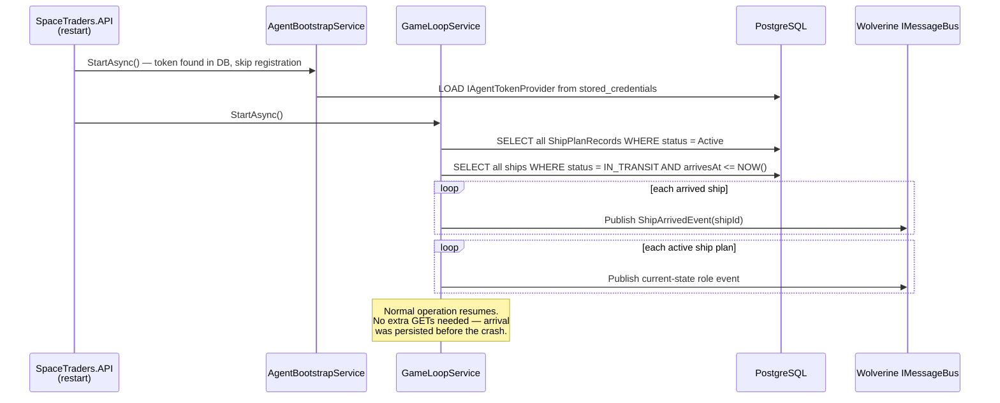

# 16 – Sequence Flows

Key runtime interaction sequences illustrated as Mermaid diagrams.

> Automation update: the trade-cycle sequence below is historical. New automation flows should follow [Ship Event Command Plan](ship-event-command-plan.md).

_See [`../GLOSSARY.md`](../GLOSSARY.md) for term definitions._

---

## 16.1 Agent Bootstrap

The flow that runs on cold start when no agent token is present in the database.



**Notes:**
- If a token _is_ found in the DB, `AgentBootstrapService` skips `POST /register` and calls
  `IAgentTokenProvider.Set(...)` directly from the persisted value.
- The `AccountToken` is never written to the DB — it passes through memory only.
- See [`14-security.md §14.5`](14-security.md) for token exposure prevention details.

---

## 16.2 Trade Cycle

A single ship completing one full buy-navigate-sell loop and receiving its next assignment.

```mermaid
sequenceDiagram
    participant GLS as GameLoopService
    participant SEH as Ship Event Handlers
    participant MB as Wolverine IMessageBus
    participant AL as Application Layer
    participant RC as Rate-Limited ST API Client
    participant DB as PostgreSQL
    participant ST as SpaceTraders.io API

    GLS->>MB: Publish ShipIdleDockedEvent(shipId)
    MB->>AL: ShipIdleDockedEventHandler
    AL->>DB: SELECT best TradeOpportunity for ship
    DB-->>AL: opportunity (buyWaypoint, sellWaypoint, tradeGood)
    AL->>DB: UPSERT ShipPlanRecord (Trader, buyWaypoint, sellWaypoint, tradeGood)
    AL->>MB: Publish ShipBecameTraderEvent

    MB->>SEH: ShipTraderDockedEventHandler

    Note over SEH: Docked handler may undock; in-orbit handler may navigate
    SEH->>RC: POST /my/ships/{id}/orbit
    RC->>ST: POST /orbit
    ST-->>RC: 200 { nav: { status: IN_ORBIT } }
    SEH->>RC: POST /my/ships/{id}/navigate { waypointSymbol: buyWaypoint }
    RC->>ST: POST /navigate
    ST-->>RC: 200 { nav: { arrival, status: IN_TRANSIT } }
    RC-->>SEH: response
    SEH->>DB: UPDATE ship (status=IN_TRANSIT, arrivesAt=arrival)

    Note over GLS: Dead-reckoning tick detects arrival
    GLS->>MB: Publish ShipArrivedEvent(shipId)
    MB->>SEH: ShipTraderUndockedEventHandler / ShipTraderDockedEventHandler

    Note over SEH: Buy while docked
    SEH->>RC: POST /my/ships/{id}/dock
    RC->>ST: POST /dock
    ST-->>RC: 200 { nav: { status: DOCKED } }
    SEH->>RC: POST /my/ships/{id}/purchase { symbol, units }
    RC->>ST: POST /purchase
    ST-->>RC: 200 { agent, cargo, transaction }
    SEH->>DB: UPDATE agent (credits), UPDATE ship cargo

    Note over SEH: Navigate to sell waypoint using the same docked → orbit → navigate pattern

    Note over SEH: Dock & sell cargo
    SEH->>RC: POST /my/ships/{id}/sell { symbol, units }
    RC->>ST: POST /sell
    ST-->>RC: 200 { agent, cargo, transaction }
    SEH->>DB: UPDATE agent (credits), UPDATE ship cargo
    SEH->>MB: Publish CargoPurchasedEvent / CargoSoldEvent

    MB->>AL: ShipTraderDockedEventHandler / role planner
    AL->>DB: SELECT next best TradeOpportunity
    AL->>DB: UPDATE ShipPlanRecord when needed

    Note over SEH,GLS: Loop restarts from top
```

**Notes:**
- Every `POST` response is applied directly to the cache — no follow-up GET is ever issued
  (see [ADR-003](15-adr.md#adr-003-no-get-after-post-caching-rule)).
- Target automation persists `ShipPlanRecord` intent and resumes from current ship state instead of `ShipAssignmentRecord.StepIndex`.
- The rate-limited client transparently queues requests so all ships share the 2 req/s budget.

---

## 16.3 Pod Restart Recovery

What happens when the Kubernetes pod is killed mid-cycle and restarted.



**Notes:**
- Ships that are still in transit have their `arrivesAt` persisted, so the dead-reckoning tick
  will detect their arrival correctly after restart — no API call needed.
- Ships that arrived while the pod was down are detected on the first tick after restart.
- See [`10-error-handling.md §10.3`](10-error-handling.md) for the full stranded-ship edge case.

---

## See Also

- [`00-overview.md`](00-overview.md) – High-level architecture overview
- [`15-adr.md`](15-adr.md) – Rationale behind the design choices shown above
- [`ship-event-command-plan.md`](ship-event-command-plan.md) – Target ship event automation detail
- [`05-automation-engine.md`](05-automation-engine.md) – Automation engine historical context and target updates
- [`10-error-handling.md`](10-error-handling.md) – Error and recovery scenarios
