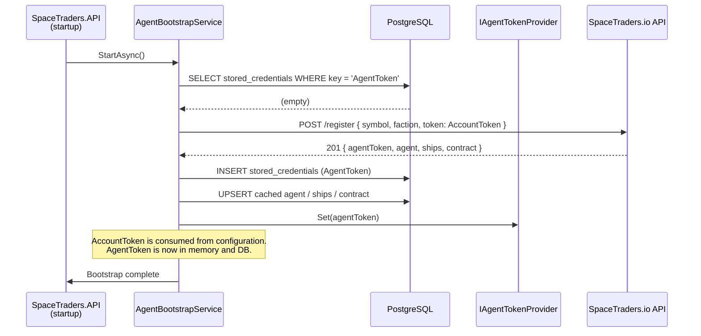
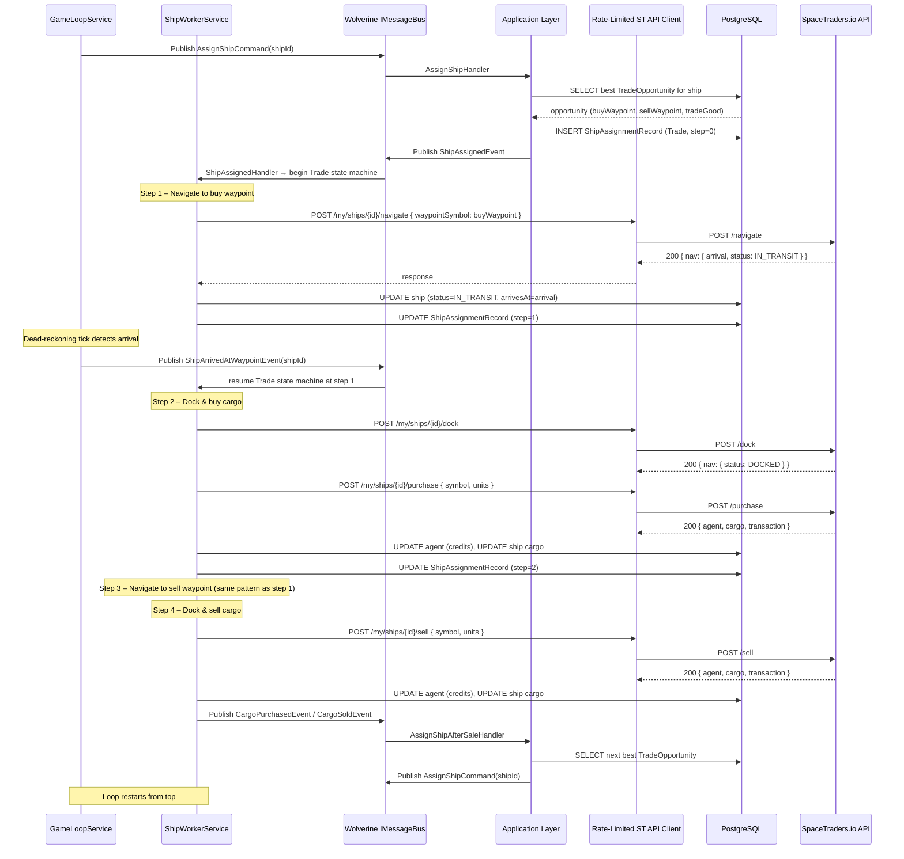
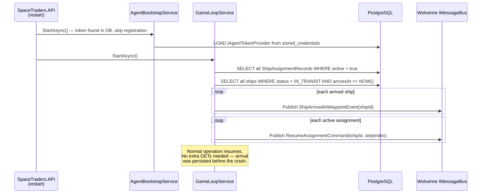

# 16 – Sequence Flows

Key runtime interaction sequences illustrated as Mermaid diagrams.

_See [`../GLOSSARY.md`](../GLOSSARY.md) for term definitions._

---

## 16.1 Agent Bootstrap

The flow that runs on cold start when no agent token is present in the database.

**Notes:**
- If a token _is_ found in the DB, `AgentBootstrapService` skips `POST /register` and calls
  `IAgentTokenProvider.Set(...)` directly from the persisted value.
- The `AccountToken` is never written to the DB — it passes through memory only.
- See [`14-security.md §14.5`](14-security.md) for token exposure prevention details.

---

## 16.2 Trade Cycle

A single ship completing one full buy-navigate-sell loop and receiving its next assignment.

**Notes:**
- Every `POST` response is applied directly to the cache — no follow-up GET is ever issued
  (see [ADR-003](15-adr.md#adr-003-no-get-after-post-caching-rule)).
- `ShipAssignmentRecord.StepIndex` is updated after each step so a pod restart can resume
  from the exact correct point (see [`10-error-handling.md §10.3`](10-error-handling.md)).
- The rate-limited client transparently queues requests so all ships share the 2 req/s budget.

---

## 16.3 Pod Restart Recovery

What happens when the Kubernetes pod is killed mid-cycle and restarted.

**Notes:**
- Ships that are still in transit have their `arrivesAt` persisted, so the dead-reckoning tick
  will detect their arrival correctly after restart — no API call needed.
- Ships that arrived while the pod was down are detected on the first tick after restart.
- See [`10-error-handling.md §10.3`](10-error-handling.md) for the full stranded-ship edge case.

---

## See Also

- [`00-overview.md`](00-overview.md) – High-level architecture overview
- [`15-adr.md`](15-adr.md) – Rationale behind the design choices shown above
- [`05-automation-engine.md`](05-automation-engine.md) – Automation engine state machine detail
- [`10-error-handling.md`](10-error-handling.md) – Error and recovery scenarios
