# SpaceTraders Documentation

## Table of Contents

- [Getting Started](#getting-started)
- [Quickstart](#quickstart)
- [Agents and Factions](#agents-and-factions)
- [Systems and Waypoints](#systems-and-waypoints)
- [Ship Navigation](#ship-navigation)
- [Extracting Resources](#extracting-resources)
- [Markets](#markets)
- [API Guide](#api-guide)
- [Reference Data](#components)
- [Changelog](#changelog)

## Getting Started
Learn how to use the SpaceTraders API with the resources below or join our Discord for help and to collaborate with other developers.

### Quickstart
Test API endpoints directly in your browser with our Quickstart guide.

### Playground
Use the playground to see your ships and inspect the network tab.

### API Docs
Interactive Open API documentation powered by Scalar.

### Support Us
Support us and reserve your call sign between resets.

### Overview
SpaceTraders is an open-universe space-themed game that offers a set of HTTP endpoints to control a fleet of ships. All players operate their fleet in the same universe, and the game is currently in alpha.

The API is fully documented using OpenAPI. You can send your first request right here in your browser to check the status of the game server, or try our Quickstart Guide to learn the basics in under five minutes.

#### cURL
```bash
curl 'https://api.spacetraders.io/v2'
```
Unlike a traditional game, SpaceTraders is headless and does not have a first-party client to play the game.

Instead, you as the player are responsible for building your own client to interact with the API. This allows you to build your own UI, automate your trade routes, or just play the game from the comfort of your terminal.

We have a Discord channel where you can share your projects, ask questions, or give feedback on what others are building.

### Gameplay
SpaceTraders is a space-themed universe where you can explore star systems, trade goods, mine asteroids, and take on faction contracts to earn credits and reputation.

Ships are the primary vehicle for interacting with the game world. You can buy and sell ships, navigate them between waypoints, upgrade them with new mounts, and send them on trade routes to earn credits.

The economy of the game is simulated and significantly influenced by player actions. Prices of goods fluctuate based on supply and demand, and players can influence the market by buying and selling goods in different systems.

All players operate in the same universe, so you can compete with others to earn the most credits or chart the most systems.

To learn more about the game, check out our gameplay concepts guide, or try the quickstart to start a new game and test various API endpoints from your browser.

The game is currently in alpha and under active development, so we are always adding new features and content.

### Donations
We are a small self-funded team dedicated to keeping the SpaceTraders platform alive and accessible for everyone, and free for as long as we can support it.

You can donate to the project using the dashboard. Contributions will go directly towards maintaining server costs for the community. As we fund everything out of pocket, every donation, no matter the size, makes a big difference.

We're grateful for your support and excited to see what you build with the SpaceTraders API!

### Next steps
The SpaceTraders API is an excellent platform to learn a new programming language, test a new framework, or stretch your skills in a fun and meaningful way.

If you are new to SpaceTraders, you should try our interactive quickstart guide which will walk you through basic API requests in just a few minutes.

If you're looking for some project inspiration, here are some ideas to get you started:

- create a script to mine asteroids and automate trade routes
- build a web or mobile app to manage your fleet of ships
- track and share market price data with other players
- generate an SDK from the OpenAPI spec and publish it
- create a Discord bot for others players to use
And finally, if you find an issue and want to report it, please open an issue on our GitHub repository or share it in our Discord channel.

## Server Resets
Server resets are a normal part of the SpaceTraders game during the alpha release, and very likely after. Each reset provides players an opportunity to start fresh and improve their code and strategies.

The game currently resets every 7 or 14 calendar days. The reset day changes depending on when the last reset was initiated, but we aim to keep it in the weekend, at 10pm JST (because that's when I'm free to resolve any issues). The exact time of the reset is announced in the status endpoint, under the serverResets field.

#### cURL
```bash
curl 'https://api.spacetraders.io/v2'
```
When the game resets, all players' agents are wiped and all game data is reset. This includes all systems, ships and cargo. Players will need to re-register their agents and start over from scratch, the final status of your previous agent is saved under your account, but you'll have to make a new agent for the next reset (either through the account dashboard or the register endpoint).

In the future, we aim to have different servers with varied reset intervals, or seasonal gameplay with different rulesets. For now, there is only one server and one reset schedule because the playerbase is limited. The most likely next addition will be a development instance, to test changes on before they make their way to the main server.

## Funding
The SpaceTraders API is free to use, but it's not free to run. The developers work on this project in their spare time and pay for the server costs out of pocket. If you'd like to help support the project, you can subscribe subscribe to a monthly donation to reserve certain callsigns and get a unique role in our Discord server. Your support helps us continue to develop and maintain the SpaceTraders API!

**Subscribe to SpaceTraders ->**

### Support Us
Our mission is to build the world's first programmable, multiplayer game for software engineers and aspiring programmers to play and sharpen their skills through automation and collaboration.

The SpaceTraders API is at a unique intersection of gaming, programming, and education. We believe that the platform has the potential to be a valuable tool for learning and teaching programming, and we're excited to see what the community builds with it.

### Fundraising
The developers of the SpaceTraders API are seeking to raise a seed round to work on the platform full-time. If you are interested in investing in the project, you can reach out via email: admin@spacetraders.io.

## Roadmap
The SpaceTraders team currently works on the API in their spare time, and so we don't have a formal roadmap. However, we do have a list of features and capabilities that we plan to work on in the future. We will update this page as we make progress on these items.

### Game Features
Creating an API-based game is a unique challenge, and we're excited to see how the game evolves over time. Here are some of the features we plan to add to the game in the future:

Piracy and Patrolling: Players will be able to pirate trade routes and patrol their own trade routes to protect their ships from pirates.
Faction Reputation: Players will be able to build reputation with various factions in the game, which will unlock new gates, modules and other benefits.
Faction warfare: For those players that don't want to fight each other, but still want to blow up virtual spaceships. They can participate in warfare between the factions, in which territory will change hands, and stations will get captured.
Crew and Ship Customization: Players will be able to hire specialized crews and customize their ships with more modules and upgrades.
Specialization Trees: Players will be able to specialize in different aspects of the game, such as trading, combat, and exploration.
Combat: Players will be able to engage in asynchronous combat with other players and NPCs, probably in dedicated combat sectors, or after turning on a PVP flag.
Construction and Ownership: Players will be able to build and own space stations and other structures in space and on planets.
Exploration: Players will be able to explore new sectors of the game world and discover new opportunities and challenges. There will be appropriate risk and rewards for those daring to explore the unknown.
Events and Rumors: Players will be able to participate in special events and rumors that will change the game world and provide new opportunities.
### Platform Features
In addition to game features, we also plan to add new capabilities to the SpaceTraders API platform itself. Some of this might include:

Webhooks and Websockets: We plan to add support for webhooks and websockets, which will allow players to receive real-time updates about game events.
Server Resets: We plan to offer different servers with varied reset intervals, so players can choose the pace of the game that suits them best.
Leaderboards: We plan to expand our leaderboard system to include more metrics and rankings, and track leaderboards across different game servers and resets.
### Plans for Paid Offerings
Our goal is to keep a core part of the SpaceTraders API free to use for as long as possible, while offering paid plans for advanced use cases and conveniences.

We never intend to make any part of the game "pay to win," and are committed to keeping the core game experience free, so that aspiring developers and players can get started without any financial commitment.

The one caveat with this commitment is that as the game progresses, we may need to restrict access to the broader universe with some minimal form of paid subscription, in order to prevent abuse and ensure a high-quality experience for dedicated players.

Having said that, our paid features will primarily be focused on advanced use cases and conveniences. Here are some of the features we might offer in paid plans:

Custom Game Servers: Players can create and manage their own custom game servers, with their own rules and settings, for testing or personal use.
Advanced Integrations: Adding support for advanced integrations with the SpaceTraders API, such as webhook or websocket support.
First Party Clients: We might offer convenient first-party clients for new players, with minimal programming experience, to get started with the game before attempting to build their own clients.
OAuth 2.0 Support: The ability to register your own OAuth 2.0 application that allows other players to authenticate with your app through the SpaceTraders API.
Online Courses and Tutorials: We might offer advanced tutorials and courses for players who want to learn more about programming in a guided capacity.
We will continue to update this page as we make progress on these items. If you have any questions or suggestions, please feel free to reach out to us on Discord.

## Quickstart
The quickstart guide should take about 5 minutes and will walk a new user through some common HTTP requests when working with the SpaceTraders API.

Each request can be sent from the browser or pasted into your terminal using cURL. The parameters of each request should update automatically as you complete each step.

### Starting a new game
To start a new game, you will need to create an account and generate an agent token. Agent tokens are used to authenticate (almost all) requests to the API, and are required to play the game.

### Create an account
To register an account, you should log in to the spacetraders dashboard at https://my.spacetraders.io. After you sign up, you'll be able to go to the 'agents' page and register a new agent, or use a generated account token to register an agent programmatically.

### Agents
Players are called agents, and each agent is identified by a unique call sign, such as ZER0_SH0T or SP4CE_TR4DER. All of your ships, contracts, credits, and other game assets will be associated with your agent identity.

### Register as a new agent
Register an agent

Your starting faction will determine which system you start in, but any faction should be fine for now.

After you've registered an agent, you should be able to press the "Generate Token" button in the list to get an agent token for that agent. Don't worry about losing it, you can generate a new one at any time.

### Alternative: Register by API
If you want to register by API, you will first need to obtain your account token from the dashboard.

Click the "Settings" menu in the sidebar, then click the "Generate Account Token" button.

### Generate Token

You can then use the following request:

#### cURL
```bash
curl --request POST \
 --url 'https://api.spacetraders.io/v2/register' \
 --header 'Authorization: Bearer ACCOUNT_TOKEN' \
 --header 'Content-Type: application/json' \
 --data '{
"symbol": "INSERT_CALLSIGN_HERE",
"faction": "COSMIC"
   }'
```
The response should include your access token, which will be used to authenticate all future requests.

### Agent Token

If you've used these docs to make the request, the agent token should have already been saved and will automatically be used for future requests.

### Data for your agent
You can see the data for your agent along with your starting faction, ships, and faction contract at any time by calling the my/agent endpoint.

#### cURL
```bash
curl 'https://api.spacetraders.io/v2/my/agent' \
 --header 'Authorization: Bearer <agent-token>'
```
### View your starting location
Your command ship is located at your faction's headquarters. Each location in SpaceTraders is referred to as a waypoint. Ships can navigate between different waypoints in a system and even jump across systems in the universe.

The universe is made up of many systems, each with a set of waypoints. Every waypoint has a symbol such as X1-DF55-A1 made up of the sector, system, and location of the waypoint. For example, X1 is the sector, X1-DF55 is the system, and X1-DF55-A1 is the waypoint.

To view your starting waypoint location, send the following request:

#### cURL
```bash
curl 'https://api.spacetraders.io/v2/systems/:systemSymbol/waypoints/:waypointSymbol'
```
### Dynamic Request Values

Dynamic values in the documentation should autofill with values from other requests as you complete them, but you can also manually edit the values.

For example, you can edit the :systemSymbol and :waypointSymbol variables in the above request.

Each waypoint has a type (planet, moon, orbital station), a set of coordinates, and some traits describing the features of the location. For example, a waypoint may have a marketplace for trading goods, or a shipyard for buying and selling ships.

### Coordinates
A quick note about coordinates: each waypoint has a set of x, y coordinates that describe its location relative to the system it is in. System coordinates are absolute units at the galactic scale.

When visualizing the universe, you can use the system coordinates to determine the position of each system, and then use the waypoint coordinates to determine the relative position of each waypoint within that system (the center of the system is 0,0).

### Quickstart: Contracts
Faction contracts are a good way to earn credits and learn the basics of the game. Your starter contract will require you to mine an asteroid field and deliver the ores to a nearby waypoint.

### View Contracts
When you registered your agent, you were given a starter contract. If you don't have the contract ID, you can view your contracts again by sending the following request:

#### cURL
```bash
curl 'https://api.spacetraders.io/v2/my/contracts' \
 --header 'Authorization: Bearer <agent-token>'
```
### Contract Terms
Each contract will have a set of terms, which describe the requirements for completing the contract. For example, you may be required to deliver a specified amount of cargo to a destination waypoint.

Contracts have a deadline for accepting the contract, and the terms will have a deadline for when the delivery must be completed. If you fail to meet the deadline, the faction will revoke the contract reclaim any advance funds you received.

### Expired Contracts

If you've come back here after the contract has expired, you will not be able to accept the contract that was initially given to you, but you can request a new contract through the negotiate/contract endpoint.

### Optional: Negotiating a new contract
If you've come back here after the contract has expired, you can request a new contract through the negotiate/contract endpoint.

#### cURL
```bash
curl --request POST \
 --url 'https://api.spacetraders.io/v2/my/ships/:shipSymbol/negotiate/contract' \
 --header 'Authorization: Bearer <agent-token>'
```
### Accept your contract
On accepting a contract, you will receive a small portion of the credits up front and the final amount on delivery. To accept your contract, send the following request:

#### cURL
```bash
curl --request POST \
 --url 'https://api.spacetraders.io/v2/my/contracts/:contractId/accept'
```
Don't stress too much about the details of the contract for now. If the contract is too difficult, you can always let the contract expire and accept a new one, or start a new agent and try again. Use the starter contract as an opportunity to learn the basics of the game.

To complete the contract, you will need to buy a ship, navigate your ship to an asteroid field, extract ores until your cargo hold is full, and deposit the contract ores at the delivery waypoint. The remaining ores can be sold at a marketplace for a profit (or jettisoned into space while still at the asteroid field if you want to fill up on only contract cargo).

### Quickstart: Shipyards
Shipyards allow you to purchase ships, and repair them when they get damaged. They also allow you to swap out different modules and mounts. To purchase a ship, you will need to find a waypoint with a shipyard.

### Find a shipyard
Look for a waypoint with the SHIPYARD trait. You can use the following endpoint to find all waypoints in your current system. Take note of the symbol for the orbital station waypoint that has a shipyard, which you can use to purchase a mining drone.

#### cURL
```bash
curl 'https://api.spacetraders.io/v2/systems/:systemSymbol/waypoints?traits=SHIPYARD'
```
### View available ships
To view the ships available for purchase at a shipyard, send the following request. You will notice that there is a mining drone available for purchase, which can help you fulfill your starting contract.

#### cURL
```bash
curl 'https://api.spacetraders.io/v2/systems/:systemSymbol/waypoints/:shipyardWaypointSymbol/shipyard'
```
### Ship Price Visibility

Several parts of the API have some fields that are hidden unless you have a ship present at the location.

When starting as a new agent, a probe ship was provided for you at this location, which allows you to see the details of the ships available for purchase.

### Purchase a ship
You can purchase a new ship at a shipyard when you have a ship present at the waypoint by sending a POST request to the my/ships endpoint. Sending this request will deduct the cost of the ship from your credits and add the ship to your fleet.

You will need to specify the type of ship you want to purchase, along with the waypoint you are purchasing from.

#### cURL
```bash
curl --request POST \
 --url 'https://api.spacetraders.io/v2/my/ships' \
 --header 'Content-Type: application/json' \
 --data '{
"shipType": "SHIP_MINING_DRONE",
"waypointSymbol": ""
   }'
```

### Quickstart: Mining
Your mining drone is equipped with a mining laser, which can be used to extract valuable ores and minerals. You will need to navigate your ship to an asteroid field to send an extraction request.

### Find the nearby engineered asteroid
Your starting system contains an asteroid that was moved into orbit near your starting location. Although the asteroid as some of the others in the asteroid belt, it is much easier to mine because it is near local markets.

#### cURL
```bash
curl 'https://api.spacetraders.io/v2/systems/:systemSymbol/waypoints?type=ENGINEERED_ASTEROID'
```
### Fly to the asteroid
You can navigate your new mining drone to the nearby asteroid. Drones are slow to navigate but fairly cheap, so it may take a while for your drone to arrive.

First let's make sure your ship is in-orbit, and then we will navigate to our target waypoint.

#### cURL
```bash
curl --request POST \
 --url 'https://api.spacetraders.io/v2/my/ships/:miningShipSymbol/orbit'
```
Now that your ship is in-orbit, we can navigate to the asteroid. You can navigate to a waypoint by sending the following request:

#### cURL
```bash
curl --request POST \
 --url 'https://api.spacetraders.io/v2/my/ships/:miningShipSymbol/navigate' \
 --header 'Content-Type: application/json' \
 --data '{
"waypointSymbol": ""
   }'
```
Your ship navigation status should now be IN_TRANSIT and your route will show you the timestamp of your ship's arrival.

While your ship is in transit, most other requests for that ship will return an error code. Try sending the navigation request again to see the response for a ship in transit error code.

### Dock your ship
When your ship arrives at the target waypoint, we will want to refuel the ship before extracting any ores. You can dock your ship at a waypoint by sending the following request:

#### cURL
```bash
curl --request POST \
 --url 'https://api.spacetraders.io/v2/my/ships/:miningShipSymbol/dock'
```
### Refuel your ship
Fuel is consumed when traveling between waypoints and warping between systems. When your ship arrives at the target waypoint, you can refuel your ship by sending the following request:

#### cURL
```bash
curl --request POST \
 --url 'https://api.spacetraders.io/v2/my/ships/:miningShipSymbol/refuel'
```
Refuel requests will only succeed if the current location has fuel offered for sale at the marketplace. One unit of fuel at the marketplace replenishes 100 units in the ship's tank. If you try to refuel at a location that doesn't have fuel, you will receive an error code.

Before we can extract any ores, we will need to orbit the asteroid. You can orbit a waypoint by sending the following request:

#### cURL
```bash
curl --request POST \
 --url 'https://api.spacetraders.io/v2/my/ships/:miningShipSymbol/orbit'
```
### Extract ores and minerals
Your mining drone is equipped with a mining laser, which can be used to extract ores and minerals from an asteroid. You can extract ores by sending a POST request to the extract endpoint.

#### cURL
```bash
curl --request POST \
 --url 'https://api.spacetraders.io/v2/my/ships/:miningShipSymbol/extract'
```
After extraction, your ship will be on a cooldown and you won't be able to extract again until the cooldown expires. Try sending another extract request to see the response for a cooldown error code.

### Optional: Yeet the non-contract cargo
If you want to fill up on only contract ores, you can jettison the non-contract cargo by sending a POST request to the jettison endpoint.

#### cURL
```bash
curl --request POST \
 --url 'https://api.spacetraders.io/v2/my/ships/:miningShipSymbol/jettison' \
 --header 'Content-Type: application/json' \
 --data '{
"symbol": "",
"units": ""
   }'
```
To find out what cargo you have on board, you can send a GET request to the my/ships/:miningShipSymbol/cargo endpoint.

#### cURL
```bash
curl 'https://api.spacetraders.io/v2/my/ships/:miningShipSymbol/cargo'
```

### Quickstart: Selling Cargo
After a few extractions, your cargo hold will likely be filled with ores and minerals that you may not need for your contract. You can sell your cargo at the nearby marketplace to unload those goods and earn some credits.

### View market data
To view the types of goods available at the market, you can send the following request. Each market has a list of imports, exports and exchange goods which can be purchased and sold at the location.

#### cURL
```bash
curl 'https://api.spacetraders.io/v2/systems/:systemSymbol/waypoints/:asteroidWaypointSymbol/market'
```
Since your ship is present at the location, you can see the purchase and sell prices for each good.

You can also see the estimated trade volume for each good, which is rough estimate of price stability. Larger trade volumes indicate more stable prices, while smaller trade volumes indicate more volatile prices.

### List ship cargo
You can view the cargo in your ship by sending a GET request to the my/ships/:shipSymbol endpoint. You will want to sell the ores and minerals in your cargo hold that don't match the contract requirements.

#### cURL
```bash
curl 'https://api.spacetraders.io/v2/my/ships/:miningShipSymbol/cargo'
```
### Sell goods
Before you can sell your cargo at the market, you will first need to dock your ship. You can dock your ship by sending a POST request to the my/ships/:shipSymbol/dock endpoint.

#### cURL
```bash
curl --request POST \
 --url 'https://api.spacetraders.io/v2/my/ships/:miningShipSymbol/dock'
```
You can sell your cargo at a marketplace by sending a POST request to the my/ships/:shipSymbol/sell endpoint. You will need to specify the type of good you want to sell, along with the number of units.

#### cURL
```bash
curl --request POST \
 --url 'https://api.spacetraders.io/v2/my/ships/:miningShipSymbol/sell' \
 --header 'Content-Type: application/json' \
 --data '{
"symbol": "IRON_ORE",
"units": "100"
   }'
```
The response will include details about your agent, ship cargo, and the transaction. You can see the total price for the transaction in the totalPrice field.

### Quickstart: Delivering Contract Goods
When you've mined a full cargo hold of the ores in your contract, you can send your ship to the delivery waypoint to deliver goods on the contract. Once the terms of the contract are complete, you can submit it to receive the full payment.

### Navigate to delivery waypoint
With a full cargo hold and a full tank, you can navigate your ship to the delivery waypoint. You can send a POST request to the my/ships/:shipSymbol/navigate endpoint to navigate your ship to a waypoint.

#### cURL
```bash
curl --request POST \
 --url 'https://api.spacetraders.io/v2/my/ships/:miningShipSymbol/navigate' \
 --header 'Content-Type: application/json' \
 --data '{
"waypointSymbol": ""
   }'
```
### Deliver contract goods
Once your ship arrives, send a POST request to the my/contracts/:contractId/deliver endpoint. You will need to specify the ship you are delivering with, along with the type of good you are delivering, and the number of units.

This request will only succeed if your ship is at the delivery waypoint, and your cargo hold contains the required goods.

#### cURL
```bash
curl --request POST \
 --url 'https://api.spacetraders.io/v2/my/contracts/:contractId/deliver' \
 --header 'Content-Type: application/json' \
 --data '{
"shipSymbol": "",
"tradeSymbol": "",
"units": ""
   }'
```
### Fulfill contract
You will need to continue to mine ores and ship them to the delivery waypoint until the contract is complete.

Once the terms have been met, you can send a request to the following endpoint to receive the full payment.

#### cURL
```bash
curl --request POST \
 --url 'https://api.spacetraders.io/v2/my/contracts/:contractId/fulfill'
```

## Agents and Factions
### Overview
Agents are the primary entity in SpaceTraders. Every player controls a single agent which can be used to manage a fleet of ships and conduct trade with factions.

The API token generated when you register is scoped to your agent. You can use this token to control your agent and view the status of your fleet.

Every endpoint under the /my namespace requires an agent token and returns data specific to your agent. For example, you can use the following API request to view your current reputation with each faction.

#### cURL
```bash
curl --request  \
 --url 'https://api.spacetraders.io/v2/my/factions'
```
### Agent vs Account

An agent is not the same as your SpaceTraders account. Accounts are tied to an email address and allow you to login to the dashboard to manage agent tokens and webhooks.

### Creating an agent
To register as a new agent, you must choose a unique call sign and a starting faction. This call sign is used to identify yourself to other players in the universe.

This will grant you a command ship, 175,000 credits, and a starting faction contract. Your command ship will be docked at the faction's home system.

#### cURL
```bash
curl --request POST \
 --url 'https://api.spacetraders.io/v2/register' \
 --header 'Authorization: Bearer ACCOUNT_TOKEN' \
 --header 'Content-Type: application/json' \
 --data '{
"symbol": "",
"faction": ""
   }'
```
If you wait a while after registering to play, you may notice that your contract has expired. This is because they're only valid for a limited amount of time. You can generate a new contract by using the negotiate contract endpoint.

### Viewing your agent
Once you have registered, you can use the following API request to view your agent's current status. An agent will have a unique call sign, credits, and a headquarters location.

#### cURL
```bash
curl --request  \
 --url 'https://api.spacetraders.io/v2/my/agent' \
 --header 'Authorization: Bearer <agent-token>'
```
### Factions
Factions are the primary NPC organizations in SpaceTraders. Each faction will (eventually) have a unique set of ships, contracts, and trade routes for you to explore. Right now they're a little bit more simplistic, and basically just add flavor to the game, as well as determine your general starting location.

Factions are spread across the universe and more can be found by exploring new systems.

### Viewing factions
During the alpha we have quite a few factions, but it's possible we'll add more in the future. You can view the current list of factions using the following API request.

#### cURL
```bash
curl --request  \
 --url 'https://api.spacetraders.io/v2/factions'
```
### Faction contracts
Factions will offer contracts to agents in exchange for credits and reputation. Every agent starts with a basic contract to deliver a mined ore to the faction's home world.

On accepting a contract, the agent will be given a deadline to complete the terms. If the contract is not completed by the deadline, the agent will lose reputation with the faction.

To view your current contracts, you can use the following API request.

#### cURL
```bash
curl --request  \
 --url 'https://api.spacetraders.io/v2/my/contracts'
```
Future: As agents complete contracts and conduct trade with factions, they earn reputation, which can be used to unlock new types of ships, upgrades, gate access, and high margin trade goods.

### Generating contracts
Faction contracts can be generated by sending an envoy ship to a faction's planets. Envoys will negotiate with the faction to generate a new contract.

Future: If the agent doesn't accept the contract, there will be a slight loss in reputation with the faction.

As the agent earns more reputation with a faction, they will be able to generate more lucrative contracts. However, contracts will also become more challenging to complete.

### Contract negotiation

The contract negotiation endpoint is under the /my/ships namespace, because it's an action a ship takes. This unlike all other contract actions which have their own namespace (and run at account level).

## Systems and Waypoints
### Overview
The SpaceTraders universe is made of up of systems and waypoints. Every system has a type, which is typically a type of star, and a set of x, y coordinates.

Waypoints are locations within a system that you can travel to. They can be planets, asteroids fields, orbital stations, or any other type of location.

Ships can navigate between waypoints and jump or warp between systems.

### Systems
Systems are the primary locations in the SpaceTraders universe. There are roughly 8,500 systems, and 200k waypoints in the universe to explore. You can view a list of all systems in the universe by calling the following endpoint:

#### cURL
```bash
curl --request  \
 --url 'https://api.spacetraders.io/v2/systems'
```
The best way to visualize the universe would be to plot the x and y coordinates of each system on a graph, which should show a rough spiral shape for the universe.

Although a majority of system types are stars, there are also a few other types of systems. Some of these include Black Holes, Neutron Stars, and Nebula.

Future: Be careful when traveling into unknown systems, as some of these types can be dangerous to your ships.

#### Waypoint Trait Reference
Waypoints are locations within a system that you can travel to. They can be planets, asteroids fields, orbital stations, or any other type of traversable location with an x, y coordinate.

You can view a list of all waypoints in a system by calling the following endpoint:

#### cURL
```bash
curl --request  \
 --url 'https://api.spacetraders.io/v2/systems/:systemSymbol/waypoints'
```
A waypoint has a type, a set of x, y coordinates, and a unique symbol name that you can use to reference it. Waypoints may also have orbital waypoints, which are locations within the orbit of the location.

Orbitals are other waypoints that are located at the exact same x, y coordinates as that waypoint. They'll have an parentSymbol property to indicate what they are in orbit of.

For example, a planet may have an space station as well as two moons that orbit it. The planet itself would be the parent waypoint, and the space station and moons would be orbital waypoints.

When visualizing a system, you can map the coordinates of each waypoint to a graph to see where they are located in the system.

### Traits
Waypoints have a list of traits that describe the details, features and characteristics of the location. For example, a planet may have a trait that describes the atmosphere as "toxic", the political leanings as "authoritarian", or the population as "sparse"

Two traits that are particularly important are the MARKETPLACE and SHIPYARD traits. These traits indicate that the location has a marketplace and shipyard, respectively. You can use these traits to determine if you can buy or sell goods at a location, or if you can purchase a new ship.

### Modifiers
Waypoint can also have modifiers. These are temporary effects that apply to a waypoint. The distiction between traits and modifiers is that the modifiers come and go, and traits are static over the duration of a reset.

Currently the only modifiers with any effect is the critical limit modifier, which applies to asteroid waypoints if they're at risk of being overextracted.

## Ship Navigation
### Overview
Ships can navigate between waypoints within a system and jump or warp between systems across the SpaceTraders universe. Ships can also dock at waypoints to refuel, repair, and trade goods.

Movement in the SpaceTraders universe is based on a grid system. Ships can only move from and to other waypoints within the same system. To move between systems, you must either jump or warp your ship.

When traveling to a new waypoint or system, your ship nav's arrival timestamp will be updated to reflect when your ship will arrive at it's destination.

### Orbiting and docking
Before a ship can travel, you must first confirm that the ship is undocked and in-orbit. You can call the following endpoint to confirm your ship is in orbit, or command it to move into orbit:

#### cURL
```bash
curl --request POST \
 --url 'https://api.spacetraders.io/v2/my/ships/:shipSymbol/orbit'
```
Conversely, you can call the following endpoint to dock your ship at a waypoint:

#### cURL
```bash
curl --request POST \
 --url 'https://api.spacetraders.io/v2/my/ships/:shipSymbol/dock'
```
The orbit and dock requests are idempotent, meaning you can call them successively and the result will be the same. This is useful if you want to ensure your ship is in orbit before you attempt to travel to another waypoint.

### Flight mode
Your ship's flight mode determines the rate at which it travels and the amount of fuel consumed. There are four flight modes:

CRUISE - Cruise flight mode is the default mode for all ships. It consumes fuel at a normal rate and travels at a normal speed.
BURN - Burn flight mode consumes fuel at a faster rate and travels at a faster speed.
DRIFT - Drift flight mode consumes the least fuel and travels at a much slower speed. Drift mode is useful when your ship has run out of fuel and you need to conserve what little fuel you have left.
STEALTH - Stealth flight mode runs with systems at a minimum, making it difficult to detect. It consumes fuel at a normal rate but travels at a reduced speed.
To update your ship's flight mode, you can call the following endpoint:

#### cURL
```bash
curl --request PATCH \
 --url 'https://api.spacetraders.io/v2/my/ships/:shipSymbol/nav' \
 --header 'Content-Type: application/json' \
 --data '{
"flightMode": ""
   }'
```
### Waypoint navigation
When navigating, a ship will move to the destination, but it will not arrive immediately. Instead, it will take time to travel to the destination, and you can use the navigation status to determine when the ship will arrive.

Navigation also consumes fuel, which is required to power the ship's engines. The amount of fuel consumed is based on the distance between the current location and the destination.

To navigate your ship to a waypoint, you can call the following endpoint:

#### cURL
```bash
curl --request POST \
 --url 'https://api.spacetraders.io/v2/my/ships/:shipSymbol/navigate' \
 --header 'Content-Type: application/json' \
 --data '{
"waypointSymbol": ""
   }'
```
### Warping
When moving between systems, whether the ship can warp is dependent on whether the ship has a warp drive installed. Warping your ship moves it into interdimensional space, and it behaves very similar to normal waypoint travel in that it takes time and consumes normal fuel.

To warp your ship to a new system, you can call the following endpoint:

#### cURL
```bash
curl --request POST \
 --url 'https://api.spacetraders.io/v2/my/ships/:shipSymbol/warp' \
 --header 'Content-Type: application/json' \
 --data '{
"systemSymbol": ""
   }'
```
### Jump gate travel
If your ship isn't equipped with a warp drive, you can still travel between systems by using faction gates. Gates are special waypoints that allow you to travel between systems.

Jumping a ship is instantaneous, but afterwards there is a jump cooldown that means you cannot jump again right away.

Jumping consumes a unit of antimatter, which, when jumping from a Jump Gate is automatically purchased and used at the gate's going rate (inspect the market at the gate to find out how much it costs).

To jump your ship to a new system, you can call the following endpoint:

#### cURL
```bash
curl --request POST \
 --url 'https://api.spacetraders.io/v2/my/ships/:shipSymbol/jump' \
 --header 'Content-Type: application/json' \
 --data '{
"systemSymbol": ""
   }'
```
Future Some faction gates are restricted based on your agent's reputation with the faction. To unlock access to new systems, you can increase your reputation with the faction by completing contracts for them.

### Refueling
Ships can be refueled at any waypoint with a marketplace that offers fuel for sell. One unit of fuel at the marketplace replenishes 100 units in the ship's tank. Often fuel prices can be driven high by demand, so it's best to refuel your ship when fuel prices are low or to help drive prices down by selling fuel at high-traffic marketplaces.

You can also refuel your ship from it's cargo hold by sending a POST request to the my/ships/:shipSymbol/refuel endpoint with a fromCargo value of true.

#### cURL
```bash
curl --request POST \
 --url 'https://api.spacetraders.io/v2/my/ships/:shipSymbol/refuel' \
 --header 'Content-Type: application/json' \
 --data '{
"fromCargo": ""
   }'
```

## Extracting Resources
### Overview
Ships can extract resources from asteroids and other celestial bodies. The amount of resources extracted is based on the ship's mounts and modules, such as mining lasers and mineral processing bays.

Typically yields from an extraction will be a random quantity of those available based on the traits of the location. However, if you have a surveying mount installed, you can survey the location and find more targeted locations to extract from, which will yield more of the resource you are looking for.

### Extracting resources
You can extract resources from an asteroid by calling the following endpoint. You'll need an extractor mount installed on the ship. After an extraction, your ship will be on a cooldown. You can still navigate while on a cooldown, but you cannot perform most other ship actions.

#### cURL
```bash
curl --request POST \
 --url 'https://api.spacetraders.io/v2/my/ships/:shipSymbol/extract'
```
### Siphoning resources
You can siphon from a gas giant by calling the following endpoint. Your ship will need a siphon mount and gas processor module installed.

#### cURL
```bash
curl --request POST \
 --url 'https://api.spacetraders.io/v2/my/ships/:shipSymbol/siphon'
```
### Surveying
You can survey a waypoint to find better spots to extract from. Surveying a waypoint will yield a list of surveys depending on the strength of your survey mount. Each of these will have a set of resources that can show up in extractions using the survey.

#### cURL
```bash
curl --request POST \
 --url 'https://api.spacetraders.io/v2/my/ships/:shipSymbol/survey'
```
To use a survey result, you must call the extract endpoint with the full survey result. Surveys have a limited lifetime, so you must use the survey result before it expires. Surveys also have a limited deposit size, and will eventually be depleted, which will manifest as an error response to your extract call.

#### cURL
```bash
curl --request POST \
 --url 'https://api.spacetraders.io/v2/my/ships/:shipSymbol/extract' \
 --header 'Content-Type: application/json' \
 --data '{
"survey": "null"
   }'
```

## Outfitting
Ship in spacetraders consist of several different components:

Frame: The frame that makes up the bulk of your ship. Determines the number of module and mount slots, as well as base fuel storage.

Reactor: The reactor that powers your ship. Determines how much power your modules and mounts can consume.

Engine: The engine that propels your ship. Determines speed.

Modules: Things that you keep on the inside of your ship

Mounts: Things that you hang on the outside of your ship

When you purchase a ship, the frame, reactor and engine cannot be taken out or swapped, but the modules and mounts are completely up to you to fill in. There are endpoints to install mounts, and modules, as well as remove them.

All frames, reactors, engines, mounts and modules have requirements in terms of power and crew. If the combined requirement of your power and crew are lower than the combined values provided by your components, your ship is valid, and you can switch mounts and modules to your hearts content.

Note that to switch out a mount or module, you need to have it available in the cargo hold of the ship doing the switching. We may simplify this in the future when you are docked at a shipyard that sells mounts or modules.

Future: Increasing your reputation with a faction will unlock more modules and mounts for purchase. Base modules and mounts will get modifies based on what faction sold them.

## Maintenance
### Preview Feature

This feature is a recent addition to the game and is still being tested. We welcome any feedback you have on this feature. Please share your thoughts in the feedback channel on our Discord server.

### Overview
Taking ship actions such as navigating and extracting have a chance of a negative event occurring which degrades the condition of the frame, reactor, or engine on a ship. Better ships will degrade at a lower rate than cheap ships.

All of the values for event frequency, repair cost, and scrap earnings are currently ballparked, so things will be adjusted from player feedback.

### Ship Condition vs Ship Integrity
Ship components, such as the frame, reactor, and engine, have a condition and an integrity value. The condition of a component can be repaired and is always restored to a value of 1. The integrity of the component is the long-term wear and cannot be repaired. The integrity of the component is reduced every time you repair your ship.

### Negative Events
Ship actions such as navigating and extracting have a chance of a negative event occurring which degrades the condition of the frame, reactor, or engine on a ship. Better ships will degrade at a lower rate than cheap ships.

### Ship Repair
Repairing your ship costs credits and the cost of this repair will factor in the type of component, the condition of the component (more damaged components are more expensive to repair), and the price of ship parts and plating at the market.

You can repair your ship by hitting the following endpoint at a shipyard:

#### cURL
```bash
curl --request POST \
 --url 'https://api.spacetraders.io/v2/my/ships/:shipSymbol/repair'
```
All of the components of your ship will be repaired to a condition of 1, and the integrity of the components repaired will be slightly reduced.

If you want to get an estimate of the repair cost for your ship, you can send a GET request to the following endpoint:

#### cURL
```bash
curl 'https://api.spacetraders.io/v2/my/ships/:shipSymbol/repair'
```
### Scrapping
Scrapping your ship will provide your agent with credits relative to the cost of the ship, the condition of the components, the mounts and modules attached, and the current price of ship parts and plating at the shipyard. You won't get a great price for your mounts and modules, so you will likely want to remove anything valuable. Cargo will be destroyed and not factored into the credits given.

You can scrap your ship by hitting the following endpoint at a shipyard:

#### cURL
```bash
curl --request POST \
 --url 'https://api.spacetraders.io/v2/my/ships/:shipSymbol/scrap'
```
If you want to get an estimate of the scrap earnings for your ship, you can send a GET request to the following endpoint:

#### cURL
```bash
curl 'https://api.spacetraders.io/v2/my/ships/:shipSymbol/scrap'
```

## Crew and Morale
Ships require crew to operate. Right now, the size of your available crew is determined solely by the number of crew modules you have installed on your ship.

Simple drone ships do not require crew (for simplicity, this is indicated as a negative crew requirement) but have limited outfit options.

Future: Crew can be hired at a shipyard, and crew wages are deducted from your credits when docking.

Crew morale determines how well your ship performs. Crew morale is affected by how aggressively your ship navigates, how often you return to port, and various hazards that your ship encounters.

Low crew morale can result in your ship being unable to perform actions, or taking more damage from hazards.

## Exploration
Ships can explore the SpaceTraders universe by navigating between waypoints and jumping between systems.

Factions at the edge of the universe are more likely to trade in rare technology and trade goods.

Future: Some waypoints contain ancient ruins that can be surveyed for valuable resources and technology.

Some systems contain hidden hazards that can damage your ship and crew. Exploration is risky but can be very profitable.

### Charting
Ships can chart a system waypoint to make the information available to other players. Without a chart, ships will need to use their scanner modules to detect waypoint information or travel to the waypoint to learn more about it.

Some information can only be found by flying to the waypoint, or by using more advanced scanners.

### Asteroid Mining
Asteroid waypoints contain an abundance of valuable ores and minerals that can only be uncovered by sending ships to the location to survey and extract the resources.

Plotting yields over time can reveal the best locations to mine for certain ores (with and without surveying first). However, these sources are not infinite, and over-mining can cause the asteroids to collapse.

Future: Resources are actually finite, right now they're definitely infinite, though they can collapse, which strongly reduces yields.

## Markets
### Overview
Markets in SpaceTraders are driven by supply and demand. Marketplaces will list of goods for trade that are either imports, exports, or exchange goods.

Exports are goods produced at the waypoint, and typically have a lower purchase price than import goods. Import goods are consumed at the waypoint, and typically have a higher sell price.

Buying at places that export goods, and selling at waypoints that import them will typically be the most profitable way to earn credits in SpaceTraders.

#### cURL
```bash
curl --request  \
 --url 'https://api.spacetraders.io/v2/systems/:systemSymbol/waypoints/:waypointSymbol/market'
```
### Visibility
Price data and transaction history are only available if you have a ship located at the waypoint. It is common to send cheap probe ships into orbit around a waypoint to gather and monitor market data.

Having visibility into market data over time can be highly profitable. You can use this data to predict the future price of goods and plan your trade routes accordingly.

### Exports
Exports are goods produced over time by the waypoint where the good is listed.

The purchase price of an export good tends to decrease over time as supply naturally increases from production. As agents buy up supply from an export good, production tends to increase to meet the demand. Be careful though, as this can only happen when there is an adequate supply of imports.

Exports are constrained by the supply of imports. When a market has an unmet need for the imports that are necessary to produce an export, production for export goods will be constrained, leading to a slower decrease in export prices.

### Imports
Imports are goods consumed over time by the civilization where the good is listed.

The sell price of an import good tends to increase over time as supply naturally decreases from consumption. As agents supply more of an import good, consumption will typically increase as the price for that good goes down.

Future: If a waypoint has an unmet supply for their imports, it can contribute to instability and potentially cause a collapse of the market. This can lead to increased piracy in the system, making it more dangerous for agents to trade and exchange goods.

### Exchange goods
Another type of market listing includes exchange goods. These goods are neither consumed nor produced at the waypoint. Instead, they are traded strictly among agents.

The price of an exchange good fluctuates purely based on supply and demand driven by agents.

### Commodity goods
Fuel is the most common exchange good listed across markets. Fuel is consumed by agents to travel between waypoints, which means there is always a natural demand for the good.

The price of fuel can skyrocket at popular locations with high demand, but where players aren't providing enough supply. Replenish the fuel at waypoints by siphoning the gas giants around the system, and bringing the hydrocarbons to a refinery.

### Growing markets
Smaller civilizations typically start with a limited number of basic goods in their markets. As agents trade and exchange goods, these markets will slowly grow.

Future: As agents trade and exchange goods, the market will grow and trigger the introduction of new types of goods.

More advanced systems will typically export higher technology and more advanced goods, but in turn have a higher demand for goods that must be met by agents.

Future: Failing to meet the demand for commodity goods can cause the market to collapse.

Maintaining a healthy market is a key part of maximizing profitability for agents. Markets that are well supplied tend to offer much more consistent margins on goods, but they require more attention to maintain.

## API Guide
The SpaceTraders API is documented using the OpenAPI Specification. This allows users to generate a client library for the API in many different languages. You can find the repository with our OpenAPI specification here.

### OpenAPI specification
We provide access to our API documentation on our website itself at https://spacetraders.io/openapi. This allows you to interact with the API directly from your browser and is synced with our OpenAPI specification.

### Generating a Client Library
The OpenAPI specification can be used to generate a client library for the SpaceTraders API in many different languages using the OpenAPI Generator .

The following is an example of generating a TypeScript client library using the typescript-axios generator and the bundled specification from Scalar (whose components we use).

The following openapi-generator was installed using homebrew, but you can find installation instructions for your platform here.

openapi-generator generate \
 -i https://spacetraders.io/SpaceTraders.json \
-o packages/spacetraders-sdk \
-g typescript-axios \
 --additional-properties=npmName="spacetraders-sdk" \
 --additional-properties=npmVersion="2.3.0" \
 --additional-properties=supportsES6=true \
 --additional-properties=withSeparateModelsAndApi=true \
 --additional-properties=modelPackage="models" \
 --additional-properties=apiPackage="api"
```
Bundled References

Our specification file uses the $ref keyword in the source to reference other files when downloaded as source. This can cause issues with some OpenAPI generators.

However, the bundled specification available from the website has all these references already resolved, so it shouldn't cause any issues.

### API Guide: Authentication
Account management

The Account Management dashboard is coming soon which will allow you to manage your agents and tokens.

Until then, you will have to obtain a token by registering as a new agent.

The SpaceTraders API requires that you authenticate with a valid JWT bearer token in order to access the API.

Once you have a JWT bearer token, you can use it to authenticate with the API by including it in the Authorization header of every request. The following is an example of authenticating with the API:

#### cURL
```bash
curl 'https://api.spacetraders.io/v2/my/agent'
```
The SpaceTraders API will return a 400 Unauthorized error if you attempt to access an endpoint without a valid JWT bearer token.

One common mistake is to forget to include the Bearer prefix in the Authorization header. For example, a proper Authorization header contains the value Bearer <token>.

### API Guide: Errors
The SpaceTraders API uses standard HTTP response codes to indicate the success or failure of an API request.

In general, codes in the 2xx range indicate success, codes in the 4xx range indicate an error that failed given the information provided (e.g., a required parameter was omitted), and codes in the 5xx range indicate an error with the SpaceTraders servers.

The structure of an API error response contains an error key with code, message and data fields. The following is an example of an API error response:

```json
{
"error": {
    "message": "Missing Bearer token in the request. Did you confirm sending the \"Bearer {token}\" as the authorization header?",
"code": 4103,
"data": {}
  }
}
```
Work in progress

We are currently working on fully documenting all errors in our OpenAPI specification. In the meantime, you can find a list of error codes below.

General Error Codes
This list is non-exhaustive. For the full list (we'll use that one here eventually), please see the /error-codes endpoint in the OpenAPI specification.

```ts
const cooldownConflictError = 4000
const waypointNoAccessError = 4001
```
Account Error Codes
```ts
const tokenEmptyError = 4100
const tokenMissingSubjectError = 4101
const tokenInvalidSubjectError = 4102
const missingTokenRequestError = 4103
const invalidTokenRequestError = 4104
const invalidTokenSubjectError = 4105
const accountNotExistsError = 4106
const agentNotExistsError = 4107
const accountHasNoAgentError = 4108
const registerAgentExistsError = 4109
const registerAgentSymbolReservedError = 4110
const registerAgentConflictSymbolError = 4111
```
Ship Error Codes
```ts
const navigateInTransitError = 4200
const navigateInvalidDestinationError = 4201
const navigateOutsideSystemError = 4202
const navigateInsufficientFuelError = 4203
const navigateSameDestinationError = 4204
const shipExtractInvalidWaypointError = 4205
const shipExtractPermissionError = 4206
const shipJumpNoSystemError = 4207
const shipJumpSameSystemError = 4208
const shipJumpMissingModuleError = 4210
const shipJumpNoValidWaypointError = 4211
const shipJumpMissingAntimatterError = 4212
const shipInTransitError = 4214
const shipMissingSensorArraysError = 4215
const purchaseShipCreditsError = 4216
const shipCargoExceedsLimitError = 4217
const shipCargoMissingError = 4218
const shipCargoUnitCountError = 4219
const shipSurveyVerificationError = 4220
const shipSurveyExpirationError = 4221
const shipSurveyWaypointTypeError = 4222
const shipSurveyOrbitError = 4223
const shipSurveyExhaustedError = 4224
const shipRefuelDockedError = 4225
const shipRefuelInvalidWaypointError = 4226
const shipMissingMountsError = 4227
const shipCargoFullError = 4228
const shipJumpFromGateToGateError = 4229
const waypointChartedError = 4230
const shipTransferShipNotFound = 4231
const shipTransferAgentConflict = 4232
const shipTransferSameShipConflict = 4233
const shipTransferLocationConflict = 4234
const warpInsideSystemError = 4235
const shipNotInOrbitError = 4236
const shipInvalidRefineryGoodError = 4237
const shipInvalidRefineryTypeError = 4238
const shipMissingRefineryError = 4239
const shipMissingSurveyorError = 4240
const shipMissingWarpDriveError = 4241
const shipMissingMineralProcessorError = 4242
const shipMissingMiningLasersError = 4243
const shipNotDockedError = 4244
const purchaseShipNotPresentError = 4245
const shipMountNoShipyardError = 4246
const shipMissingMountError = 4247
const shipMountInsufficientCreditsError = 4248
const shipMissingPowerError = 4249
const shipMissingSlotsError = 4250
const shipMissingMountsError = 4251
const shipMissingCrewError = 4252
const shipExtractDestabilizedError = 4253
const shipJumpInvalidOriginError = 4254
const shipJumpInvalidWaypointError = 4255
const shipJumpOriginUnderConstructionError = 4256
const shipMissingGasProcessorError = 4257
const shipMissingGasSiphonsError = 4258
const shipSiphonInvalidWaypointError = 4259
const shipSiphonPermissionError = 4260
const waypointNoYieldError = 4261
const shipJumpDestinationUnderConstructionError = 4262
```
Contract Error Codes
```ts
const acceptContractNotAuthorizedError = 4500
const acceptContractConflictError = 4501
const fulfillContractDeliveryError = 4502
const contractDeadlineError = 4503
const contractFulfilledError = 4504
const contractNotAcceptedError = 4505
const contractNotAuthorizedError = 4506
const shipDeliverTermsError = 4508
const shipDeliverFulfilledError = 4509
const shipDeliverInvalidLocationError = 4510
const existingContractError = 4511
```
Market Error Codes
```ts
const marketTradeInsufficientCreditsError = 4600
const marketTradeNoPurchaseError = 4601
const marketTradeNotSoldError = 4602
const marketNotFoundError = 4603
const marketTradeUnitLimitError = 4604
```
Faction Error Codes
```ts
const waypointNoFactionError = 4700
```
Construction Error Code
```ts
const constructionMaterialNotRequired = 4800
const constructionMaterialFulfilled = 4801
const shipConstructionInvalidLocationError = 4802
```

### API Guide: Rate Limits
Rate Limits
The SpaceTraders API is subject to rate limits. The following is a list that outlines the rate limits that are currently in place:

Type	Status	Limit	Burst Limit	Burst Duration
IP Address	429	2 requests per second	30 requests	60 seconds
Account	429	2 requests per second	30 requests	60 seconds
DDoS Protection	502	-	-	-
Response Headers
The SpaceTraders API will return the following headers in a 429 response to indicate the current rate limit status.

Header Name	Description
x-ratelimit-type	The type of rate limit that was exceeded.
x-ratelimit-limit	The maximum number of requests that can be made in a given time period.
x-ratelimit-remaining	The number of requests remaining in the current time period.
x-ratelimit-reset	The time at which the current time period will reset.
x-ratelimit-limit-burst	The maximum number of requests that can be made in a given burst duration.
x-ratelimit-limit-per-second	The maximum number of requests that can be made in a given time period.
Other Status Codes

Unfortunately, our cloud infrastructure may also throw error codes, including a 429, and we cannot modify the headers or body of the response.

Always check for headers to determine if the response is from our rate limiter. In all other instances, you may want to implement an exponential backoff strategy.

The DDoS protection is in place to protect the SpaceTraders API from being overwhelmed by a large number of requests. If you are receiving a 502 Bad Gateway response, you should wait a few minutes before trying again.

We don't publish the exact details of our DDoS protection layer, but it is designed to allow a reasonable number of requests to be made in a short period of time.

Example Response
The following is an example of a response when the rate limit has been exceeded:

```http
HTTP/1.1 429 Too Many Requests
Date: Tue, 21 Jan 2023 23:36:32 GMT
access-control-allow-origin: \*
access-control-expose-headers: Retry-After, X-RateLimit-Type, X-RateLimit-Limit-Burst, X-RateLimit-Limit-Per-Second, X-RateLimit-Remaining, X-RateLimit-Reset
content-type: application/json; charset=utf-8
retry-after: 1
x-powered-by: Express
x-ratelimit-limit-burst: 10
x-ratelimit-limit-per-second: 2
x-ratelimit-remaining: 0
x-ratelimit-reset: 2023-01-21T23:36:33.435Z
x-ratelimit-type: IP Address
```

```json
{
"error": {
"message": "You have reached your API limit.",
"code": 429,
"data": {
"type": "IP Address",
"retryAfter": 1,
"limitBurst": 10,
"limitPerSecond": 2,
"remaining": 0,
"reset": "2023-01-21T23:36:33.435Z"
    }
}
```
}

## Changelog
This is a list of all the changes made to the game. We will try to keep this list up to date with the latest changes, but it may not always be accurate. If you have any questions, please ask in the #general-chat channel on Discord.

March 23, 2025
This reset focuses on system generation. There's no changes to functionality, but I've tweaked the generation parameters of the universe again to make non-home and starter systems more likely to be, well, awesome.

TIer 5 systems are now a thing. I'm fairly sure nobody knew systems had tiers, but Galactic Inc. has been classifying them as such for quite a while. Home systems are not the best systems in the universe any more. There's better systems out there now, go find them.
Every planet now has a chance to be populated
Every populated planet now needs some minimal goods to keep it's population fed and happy (actually, I'm fairly certain none of the planetary governments care about the happiness of the populace, but at least they import the required goods).
(Populated) Planets have a much higher chance to have a station which sells ships. Surprisingly enough people do not enjoy the idea of being stranded in an intergalactic society).
Astronomers have discovered that planets have moons, even outside the starting systems.
Gas giants are especially prone to having moons due to their size.
The factions aren't somehow spread throughout the entire galaxy, their influence extends in a more natural manner
To promote efficient use of resources, management has decided to significantly reduce jump lane numbers and length, to compensate, you will be given more efficient reactors, that won't need to cool down quite so long.
Because that same management couldn't figure out how to pronounce X1-XDFS-DMEP, systems can now be referred to by alternative names, like Omicron Alpha I, their new properties include constellation and name on the System entity.
It has been discovered that the reason systems were underdeveloped was because they had no jump gates, and it was hard to cart resources there using warp, therefore, more jump gates have been built all across the galaxy.
To prevent mere paupers from overrunning the elite faction home system, starting systems have been spread out (any issues you have with placement can be directed towards the planning committee).
February 27, 2025
Added ship module installation and removal endpoints, following the same pattern as ship mounts. This allows players to modify their ships' capabilities by installing and removing modules at shipyards.

BREAKING CHANGES

Ship nav mode can now be updated in transit. This will cost additional fuel, but will make your ship arrive faster when the nav mode is changed to a faster speed. Unfortunately, switching to a slower speed does not return fuel that was already spent (and the endpoint will throw an error if you try to do so). Due to this, the ship nav patch endpoint now returns both nav and fuel objects (same as the navigate endpoint), not just the nav object at top level.
Updates

Added new endpoints for managing ship modules:
GET /my/ships/{shipSymbol}/modules to list installed modules
POST /my/ships/{shipSymbol}/modules/install to install a module
POST /my/ships/{shipSymbol}/modules/remove to remove a module
Added new error codes for module-related operations:
4266: Ship Module No Shipyard Error
4267: Ship Module Not Installed Error
4268: Ship Module Insufficient Credits Error
Documentation

Added OpenAPI specifications for the new module endpoints
Changes

Gave the shuttle a faster engine to give it some role in the game (as opposed to the default light freighter).
Increased the relative speed of the slowest engines significantly to make mistakes less painful. Need to see how this works out, as it might make drift potentially very powerful for probes.
Tweaked the relative spawn chance of randomly generated ship types to make the rare ones a bit more likely to show up (note that this means they exist about 5 times in the inner, and 10 times in the outer galaxy).
Added a new ship type, which you'll need to find by exploring the galaxy. It uses a never before seen module (I think).
Some modifications have been made to the seeding logic for waypoints to ensure that most imports in a system have a source (either in the same system, or in a neighbor).
January 25, 2025
Added an agent dashboard to the game. You can use this to register new agents and get tokens.

Registering a new account won't happen automatically though the register endpoint any more, you'll need to register an account through the dashboard, and either use the dashboard, or the register endpoint with a new 'account' token to create a new agent.

Updates

Added an agent dashboard to the game. You can use this to register new agents and get tokens.
January 22, 2025
Fixed a little bit in the seeding.

Fixes

JumpGate Connections don't "self link" anymore.
HQ's dont get reduced to StarterSystems anymore
March 24, 2024
Only some minor updates this week and we'll be fairly busy this month, but will be working on a surprise feature in the near future. We don't have an estimate on when this feature will be ready, but we are aiming for the next reset or the following reset.

Updates

lowered the cost of repairing ships while we work on adjusting ship prices in general to take into account the new repair and scrap systems
lowered the credits given for scrapping a ship
March 10, 2024
We are bumping the release from v2.1 to v2.2 with some changes to implement ship condition and adverse ship events. With this release comes some new endpoints to repair and scrap ships, a change to the properties of ship components (frame / reactor / engine), and a new key for events when navigating and extracting.

This is just an initial release of this new game mechanic, and we will be tweaking the balance of ship condition and adverse ship events over the next few resets. A lot of the balance will depend on how players respond to these new mechanics, so we will be watching closely and making adjustments as needed (potentially mid-reset if needed).

Breaking Changes

the condition property has been updated from an integer to a float between 0 and 1. Previously the condition property wasn't being used, but now it will be used to determine the health of the ship. The condition will degrade over time and with adverse ship events, and players will need to repair their ships to keep them in good condition.
Updates

added new endpoints to repair and scrap ships with credits based on the condition of the ship, and the price of materials at the shipyard.
ships will perform worse when their condition is low, but will never become inoperable to allow new players to ignore this mechanic if they choose.
ship components now have an integrity property that will degrade with each repair to the ship, representing the long-term health of the ship. The integrity of a ship component is non-repairable and will eventually require the ship to be scrapped.
aded a new key for events to several endpoints that will detail any adverse ship events that have occurred to the ship. This will be used to determine when the condition of the ship degrades, and will be used in the future for other adverse ship events. Only navigation and extraction will return events for now, but we will add more events in the future.
February 25, 2024
No updates this reset but we are testing a release that will add adverse ship events to the game which will degrade ship condition, and require players to repair or scrap their ships. Responses such as navigate and extract will now return an events property that will detail any adverse events that have occurred to the ship.

We weren't able to finalize this in time, but it will be ready to go for the next reset.

February 10, 2024
A few minor fixes this reset but no major changes. The team is still a bit busy with other commitments but have been doing a lot of thinking / planning around what the next major release will look like. We might also be tackling actual accounts soon and a simple authentication system.

Fixes

fixed an exploit that would allow an agent to accept / fulfill a contract more than once.
added missing exports for biocomposites and lab instruments to starter systems to further fill out the supply chain.
fixed a bug where each starting system was supposed to have a unique export / import connected to other starting systems, but this was not the case.
tweaked imports for quantum stabilizers and quantum drives to remove uranite / meritium
January 13, 2024
Note: we will be moving resets to Sundays instead of Saturdays in the future.

No major updates this reset. We fixed a bug in the last two resets with trade volumes being set too high across all systems. More advanced goods have a lower trade volume cap than raw resources.

With this fix there will likely be a slower ramp up period and we may need to continue to tweak these numbers.

Other than that, our day jobs have kept us fairly busy this week so we don't have any other updates. We are thinking about the next minor release and planning a re-working of the docs website to improve the getting started experience.

Updates

trade volumes are now properly enforced as intended for various types of goods, and starting systems have the most reserved caps for how big a market will grow. Ships and advanced goods have the lowest caps, and raw resources have the highest.
December 16, 2023
We had some down time these past two weeks due to illness, so not too many updates on this reset. There are a few bug fixes and some breaking changes based on feedback and a deprecated property.

This week we want to slow down the economy a bit relative to how quickly things progressed on the last reset, so some of the market production / consumption has been tweaked. Each system also has a min / max trade volume for certain goods, and we are still working on exposing properties to help players understand how this works. Starting systems are tier 1, and so will cap early, but you can find other markets that have higher limits.

If things continue to go well we might start working on another larger feature (TBD) after wrapping up any final bug fixes and doc updates.

Breaking Changes

removed deprecated property departure on ShipNavRoute. If you are still using this property, switch to the new origin property which replaces the use of departure.
the GET construction endpoint now returns a 200 instead of a 404 for waypoints that are not under construction.
Updates

slightly slowed down production / consumption of goods at markets to extend the early stages of the game
updated the min / max range of trade volumes across the markets based on the system tier (which is still an internal flag and will be exposed soon)
added agent to the jump ship response as credits are deducted on a jump
added symbol property to the jump gate object
slightly increased the materials cost of jump gate construction
Bug Fixes

fixed missing antimatter for some jump gates causing ships to get stranded
December 2, 2023
No major changes this week due to Thanksgiving break and being a bit busy with work. We fixed a few bugs and tweaked a few parameters on market growth.

Updates

updated ActivityLevel to RESTRICTED only when there is a supply issue between imports / exports. Previously this flag would be set when either supply is limited OR the market can't grow due to import-to-export ratios. A new, separate flag will be added to indicate that a market can't grow because the related import / export market is too small.
lowered max trade volume from 600 to 400 for starter systems. Internally each system has a tier (this will be exposed soon) which limits how big markets can get. Home systems and others have higher limits than the starting system.
increased the minimum trade volume of some markets that might provide some early price stability in trades
also increased exchange trade volume from 100 to 300 to provide a little more price stability
slightly increased growth of market production / consumption relative to supply levels
slightly decreased market sensitivity to supply levels for market growth
slightly decreased sensitivity RESTRICTED Activity Level relative to supply levels
lowered construction requirement of FAB_MATS and increased requirement of ADVANCED_CIRCUITRY
Bug Fixes

fix bug where refueling from cargo wouldn't remove cargo
fix bug where refueling worked when fuel wasn't available at the market
fixed a bug where market production / consumption would drop because it couldn't "grow" to the next trade volume, when the intention was it should only drop when related import / export supplies hit extremes
fixed a bug where supply levels can get very high or very low, and when markets decline it makes it very hard to re-balance the supply. Market declines should no longer result in very extreme supply scenarios.
November 18, 2023
This week's reset brings a number of changes and fixes aimed at balancing the in-game economy. We will continue to monitor the economy and make adjustments as needed. With these changes, you may notice that your economy stalls out pretty early if you aren't supplying markets with raw materials.

The reset schedule will continue to be every two weeks. We may apply some mid-reset adjustments to the economy as needed. For the next two weeks we will continue to monitor the economy and focus on some bug fixes and deprecations to the API.

Updates

Market Growth Fix: Resolved a persistent issue where the markets for ship parts and ship plating would expand indefinitely, regardless of the actual demand for ships.
Market Rebalance and New Activity Level: We've adjusted the market dynamics to prevent trade goods from exceeding their related imports/exports, which previously led to overly simplified and highly profitable trade loops. A new Activity Level, "RESTRICTED," has been introduced. This level indicates supply chain issues for related imports/exports. For instance, a "RESTRICTED" status on IRON export implies a shortage in IRON ORE import, affecting IRON production. Supplying the necessary IRON ORE will resolve this restriction.
New Pirate Base: A pirate base has been added in the outer asteroid belt. This base has demand for weapons, but you wouldn't want to trade with pirates, would you?
Refueling Update: players can now refuel from cargo by setting fromCargo: true in your request (thanks Feba!).
Jump Gate Construction Cost Reduction: The cost of Fabrication Materials (FAB_MAT) for constructing jump gates has been lowered, hopefully making interstellar travel more accessible.
New Shuttle Ship in Starting System: A more affordable trading ship is now available in the starting system, ideal for short-range trading.
Fuel and Trade Good Adjustments: We've reduced the cost of fuel and tweaked the base price of several trade goods, as well as some of the import / export mapping.
Cargo Hold Capacity Changes: Cargo storage capacity has been slightly increased for tier I and II cargo holds, while it has been marginally reduced for tier III holds, balancing the storage capabilities across different tiers.
Enhanced Asteroid Mining: The extraction limit for engineered asteroids has been increased from approximately 10 to around 20 extractions per minute, boosting mining efficiency and resource availability.
November 4, 2023
This week we are rebalancing some of the markets in the starting systems to provide a full supply chain of goods. That means prices have changed quite a bit so you'll want to check the new prices before you start trading.

This week was mostly focused on bug fixes and rebalancing from the v2.1 release. We'll switch to a forthnightly reset schedule starting this week, and will start planning what features are going into the v2.2 release.

For the next few resets we'll mostly be working on the Playground to make it fully functional, and update the quickstart to add some visual elements to help new players get started.

Bug Fixes

jump gates should now always have connections, and each starter system should have a connection to the faction headquarters system.
fixed a memory leak with the websocket server
we will patch the construction supply endpoint to prevent an edge case where a race condition can lead to negative cargo.
fix an issue where a "full cargo" error was thrown when an extraction resulted in 0 yield.
fixed an issue where all yields were coming out as iron ore
fixed an issue where export markets wouldn't grow when imports were going strong and trade activiy was high.
fixed some factions being marked as isRecruiting when they are in fact not recruiting.
Updates

a new trade good FAB_MAT has been added as a general construction material
jump gate construction has been updated to replace Platinum with Fabrication Materials and other more common goods
prices have been adjusted to generally balance imports to exports, resulting in a number of trade goods going up in price. One impact of this change is that ships are more expensive, but the margin on trading should be high enough to make these ships more affordable.
coming soon will be system tiers that limit the size of markets in a system, and starter systems will have a cap. There may be a feature in the future to help upgrade these systems to higher tiers.
v2.1 Release
This week we've released v2.1 which includes a few breaking API changes, a number of tweaks to gameplay, and a reworking of the universe seeder, including what your faction starting system looks like.

Over the next few weeks we'll be playtesting and tweaking the new mechanics to make sure the game is balanced and fun. Check the updates below to learn more about what's new in v2.1.

if you notice any bugs or exploits, please let us know in Discord. We really appreciate the help in finding these issues! We expect to need to rebalance the economy a few times over the next few weeks as everyone playtests the new mechanics.
if you find any errors that don't have codes, please let us know so we can add them to the documentation.
we'll be pushing regular updates to the new Playground to support all of the basic gameplay mechanics. We'll also be adding more documentation to the API docs to help new players get started.
Gameplay Updates

the asteroid field waypoint has been replaced with individual asteroids, and each asteroid now has an extraction rate limit before it becomes unstable. That means you can't just mine the same asteroid over and over again. Eventually we'll add some way of ballparking the rate limit, but for now you can assume about 10 extractions per minute before you risk the asteroid becoming unstable.
starting system markets now start begin low trade volume, and will increase over time as players trade with the market. This means you'll want to trade consistently with the market to promote growth. A new enum for ActivityLevel has been added to each trade good in the market, which will tell you how healthy the trade good is at that market.
fuel is being tweaked to become more of a focus to maintain your fleet. We've made fuel a bit more scarce and decreased the fuel capacity of smaller ships. Players will want to make regular runs to gas giants to siphon fuel, or buy hydrocarbons and supply them to the local refinery to promote fuel exports.
players can now siphon hydrocarbons from gas giants using the new siphon ship and gas processor module. Use the new siphon endpoint to siphon gases from a gas giant. Surveys are not part of this mechanic, so siphoning is fairly straight forward.
optimized cargo modules have been added so that your ships can carry more cargo with the new modules, with the intention to make freighters and haulers more useful.
the systems seeder has been completely rewritten and the code cleaned up. Many of the systems have a focus (mining, refining, manufacturing, etc) and we'll be able to continue to make systems more interesting over time. This release focused mostly on making the starting systems a little more interesting.
jump gates have been reworked to have direct connections to other jump gates. This means you can't jump to a system that doesn't have a jump gate (use a warp drive if you want to explore systems without jump gates). Ships will still enter a cooldown after a jump based on distance, to prevent players from jumping too far too quickly. We might add multiple jump gates per system with unique connections in the future.
waypoints now have modifiers, which are temporary conditions that affect the waypoint. For example, an asteroid can become "unstable" which makes extracting from it more difficult. We'll be adding more modifiers in the future.
jumping from a jump gate now requires a unit of antimatter purchased from the market. Players will have to keep these markets supplied or the price of jumping will increase over time.
we've added websockets to the API but have not documented these yet. The Playground uses these websockets to subscribe to departures in the system, showing your ships and others as they travel around. We'll be adding more events to the websockets in the future and documenting them. Right now the websockets are experimental and may be unstable.
waypoints can now be under construction and players can supply the construction with materials using the new endpoint. Right now only jump gates are under construction, and we'll expand on this mechanic in the future.
ship endpoints were previously "locked" on all requests, but will now only be locked on non-GET requests.
we've added some query filters to the system waypoints endpoint so you can filter by waypoint type and traits. There are now far more waypoints per system than before, so you may need to use these filters or get comfortable with pagination to find what you're looking for.
a new survey ship has been added to the game, with no new changes to how surveying works.
API Updates

added new endpoints for /construction and /construction/supply to help complete waypoints that are under construction
added new endpoints for /my/ships/{shipSymbol}/siphon to siphon gases from gas giants
added some new enum values to WaypointTrait, ShipType, ShipModule, ActivityLevel, SupplyLevel
added supply and activity enums to ShipyardShip and MarketTradeGood
added new query filters to /systems/{symbol}/waypoints to filter by type and traits
added cooldown to the /my/ships/{shipSymbol}/jump response
Breaking Changes - Game Mechanics

asteroids are now individual waypoints, and asteroids have a rate limit before they become unstable. We'll be tweaking this new mechanic with playtesting, but for now you can assume about 10 extractions per minute before the asteroid becomes unstable. You can check waypoint modifiers to determine when you are exceeding a stable extraction rate, where you will first see "CRITICAL_LIMIT" warning you to reduce your extraction rate, and then "UNSTABLE" when you have exceeded the extraction rate and the asteroid is unstable.
previously asteroids had consistent yields based on the waypoint traits, but now some yields are more likely than others (still based on the traits). That means each asteroid will have a unique composition of yields, which will make it more interesting to find the best asteroids to mine. We plan to also exhaust asteroids in the future.
agents now start in a random starting system when they join a faction, and each starting system is roughly the same. You will need to complete the jump gate in your system if you want to travel to other systems, including the connected home system for your faction. Each starting system has some unique imports and exports, and the faction home system has better ships and mountsq available for purchase.
Breaking Changes - API

the following modules have been removed: JUMP_DRIVE_I, JUMP_DRIVE_II, JUMP_DRIVE_III
the following waypoint type is now deprecated: ASTEROID_FIELD
jump gates now have direct connections to other jump gates
October 15, 2023
Hello everyone! No change this week but we are getting closer on the v2.1 release which introduces a lot of interesting changes for you to play with. Below we've outlined some goals and the list of changes that should be making it into the next release.

We may push to send this out even if we're only 90% of the way there, so expect some bugs during that first reset. If you have any notes or suggestions, feel free to jump into Discord and let us know.

Goals

Here are some of the goals we are trying to achieve with the v2.1 release:

extend the lifecycle of the reset into two weeks by slowing down the ramp up period in the starting system
encourage players to explore outside their starting system by nerfing some of the starting resources and create new opportunities in the sector
provide new players with an easy goal that is achievable within the first few days: constructing a jump gate that allows you to exit the system
build a visualization UI for the docs that allows new players to understand the mechanics of the game and see what their ships are doing
incorporate feedback and balance some mechanics of the game
New Agent

starting a new agent will likely have a mix of different starting ships and credits, so expect that response type to change slightly
we will update the quickstart and documentation to reflect the new starting resources
Starter Systems

players will now start in a random system near the headquarters of their starting faction
starting systems will have limited access to ship types, mounts and modules - your first goal should be to reach your jump gate and make it to the faction headquarters, where you can purchase better ships
your jump gate in the starting system will be under construction (more below), so you will need to supply the required materials in order to start making jumps
Mining And Asteroids

breaking change: the asteroid field waypoint type no longer exists, and is being replaced with individual asteroids
systems are now seeded with dozens of asteroids in a belt, often an inner belt and an outer belt
each asteroid has a unique mix of richer deposits of 2-3 resources, so it is worth extracting from each one to learn what the composition is - for example, you may find an asteroid out there richer in diamonds or other profitable resources.
asteroids will now enter an unstable state if they are over-extracted in a given period, which will result in significantly reduced yields during that time
this period of instability will eventually self-correct, and yields will return to normal
check the new modifiers property on the asteroid and keep an eye on the "critical limit" modifier, which indicates that the asteroid is about to become unstable.
decrease your rate of mining on the asteroid until you find a stable rate of extraction
Waypoint Modifiers

waypoints now have a modifiers attribute which will indicate various temporary states of the waypoint
we are going to try to move any traits that should be temporary into this modifiers attribute, and keep traits as permanent attributes of the waypoint
two of these modifiers include "critical limit" and "unstable" for asteroids, which will be used to indiciate when an asteroid is being over-extracted
Ship Fuel

fuel stations have been added as a waypoint type to help bridge some distances within a system
fuel is going to become more scarce and require players to distribute supply across the system in order to maintain profitable routes
we should have a new fuel refining ship type available to refine hydrocarbon into fuel, which should be the most profitable way to maintain fuel supplies
Jumping Vs Warping

breaking change: jump drives have been removed from the game for now and players will have to use either jump gates or warp drives to travel between systems
jump gates are now the only way to instantly travel large distances in the universe
warp drives will allow players to travel to any system but will be quite a bit slower
Jump Gates

breaking change: jump gates are no longer connected to all other jump gates within a configured range (previously it was 2500)
each jump gate is now connected to a number of other jump gates, which means you will need to be more creative when trying to find jump gate routes across the sector
your starting system jump gate should always be connected to the faction headquarters, where you can find some of the better ships
every jump gate has an anti-matter exchange, and when a ship jumps, it will purchase + consume one unit of anti-matter.
jump gates you use often will likely need to be re-supplied with anti-matter over time or the prices will skyrocket.
Factions

factions are now seeded more naturally in the sector instead of evenly distributed in a grid
some of the outer system factions may not yet be in the game for v2.1 but will be coming shortly after
Waypoint Construction

waypoints can now be under construction and require delivering materials to the waypoint to complete it
jump gates are the first waypoint type that will be under construction - you will not be able to jump across systems until the gate is complete
Websockets

we are experimenting with websocket support for streaming some game data, such as ship departures and market transactions.
this may require you to have a ship with specified mounts or modules, but allows you to see other player activity in the game in real time
we are not sure yet how websockets will be documented, but they will use the same data types as our other endpoints
September 30, 2023
No updates this week as we continue to work on some larger changes with v2.1 where we are re-working the starting systems, adding multiple asteroids to replace asteroid fields, changing jump gates so they are connected to other jump gates, and adding some new ship types and trade goods.

This release will also be a two week cycle as we won't be available next weekend to reset the server. We will likely have v2.1 ready for the following week if all goes well.

September 23, 2023
This week we've updated the shape of the galaxy to a three-armed spiral galaxy, and a few small bug fixes.

Updates

new galaxy shape (3-armed spiral)
Fixes

extract/survey endpoint should now actually use the survey
added shipCount to my/agent endpoint
We are also continuing to work on a few new game mechanics along with a brand new starting system seeder which will come out in a future release. Some of these new mechanics coming up will include:

random starting locations for each agent that joins a faction
seeding dozens of individual asteroids, each with potentially richer deposits of ores and metals
limits to the rate at which you can mine an asteroid before it becomes "unstable"
related to the above, waypoints will now have "modifiers" for different states of the waypoint, such as "unstable" or "stripped" (for asteroids), and others for markets and shipyards
ships will now become locked in "engagements" during certain activities, such as surveying or generating contracts
re-working the jump gate network so jump gates have direct connections to other jump gates
some new ship types and trade goods
We will probably tag these upcoming changes as our "v2.1" release, and will anounce when we are ready to release them.

September 14, 2023
Hello everyone! We are back from summer break and diving back in to regular updates. This week we fixed a few reported issues. Note that there is a deprecated property on ShipNavRoute and a new endpoint for extracting with surveys that you will want to update before the next reset.

In the next few weeks we may be updating the seeder to change the starting conditions for new agents, which will likely invalidate some of your existing trading strategies that rely on your starter system dynamics. With change comes new opoprtunities to make it to the leaderboard!

Updates

the Ship schema will now include a cooldown so players no longer need to hit a separate endpoint to get the cooldown status. In the instance where a ship has no cooldown, the expiration key will be undefined and seconds remaining will be 0.
import market trade volume will now only grow when related exports are being fulfilled. There may also be tweaks to how often this occurs. We will continue to update market growth and contraction over the next few weeks to simulate interesting opportunities for players to take advantage of.
the ShipNavigation schema now has an origin property to replace the departure property. The departure key is going to be re-purposed as a timestamp, so arrival: Date and departure: Date will be aligned, and origin and destination will detail the waypoints of the ship's navigation.
players can now see the modification fee for installing and removing mounts. This fee is charged per mount install / removal. When module modifications are added, this fee will be charged per slot of the module.
a new endpoint has been added to make extractions with surveys more explicit, and we will be deprecating the survey property on the current extract endpoint. You will want to migrate your survey extractions to the new /my/ships/{shipSymbol}/extract/survey endpoint.
adds a new property orbits to Waypoint which is the parent symbol if the waypoint is orbiting another waypoint, otherwise this property is undefined.
adds a crew property to ShipyardShip to detail the crew required and capacity fields for the ship type.
Deprecations

ShipNavigation property departure is now deprecated in favor of origin. Next week we will re-purpose the departure property to replace departureTime so arrival and departure will be aligned as timestamps, and origin and destination will detail the ship's navigation waypoints.
the survey property on the extraction endpoint is now deprecated in favor of the separate endpoint /my/ships/{shipSymbol}/extract/survey. This will allow us to better communicate survey related errors to the user.
New Endpoints

/my/ships/{shipSymbol}/extract/survey
Internal

updated our database client library to the latest major version
June 24, 2023
This week is just a light release of bug fixes and minor updates. We will have to skip a reset next weekend due to our schedules, but we'll be back the following week with a new release.

The only major change this week is downgrading diamond profitability to be closer to gold and platinum (sorry diamond miners!). There will be two weeks between resets, so maybe the downgrade in diamond prices will stretch things out a bit.

We've downgraded some of the extra server resources to optimize costs. There is a small chance we are too close to the limit, which might require some downtime mid-week to add resources back in.

Updates

An agent symbol that's already taken now throws a 409 error instead of 422 (013037d4)
Diamonds are now as profitable as gold or platinum (a78b9722)
Contracts now increase the supply at the market on fulfillment (0b91098a)
Increased the credits leaderboard to 15 spots (9ad38718)
Fixes

Fixed bug in the refine response fields for trade symbol (af99736c)
Added diamonds to Surveyor III (54a7adbd)
Fixed 500 bug with surveying waypoints without traits (ce73b2de)
Fixed bug with refuel amounts not being accurate (11da3508)
June 17, 2023
This week we mostly focused on some bug fixes and server maintanence tasks that we've been putting off for a while.

Going into our summer schedule, updates might be a bit slower than usual depending on vacation schedules, but we'll still be around to fix bugs and answer questions. We might take the time to work on some larger features that require more time to implement. However we'll continue to maintain regular weekly resets while the economy is hot.

Next week we may experiment with extending some of the travel times to make the economy remain balanced longer into the week. As always, if you find any bugs or discover any exploits, please let us know!

Breaking

Corrected the transaction object in the install / remove 201 response (5ae4f737)
Updates

Slightly nerfed surveys to have fewer yields and occurrences (c0e04734)
Provided more cargo modules on heavy freighters (1f8fbdcb)
Added an option to specify the refuel amount in the refuel request (69f2d40a)
Increased the system count to 12k (be5a3a72)
Fixes

Fixed the ship role on the probe ship (0a14c9e8)
Resolved a server error on extraction (bb56cf52)
Corrected the sell cargo error message (2d985d3f)
Orbital stations are now correctly marked as orbitals to a parent waypoint (d8785a01)
Improved universe seeding: starter waypoints are now closer together, and
starter systems are seeded with closer waypoints for fuel (ad4c2f0b, 2bc6e377)
June 10, 2023
This week was busier for the team so we didn't have a chance to add any new game mechanics, but we did fix a few bugs and tweak some of the game mechanics from last week's release.

In this release, we've implemented several game mechanics updates to improve gameplay experience and balance the universe economy. Notably, warping is now slower than inner-system travel, and exchange purchase/sell prices are more aligned with lower margins across the universe. In addition, new requirements for navigation and adjustments to mining and trade have been introduced to enrich the universe's economy. In response to player feedback and our ongoing testing, we've also resolved several bugs and improved system performance.

Breaking

Navigation and warp now require the ship to be in orbit (70f88b05)
Updates

Changed travel mechanics: warping is now slower than inner-system travel (8a258ac0)
Rebalanced economy: exchange purchase/sell prices are more aligned, margins are a bit lower across the universe, starter system exchanges now support higher volumes in common ores and minerals, and - have lower trade volume for diamonds (729b29f5, def78e67)
Mining lasers now only extract ores and metals; mineral deposits now contain precious stones (def78e67)
Preparing to add gas extraction and fuel refinement (bb274b58)
Fixes

Corrected negotiate contract status from 200 to 201 (fba6e0bd)
Fixed bug allowing installation of one more mount than specs allow (2b7ead08)
Fixed game description of mineral deposits (bd9f318c)
Validated mount symbol on install (7afd2537)
Enjoy your updated journey across the universe!

June 03, 2023
This week's reset focused on tweaking the starter system economics and removing some exploits from last week's release. We also added the ability to install and remove mounts from your ships using the new /my/ships/{shipSymbol}/mounts endpoints.

There is only one breaking change this week that will likely affect your scripts. Purchasing a ship will now require a ship to be present at the location of the shipyard. This is to prevent agents from too easily spreading across the galaxy.

To continue to make the quickstart as easy as possible, a probe ship is seeded at your starting shipyard to enable ship purchasing right away.

We also applied various tweaks to starter systems markets and asteroids:

the starting system asteroid now only contains common metal deposits, meaning agents will need to venture outside of the starting system to maximize profits from mining.
exchange prices should now better incentivize agents to sell when supplies are low, and purchase when supplies are high
trade volume has been lowered across the starting system meaning agents are likely to see more volatile prices early on in the reset
market growth / decay is being tested this reset, so players should see trade volume increase with consistent trade and when imports are met (and thus more stable prices)
exchanges have been seeded at asteroids in populated systems across the galaxy
starting contracts are now much easier to complete due to the smaller trade volumes and various bugs have been fixed
contract deliveries should now come from the least supplied markets and the new agent contract should provide better "on-fulfilled" payment terms
to compensate for lower contract payments, starting agents will begin with 150,000 credits
contracts should start expiring this week and will be removed if you don't accept the terms; generating new contracts are still a WIP so if you find bugs please let us know
Later during this reset we might be adding the ability to install / remove modules as well, but it might wait until the following week. We had a busy weekend with the holiday so there is still a lot of work to do that didn't make it into this reset.

Enjoy and please file bugs and exploits as you explore!

Breaking

Added requirement of ship presence at shipyard for purchasing a ship (6c4e3fe9)
Updates

Added ability to install and remove ship mounts (05d1248c)
Enhanced new agent experience: easier new agent contracts, increased new agent contract payment, new agent probe ship at shipyard (13f7629f, 14695b27, 64a9b892)
Updated trade and economy: rebalanced trade prices, tweaked price of fuel, removed antimatter from starting systems and homeworld exports (fbcf99da, 1ed2f29c, e95caf99)
Changed starter system parameters (b82e5695)
Fixes

Fixed various contract-related bugs: bug with contract generation selecting over supplied markets, bug with contract generation, contract delivery at wrong destination, new agent contract destination (f637766f, 73379e77, 02091bba, 43fccb03)
Addressed a bug with charting waypoints (d838011b)
Improved data in ShipInTransitError (303c17c7)
Internal

Updated background jobs for contract processing and market growth (63a03f4e, 6d8ac036, 39b8b201 fab37233, 3640c6b2, 4079ca6a)
Added module install command, ship install / remove error codes, and refactored register agent (6df4b927, 3adb05e0, 94ff962b, 751955d4)
Documentation

Updated quickstart guide with new probe (8dbbb5d4)
May 20, 2023
In this release, we continued to apply fixes and tweak gameplay mechanics. The universe seeder parameters have been updated to offer more factions, more shipyards and more markets. We've also added the ability to generate contracts, which we will further enhance in the next release. Contracts can now expire and the faction will take back any credits advanced to the agent. Agents can only have one contract at a time until we have a chance to add more features around negotiation.

Next week we will either need to reset on Friday or the following Monday, or skip a week due to scheduling conflicts with the holiday weekend. We will announce the decision in the #announcements channel on Discord.

Breaking

fixed Retry-After header to conform to whole seconds
ships can no longer extract while docked
Cooldown expiredAt is now an optional field (preparing to convert the cooldown response from 204 to 200)
Contract field expiration has been deprecated in favor of deadlineToAccept
Updates

Tweaked universe seeding parameters and contract generation parameters (b028d92f, 898abbbc)
Enhanced faction dynamics: added faction flag for recruitment status and starting faction field to agent (6b71144a, b6927b45)
Updated transaction elements: added transaction to refuel response, increased transaction history to 20 items (dc6f5a2c, dc7501f2)
Adjusted game mechanics: increased scarcity of diamonds, lowered jump gate range with cooldown as a product of distance jumped, added negotiate contract endpoints, and fixed starting contract params, added contract expiry and advance credits repossession (b1ecf871, 6465bf59, e1f839cd, 3d30b3f3)
Enhanced agent token with version and reset_date (a0c3344a)
Updated status endpoint to include more info, reset, and links (f30290f2, 5fc47f70, 37177c17)
Contracts can now fail and the faction will reclaim any advance credits provided on accepting the contract
New experimental /my/agent/events endpoint which should show you the last 60 seconds of events that have happened to your agent (right now this is just where failed contracts will be recorded)
Fixes

Addressed various gameplay bugs: fixed ship transfer rules, , addressed issues with chartable systems, survey validation date time format, and survey exhausted error, and fixed refining and extraction while on cooldown bugs (b609eb9c, f11a9e45, edc87ede, ac820dd7, 35bff480, cc4a5eb2, 7d43f3d0)
Adjusted agent symbol check in transaction and made integer only in pagination (4cb08b63, ee0b9c6c)
Ensured ship must be in orbit to extract (36f4e0ff)
Internal

Provided a helpful message for error regarding reserved call signs (4e6753da)
Regenerated OpenAPI types (f123a3c1, e1f839cd)
Added server resets page to docs and fixed tests (d5744a19, 79af1229)
Optimized several endpoints including contract deliver, warp, ship transfer, refuel, navigate route, dock and orbit routes, sell cargo, and extraction (5dcef3f9, bb0499d4, faca4373, d545f0b7, e6e89f06, fe19bbb5, af8be35f, 7ebbfacb, 77781131)
Updated language in changelog, added more test commands, and increased volume for refinement of goods (c08250db, d1c31fe3, c3d24fd8)
Added changelog page (20646299)
Documentation

Updated rate limit page with DDoS information (2580e38f)
We'll be discussing what to focus on for the next reset in Discord (likely installing / removing modules and mounts). Enjoy!

May 14, 2023
This week we focused primarily on bug fixes and internal improvements. We also added the ability to reserve call signs with Stripe donations.

The server was reset on May 13, 2023 at 10:00AM PST. All tokens prior to the reset are now invalid. You will need to register a new agent and generate a new access token to play the game.

We will be resetting the server on a regular cadence until we are confident that the game is stable enough to run for longer periods of time.

This will be announced in the #announcements channel on Discord. We will also add data to the status endpoint to indicate when the next reset will occur, and better handle error messages when users attempt to use an invalid token.

Next week we will continue to focus on patching core issues, improving documentation, and solidfying the process around server resets and how we communicate them.

Fixes

fixed exploit with refining while on cooldown
fixed exploit with extraction while on cooldown
fixed bug where a cooldown would still happen even when an error is thrown
fixed the server error message to link to the new api-docs repository
fixed bug where survey error was thrown after extraction
fixed bug where shipyard supply was not updating on purchase
fixed bug where warp drives / mineral processors were not required to warp / extract
fixed bug where refueling ship in small quantities was free
fixed bug where import re-purchase prices were too low during supply shock\
Updates

added the ability to reserve call signs with Stripe donations
Internals

fixed server 500 errors related to database connection issues
scaled database to allow for more concurrent connections
Removals

removed token validation from public endpoints
Documentation

added detail about generating Open API clients from the Stoplight bundled export
fixed various typos and links
added clarification on how refueling works
added clarification on how sector / system / waypoint symbols work
added donation link to support the game

## Components

This is a page that list all the ship components currently in game and their stats (if known).

## Frames

| Symbol                | Name                  | Description                                                                                                         | Fuel | Modules | Mounts | Requirements       |
| --------------------- | --------------------- | ------------------------------------------------------------------------------------------------------------------- | ---- | ------- | ------ | ------------------ |
| FRAME_PROBE           | Frame Probe           | A small, unmanned spacecraft used for exploration, reconnaissance, and scientific research.                         | 0    | 0       | 0      | Power 1            |
| FRAME_DRONE           | Drone Frame           | A small, unmanned spacecraft used for various tasks, such as surveillance, transportation, or combat.               | 100  | 3       | 2      | Crew -3, Power 1   |
| FRAME_INTERCEPTOR     | Frame Interceptor     | A small, agile spacecraft designed for high-speed, short-range combat missions.                                     | 500  | 2       | 2      | Crew 5, Power 1    |
| FRAME_RACER           | ?                     | ?                                                                                                                   | ?    | ?       | ?      | ?                  |
| FRAME_FIGHTER         | ?                     | ?                                                                                                                   | ?    | ?       | ?      | ?                  |
| FRAME_FRIGATE         | Frame Frigate         | A medium-sized, multi-purpose spacecraft, often used for combat, transport, or support operations.                  | 1200 | 8       | 5      | Crew 25, Power 8   |
| FRAME_SHUTTLE         | Frame Shuttle         | A small, reusable spacecraft designed for short-range, low-speed travel between spacecraft or planetary surfaces.   | 900  | 4       | 1      | Crew 10, Power 1   |
| FRAME_EXPLORER        | Frame Explorer        | A large, long-range spacecraft designed for deep space exploration and scientific research.                         | 1500 | 8       | 2      | Crew 30, Power 5   |
| FRAME_MINER           | Frame Miner           | A medium-sized spacecraft designed for mining operations and resource extraction.                                   | 900  | 5       | 3      | Crew 15, Power 5   |
| FRAME_LIGHT_FREIGHTER | Frame Light Freighter | A small, versatile spacecraft used for cargo transport and other commercial operations.                             | 1700 | 6       | 1      | Crew 40, Power 5   |
| FRAME_HEAVY_FREIGHTER | Frame Heavy Freighter | A large, heavily-armed spacecraft used for cargo transport and other commercial operations in hostile environments. | 2300 | 12      | 3      | Crew 100, Power 10 |
| FRAME_TRANSPORT       | ?                     | ?                                                                                                                   | ?    | ?       | ?      | ?                  |
| FRAME_DESTROYER       | ?                     | ?                                                                                                                   | ?    | ?       | ?      | ?                  |
| FRAME_CRUISER         | ?                     | ?                                                                                                                   | ?    | ?       | ?      | ?                  |
| FRAME_CARRIER         | ?                     | ?                                                                                                                   | ?    | ?       | ?      | ?                  |

## Engines

| Symbol                 | Name            | Description                                                                                                                                          | Speed | Requirements    |
| ---------------------- | --------------- | ---------------------------------------------------------------------------------------------------------------------------------------------------- | ----- | --------------- |
| ENGINE_IMPULSE_DRIVE_I | Impulse Drive I | A basic low-energy propulsion system that generates thrust for interplanetary travel.                                                                | 2     | Crew 1, Power 1 |
| ENGINE_ION_DRIVE_I     | Ion Drive I     | An advanced propulsion system that uses ionized particles to generate high-speed, low-thrust acceleration.                                           | 10    | Crew 3, Power 3 |
| ENGINE_ION_DRIVE_II    | Ion Drive II    | An advanced propulsion system that uses ionized particles to generate high-speed, low-thrust acceleration, with improved efficiency and performance. | 30    | Crew 8, Power 6 |

## Reactors

| Symbol             | Name               | Description                                                                                 | Power | Requirements |
| ------------------ | ------------------ | ------------------------------------------------------------------------------------------- | ----- | ------------ |
| REACTOR_CHEMICAL_I | Chemical Reactor I | A basic chemical power reactor, used to generate electricity from chemical reactions.       | 15    | Crew 3       |
| REACTOR_FISSION_I  | Fission Reactor I  | A basic fission power reactor, used to generate electricity from nuclear fission reactions. | 31    | Crew 8       |
| REACTOR_FUSION_I   | Fusion Reactor I   | A basic fusion power reactor, used to generate electricity from nuclear fusion reactions.   | 40    | Crew 12      |
| REACTOR_SOLAR_I    | Solar Reactor I    | A basic solar power reactor, used to generate electricity from solar energy.                | 3     | -            |

## Mounts

| Symbol                   | Name             | Description                                                                                                                           | Effect                                                                                                                                                                                   | Requirements    |
| ------------------------ | ---------------- | ------------------------------------------------------------------------------------------------------------------------------------- | ---------------------------------------------------------------------------------------------------------------------------------------------------------------------------------------- | --------------- |
| MOUNT_GAS_SIPHON_I       | Gas Siphon I     | A basic gas siphon that can extract gas from gas giants and other gas-rich bodies.                                                    | ?                                                                                                                                                                                        | ?               |
| MOUNT_GAS_SIPHON_II      | Gas Siphon II    | An advanced gas siphon that can extract gas from gas giants and other gas-rich bodies more efficiently and at a higher rate. | Strength 20 | ? |
| MOUNT_GAS_SIPHON_III     | Gas Siphon III   | An advanced gas siphon that can extract gas from gas giants and other gas-rich bodies with even greater efficiency and at a higher rate. | ? | Crew 2, Power 2 |
| MOUNT_SURVEYOR_I         | Surveyor I       | A basic survey probe that can be used to gather information about a mineral deposit.                                                  | Strength 1, Surveys `QUARTZ_SAND`, `SILICON_CRYSTALS`, `PRECIOUS_STONES`, `ICE_WATER`, `AMMONIA_ICE`, `IRON_ORE`, `COPPER_ORE`, `SILVER_ORE`, `ALUMINUM_ORE`, `GOLD_ORE`, `PLATINUM_ORE` | Crew 2, Power 1 |
| MOUNT_SURVEYOR_II        | Surveyor II      | An advanced survey probe that can be used to gather information about a mineral deposit with greater accuracy. | Strength 2, Surveys `QUARTZ_SAND`, `SILICON_CRYSTALS`, `PRECIOUS_STONES`, `ICE_WATER`, `AMMONIA_ICE`, `IRON_ORE`, `COPPER_ORE`, `SILVER_ORE`, `ALUMINUM_ORE`, `GOLD_ORE`, `PLATINUM_ORE`, `DIAMONDS`, `URANITE_ORE` | Crew 4, Power 3 |
| MOUNT_SURVEYOR_III       | Surveyor III     | An advanced survey probe that can be used to gather information about a mineral deposit with even greater accuracy.                   | ?                                                                                                                                                                                        | ?               |
| MOUNT_SENSOR_ARRAY_I     | Sensor Array I   | A basic sensor array that improves a ship's ability to detect and track other objects in space.                                       | Strength 1                                                                                                                                                                               | Power 1         |
| MOUNT_SENSOR_ARRAY_II    | Sensor Array II  | An advanced sensor array that improves a ship's ability to detect and track other objects in space with greater accuracy and range.   | Strength 4                                                                                                                                                                               | Crew 2, Power 2 |
| MOUNT_SENSOR_ARRAY_III   | Sensor Array III | A powerful sensor array that can be used to scan for nearby objects and resources.                                                    | ?                                                                                                                                                                                        | ?               |
| MOUNT_MINING_LASER_I     | Mining Laser I   | A basic mining laser that can be used to extract valuable minerals from asteroids and other space objects.                            | Strength 3                                                                                                                                                                              | Crew 1, Power 1 |
| MOUNT_MINING_LASER_II    | Mining Laser II  | An advanced mining laser that is more efficient and effective at extracting valuable minerals from asteroids and other space objects. | Strength 5                                                                                                                                                                              | Crew 2, Power 2 |
| MOUNT_MINING_LASER_III   | ?                | An advanced mining laser that is even more efficient and effective at extracting valuable minerals from asteroids and other space objects.                                                                                                                                     | ?                                                                                                                                                                                        | ?               |
| MOUNT_LASER_CANNON_I     | Laser Cannon     | A basic laser weapon that fires concentrated beams of energy at high speed and accuracy.                                              | *[Game effects not yet known]*                                                                                                                                                           | Crew 1, Power 2 |
| MOUNT_MISSILE_LAUNCHER_I | Missile Launcher | A basic missile launcher that fires guided missiles with a variety of warheads for different targets.                                 | *[Game effects not yet known]*                                                                                                                                                           | Crew 2, Power 1 |
| MOUNT_TURRET_I           | Rotary Cannon    | A rotary cannon is a type of mounted turret that is designed to fire a high volume of rounds in rapid succession.                     | *[Game effects not yet known]*                                                                                                                                                           | Crew 1, Power 2 |

## Modules

| Symbol                     | Name                      | Description                                                                                                                                          | Effect                                                                                                                             | Requirements                   |
| -------------------------- | ------------------------- | ---------------------------------------------------------------------------------------------------------------------------------------------------- | ---------------------------------------------------------------------------------------------------------------------------------- | ------------------------------ |
| MODULE_CARGO_HOLD_I        | Cargo Hold                | A module that increases a ship's cargo capacity.                                                                                                     | Cargo Space 15                                                                                                                     | Power 1                        |
| MODULE_CARGO_HOLD_II       | Expanded Cargo Hold       | An expanded cargo hold module that provides more efficient storage space for a ship's cargo.   | Cargo Space 40                                                                                                                     | Crew 2, Power 2, __Slots 2__   |
| MODULE_CREW_QUARTERS_I     | Crew Quarters             | A module that provides living space and amenities for the crew.                                                                                      | Crew Capacity 40                                                                                                                   | Crew 2, Power 1    |
| MODULE_WARP_DRIVE_I        | Warp Drive I              | A basic warp drive that allows for short-range interstellar travel.                                                                                  | Warp Range 2000                                                                                                                    | Crew 2, Power 3                |
| MODULE_WARP_DRIVE_II       | Warp Drive II             | An advanced warp drive that allows for longer-range interstellar travel with improved reliability.                                                   | Warp Range 6000                                                                                                                    | Crew 8, Power 5, __Slots 2__   |
| MODULE_WARP_DRIVE_III      | ?                         | ?                                                                                                                                                    | ?                                                                                                                                  | ?                              |
| MODULE_MINERAL_PROCESSOR_I | Mineral Processor         | Crushes and processes extracted minerals and ores into their component parts, filters out impurities, and containerizes them into raw storage units. | Allows ship to use `MOUNT_MINING_LASER_I/II/III`                                                                                   | Power 1, __Slots 2__           |
| MODULE_GAS_PROCESSOR_I | Gas Processor | Filters and processes extracted gases into their component parts, filters out impurities, and containerizes them into raw storage units. | Allows ship to use `MOUNT_GAS_SIPHON_I/II/III`                                                                                   | Power 1, __Slots 2__           |
| MODULE_ENVOY_QUARTERS_I    | Envoy Quarters            | A module that provides living space and amenities for VIP passengers or diplomatic envoys.                                                           | Capacity 1                                                                                                                         | Crew 5, Power 2                |
| MODULE_SCIENCE_LAB_I       | Science Lab               | A specialized module equipped with advanced instruments and equipment for scientific research and analysis.                                          | *[Game effects not yet known]*                                                                                                     | Crew 6, Power 2, __Slots 2__   |
| MODULE_PASSENGER_CABIN_I   | Passenger Cabin           | A module that provides living space and amenities for passengers.                                                                                    | Passenger Capacity 30                                                                                                              | Crew 2, Power 2                |
| MODULE_ORE_REFINERY_I      | Ore Refinery              | A specialized module that can refine raw ores into usable metals and other materials.                                                                | Allows refining respective ores in cargo into `IRON`, `COPPER`, `SILVER`, `GOLD`, `ALUMINUM`, `PLATINUM`, `URANITE` and `MERITIUM` | Crew 20, Power 12, __Slots 4__ |
| MODULE_SHIELD_GENERATOR_I  | Shield Generator          | A basic shield generator that provides protection against incoming weapons fire and other hazards.                                                   | *[Game effects not yet known]*                                                                                                     | Crew 2, Power 3                |
| MODULE_SHIELD_GENERATOR_II | Advanced Shield Generator | An advanced shield generator that provides enhanced protection against incoming weapons fire and other hazards.                                      | *[Game effects not yet known]*                                                                                                     | Crew 4, Power 5                |


```typescript
export const SHIP_IMPORTS = [TradeSymbol.SHIP_PLATING, TradeSymbol.SHIP_PARTS]

/**
 * A map of each export and the imports associated with that export.
 */
export const ExportImportsMap: Record<ExportSymbol, TradeSymbol[]> = {
  [TradeSymbol.LIQUID_HYDROGEN]: [TradeSymbol.MACHINERY],
  [TradeSymbol.LIQUID_NITROGEN]: [TradeSymbol.MACHINERY],
  [TradeSymbol.HYDROCARBON]: [TradeSymbol.MACHINERY],
  [TradeSymbol.AMMONIA_ICE]: [TradeSymbol.MACHINERY],
  [TradeSymbol.ICE_WATER]: [TradeSymbol.MACHINERY],

  [TradeSymbol.PRECIOUS_STONES]: [TradeSymbol.EXPLOSIVES],
  [TradeSymbol.QUARTZ_SAND]: [TradeSymbol.EXPLOSIVES],
  [TradeSymbol.SILICON_CRYSTALS]: [TradeSymbol.EXPLOSIVES],
  [TradeSymbol.IRON_ORE]: [TradeSymbol.EXPLOSIVES],
  [TradeSymbol.ALUMINUM_ORE]: [TradeSymbol.EXPLOSIVES],
  [TradeSymbol.SILVER_ORE]: [TradeSymbol.EXPLOSIVES],
  [TradeSymbol.COPPER_ORE]: [TradeSymbol.EXPLOSIVES],
  [TradeSymbol.PLATINUM_ORE]: [TradeSymbol.EXPLOSIVES],
  [TradeSymbol.GOLD_ORE]: [TradeSymbol.EXPLOSIVES],
  [TradeSymbol.URANITE_ORE]: [TradeSymbol.EXPLOSIVES],
  [TradeSymbol.MERITIUM_ORE]: [TradeSymbol.EXPLOSIVES],
  [TradeSymbol.DIAMONDS]: [TradeSymbol.EXPLOSIVES],

  [TradeSymbol.SHIP_SALVAGE]: [TradeSymbol.MACHINERY],
  [TradeSymbol.CULTURAL_ARTIFACTS]: [TradeSymbol.LAB_INSTRUMENTS],

  [TradeSymbol.PLASTICS]: [TradeSymbol.LIQUID_HYDROGEN],
  [TradeSymbol.FERTILIZERS]: [TradeSymbol.LIQUID_NITROGEN],
  [TradeSymbol.FUEL]: [TradeSymbol.HYDROCARBON],
  [TradeSymbol.IRON]: [TradeSymbol.IRON_ORE],
  [TradeSymbol.ALUMINUM]: [TradeSymbol.ALUMINUM_ORE],
  [TradeSymbol.POLYNUCLEOTIDES]: [TradeSymbol.LIQUID_HYDROGEN, TradeSymbol.LIQUID_NITROGEN],
  [TradeSymbol.EXPLOSIVES]: [TradeSymbol.LIQUID_HYDROGEN, TradeSymbol.LIQUID_NITROGEN],
  [TradeSymbol.COPPER]: [TradeSymbol.COPPER_ORE],
  [TradeSymbol.SILVER]: [TradeSymbol.SILVER_ORE],
  [TradeSymbol.PLATINUM]: [TradeSymbol.PLATINUM_ORE],
  [TradeSymbol.GOLD]: [TradeSymbol.GOLD_ORE],
  [TradeSymbol.URANITE]: [TradeSymbol.URANITE_ORE],
  [TradeSymbol.MERITIUM]: [TradeSymbol.MERITIUM_ORE],

  [TradeSymbol.AMMUNITION]: [TradeSymbol.IRON, TradeSymbol.LIQUID_NITROGEN],
  [TradeSymbol.FAB_MATS]: [TradeSymbol.IRON, TradeSymbol.QUARTZ_SAND],
  [TradeSymbol.FOOD]: [TradeSymbol.FERTILIZERS],
  [TradeSymbol.FABRICS]: [TradeSymbol.FERTILIZERS],
  [TradeSymbol.ELECTRONICS]: [TradeSymbol.SILICON_CRYSTALS, TradeSymbol.COPPER],
  [TradeSymbol.MACHINERY]: [TradeSymbol.IRON],
  [TradeSymbol.EQUIPMENT]: [TradeSymbol.ALUMINUM, TradeSymbol.PLASTICS],
  [TradeSymbol.JEWELRY]: [TradeSymbol.GOLD, TradeSymbol.SILVER, TradeSymbol.PRECIOUS_STONES, TradeSymbol.DIAMONDS],
  [TradeSymbol.MICROPROCESSORS]: [TradeSymbol.SILICON_CRYSTALS, TradeSymbol.COPPER],
  [TradeSymbol.FIREARMS]: [TradeSymbol.IRON, TradeSymbol.AMMUNITION],
  [TradeSymbol.ASSAULT_RIFLES]: [TradeSymbol.ALUMINUM, TradeSymbol.AMMUNITION],

  [TradeSymbol.CLOTHING]: [TradeSymbol.FABRICS],
  [TradeSymbol.SHIP_PLATING]: [TradeSymbol.ALUMINUM, TradeSymbol.MACHINERY],
  [TradeSymbol.SHIP_PARTS]: [TradeSymbol.EQUIPMENT, TradeSymbol.ELECTRONICS],
  [TradeSymbol.MEDICINE]: [TradeSymbol.FABRICS, TradeSymbol.POLYNUCLEOTIDES],
  [TradeSymbol.DRUGS]: [TradeSymbol.AMMONIA_ICE, TradeSymbol.POLYNUCLEOTIDES],
  [TradeSymbol.MILITARY_EQUIPMENT]: [TradeSymbol.ALUMINUM, TradeSymbol.ELECTRONICS],
  [TradeSymbol.LAB_INSTRUMENTS]: [TradeSymbol.ELECTRONICS, TradeSymbol.EQUIPMENT],
  [TradeSymbol.BIOCOMPOSITES]: [TradeSymbol.FABRICS, TradeSymbol.POLYNUCLEOTIDES],
  [TradeSymbol.ADVANCED_CIRCUITRY]: [TradeSymbol.ELECTRONICS, TradeSymbol.MICROPROCESSORS],
  [TradeSymbol.REACTOR_SOLAR_I]: [TradeSymbol.IRON, TradeSymbol.MACHINERY],
  [TradeSymbol.REACTOR_FUSION_I]: [TradeSymbol.IRON, TradeSymbol.MACHINERY],
  [TradeSymbol.REACTOR_FISSION_I]: [TradeSymbol.IRON, TradeSymbol.MACHINERY],
  [TradeSymbol.REACTOR_CHEMICAL_I]: [TradeSymbol.IRON, TradeSymbol.MACHINERY],
  [TradeSymbol.REACTOR_ANTIMATTER_I]: [TradeSymbol.IRON, TradeSymbol.MACHINERY],
  [TradeSymbol.ENGINE_IMPULSE_DRIVE_I]: [TradeSymbol.IRON, TradeSymbol.MACHINERY],
  [TradeSymbol.ENGINE_ION_DRIVE_I]: [TradeSymbol.IRON, TradeSymbol.MACHINERY],
  [TradeSymbol.MODULE_CARGO_HOLD_I]: [TradeSymbol.IRON, TradeSymbol.MACHINERY],
  [TradeSymbol.MODULE_CARGO_HOLD_II]: [TradeSymbol.ALUMINUM, TradeSymbol.MACHINERY],
  [TradeSymbol.MODULE_MINERAL_PROCESSOR_I]: [TradeSymbol.IRON, TradeSymbol.MACHINERY],
  [TradeSymbol.MODULE_GAS_PROCESSOR_I]: [TradeSymbol.IRON, TradeSymbol.MACHINERY],
  [TradeSymbol.MODULE_CREW_QUARTERS_I]: [TradeSymbol.IRON, TradeSymbol.MACHINERY, TradeSymbol.FABRICS],
  [TradeSymbol.MODULE_ENVOY_QUARTERS_I]: [TradeSymbol.IRON, TradeSymbol.MACHINERY, TradeSymbol.FABRICS],
  [TradeSymbol.MODULE_PASSENGER_CABIN_I]: [TradeSymbol.IRON, TradeSymbol.MACHINERY, TradeSymbol.FABRICS],
  [TradeSymbol.MODULE_SCIENCE_LAB_I]: [TradeSymbol.PLATINUM, TradeSymbol.MACHINERY, TradeSymbol.ADVANCED_CIRCUITRY],
  [TradeSymbol.MODULE_ORE_REFINERY_I]: [TradeSymbol.PLATINUM, TradeSymbol.MACHINERY],
  [TradeSymbol.MODULE_FUEL_REFINERY_I]: [TradeSymbol.PLATINUM, TradeSymbol.MACHINERY],
  [TradeSymbol.MODULE_MICRO_REFINERY_I]: [TradeSymbol.PLATINUM, TradeSymbol.MACHINERY],
  [TradeSymbol.MOUNT_GAS_SIPHON_I]: [TradeSymbol.IRON, TradeSymbol.MACHINERY],
  [TradeSymbol.MOUNT_GAS_SIPHON_II]: [TradeSymbol.ALUMINUM, TradeSymbol.MACHINERY],
  [TradeSymbol.MOUNT_SURVEYOR_I]: [TradeSymbol.IRON, TradeSymbol.MACHINERY, TradeSymbol.ELECTRONICS],
  [TradeSymbol.MOUNT_SURVEYOR_II]: [TradeSymbol.ALUMINUM, TradeSymbol.MACHINERY, TradeSymbol.ELECTRONICS],
  [TradeSymbol.MOUNT_SENSOR_ARRAY_I]: [TradeSymbol.IRON, TradeSymbol.MACHINERY, TradeSymbol.ELECTRONICS],
  [TradeSymbol.MOUNT_SENSOR_ARRAY_II]: [TradeSymbol.ALUMINUM, TradeSymbol.MACHINERY, TradeSymbol.ELECTRONICS],
  [TradeSymbol.MOUNT_MINING_LASER_I]: [TradeSymbol.IRON, TradeSymbol.MACHINERY, TradeSymbol.DIAMONDS],
  [TradeSymbol.MOUNT_MINING_LASER_II]: [TradeSymbol.ALUMINUM, TradeSymbol.MACHINERY, TradeSymbol.DIAMONDS],
  [TradeSymbol.MOUNT_TURRET_I]: [TradeSymbol.IRON, TradeSymbol.MACHINERY],
  [TradeSymbol.MOUNT_LASER_CANNON_I]: [TradeSymbol.IRON, TradeSymbol.MACHINERY, TradeSymbol.DIAMONDS],
  [TradeSymbol.MOUNT_MISSILE_LAUNCHER_I]: [TradeSymbol.IRON, TradeSymbol.MACHINERY],

  [TradeSymbol.QUANTUM_STABILIZERS]: [TradeSymbol.PLATINUM, TradeSymbol.ADVANCED_CIRCUITRY, TradeSymbol.URANITE],
  [TradeSymbol.ANTIMATTER]: [TradeSymbol.LAB_INSTRUMENTS, TradeSymbol.ADVANCED_CIRCUITRY],
  [TradeSymbol.EXOTIC_MATTER]: [TradeSymbol.LAB_INSTRUMENTS, TradeSymbol.ADVANCED_CIRCUITRY],
  [TradeSymbol.RELIC_TECH]: [TradeSymbol.LAB_INSTRUMENTS, TradeSymbol.EQUIPMENT],
  [TradeSymbol.NOVEL_LIFEFORMS]: [TradeSymbol.LAB_INSTRUMENTS, TradeSymbol.EQUIPMENT],
  [TradeSymbol.BOTANICAL_SPECIMENS]: [TradeSymbol.LAB_INSTRUMENTS, TradeSymbol.EQUIPMENT],
  [TradeSymbol.AI_MAINFRAMES]: [TradeSymbol.ADVANCED_CIRCUITRY, TradeSymbol.MICROPROCESSORS],
  [TradeSymbol.QUANTUM_DRIVES]: [TradeSymbol.ADVANCED_CIRCUITRY, TradeSymbol.URANITE],
  [TradeSymbol.GRAVITON_EMITTERS]: [TradeSymbol.ADVANCED_CIRCUITRY, TradeSymbol.MERITIUM],
  [TradeSymbol.ROBOTIC_DRONES]: [TradeSymbol.ADVANCED_CIRCUITRY, TradeSymbol.ALUMINUM],
  [TradeSymbol.CYBER_IMPLANTS]: [TradeSymbol.ADVANCED_CIRCUITRY, TradeSymbol.BIOCOMPOSITES],
  [TradeSymbol.NANOBOTS]: [TradeSymbol.POLYNUCLEOTIDES, TradeSymbol.LAB_INSTRUMENTS],
  [TradeSymbol.GENE_THERAPEUTICS]: [TradeSymbol.POLYNUCLEOTIDES, TradeSymbol.LAB_INSTRUMENTS],
  [TradeSymbol.NEURAL_CHIPS]: [TradeSymbol.POLYNUCLEOTIDES, TradeSymbol.ADVANCED_CIRCUITRY],
  [TradeSymbol.MOOD_REGULATORS]: [TradeSymbol.POLYNUCLEOTIDES, TradeSymbol.LAB_INSTRUMENTS],
  [TradeSymbol.VIRAL_AGENTS]: [TradeSymbol.POLYNUCLEOTIDES, TradeSymbol.LAB_INSTRUMENTS],
  [TradeSymbol.MICRO_FUSION_GENERATORS]: [TradeSymbol.ADVANCED_CIRCUITRY, TradeSymbol.PLATINUM, TradeSymbol.DIAMONDS],
  [TradeSymbol.SUPERGRAINS]: [TradeSymbol.FERTILIZERS, TradeSymbol.POLYNUCLEOTIDES, TradeSymbol.LAB_INSTRUMENTS],
  [TradeSymbol.LASER_RIFLES]: [TradeSymbol.DIAMONDS, TradeSymbol.PLATINUM, TradeSymbol.ADVANCED_CIRCUITRY],
  [TradeSymbol.HOLOGRAPHICS]: [TradeSymbol.GOLD, TradeSymbol.SILVER, TradeSymbol.ADVANCED_CIRCUITRY],
  [TradeSymbol.ENGINE_ION_DRIVE_II]: [TradeSymbol.PLATINUM, TradeSymbol.ADVANCED_CIRCUITRY],
  [TradeSymbol.ENGINE_HYPER_DRIVE_I]: [TradeSymbol.PLATINUM, TradeSymbol.ADVANCED_CIRCUITRY],
  [TradeSymbol.MODULE_CARGO_HOLD_III]: [TradeSymbol.PLATINUM, TradeSymbol.MACHINERY, TradeSymbol.ADVANCED_CIRCUITRY],
  [TradeSymbol.MODULE_JUMP_DRIVE_I]: [TradeSymbol.IRON, TradeSymbol.ADVANCED_CIRCUITRY],
  [TradeSymbol.MODULE_JUMP_DRIVE_II]: [TradeSymbol.PLATINUM, TradeSymbol.ADVANCED_CIRCUITRY, TradeSymbol.GOLD],
  [TradeSymbol.MODULE_JUMP_DRIVE_III]: [
    TradeSymbol.PLATINUM,
    TradeSymbol.ADVANCED_CIRCUITRY,
    TradeSymbol.GOLD,
    TradeSymbol.MERITIUM,
  ],
  [TradeSymbol.MODULE_WARP_DRIVE_I]: [TradeSymbol.IRON, TradeSymbol.ADVANCED_CIRCUITRY],
  [TradeSymbol.MODULE_WARP_DRIVE_II]: [TradeSymbol.PLATINUM, TradeSymbol.ADVANCED_CIRCUITRY, TradeSymbol.URANITE],
  [TradeSymbol.MODULE_WARP_DRIVE_III]: [
    TradeSymbol.PLATINUM,
    TradeSymbol.ADVANCED_CIRCUITRY,
    TradeSymbol.MERITIUM,
    TradeSymbol.MERITIUM,
  ],
  [TradeSymbol.MOUNT_GAS_SIPHON_III]: [TradeSymbol.PLATINUM, TradeSymbol.MACHINERY, TradeSymbol.ADVANCED_CIRCUITRY],
  [TradeSymbol.MODULE_SHIELD_GENERATOR_I]: [TradeSymbol.IRON, TradeSymbol.MACHINERY, TradeSymbol.URANITE],
  [TradeSymbol.MODULE_SHIELD_GENERATOR_II]: [TradeSymbol.ALUMINUM, TradeSymbol.MACHINERY, TradeSymbol.URANITE],
  [TradeSymbol.MOUNT_SURVEYOR_III]: [TradeSymbol.PLATINUM, TradeSymbol.MACHINERY, TradeSymbol.ADVANCED_CIRCUITRY],
  [TradeSymbol.MOUNT_SENSOR_ARRAY_III]: [
    TradeSymbol.PLATINUM,
    TradeSymbol.MACHINERY,
    TradeSymbol.ADVANCED_CIRCUITRY,
    TradeSymbol.URANITE,
  ],
  [TradeSymbol.MOUNT_MINING_LASER_III]: [
    TradeSymbol.PLATINUM,
    TradeSymbol.MACHINERY,
    TradeSymbol.ADVANCED_CIRCUITRY,
    TradeSymbol.URANITE,
  ],

  [TradeSymbol.SHIP_PROBE]: SHIP_IMPORTS,
  [TradeSymbol.SHIP_MINING_DRONE]: SHIP_IMPORTS,
  [TradeSymbol.SHIP_SIPHON_DRONE]: SHIP_IMPORTS,
  [TradeSymbol.SHIP_LIGHT_HAULER]: SHIP_IMPORTS,
  [TradeSymbol.SHIP_COMMAND_FRIGATE]: SHIP_IMPORTS,
  [TradeSymbol.SHIP_INTERCEPTOR]: SHIP_IMPORTS,
  [TradeSymbol.SHIP_EXPLORER]: SHIP_IMPORTS,
  [TradeSymbol.SHIP_LIGHT_SHUTTLE]: SHIP_IMPORTS,
  [TradeSymbol.SHIP_HEAVY_FREIGHTER]: SHIP_IMPORTS,
  [TradeSymbol.SHIP_ORE_HOUND]: SHIP_IMPORTS,
  [TradeSymbol.SHIP_REFINING_FREIGHTER]: SHIP_IMPORTS,
  [TradeSymbol.SHIP_SURVEYOR]: SHIP_IMPORTS,
}
```


Markets can be found at waypoints with the "MARKETPLACE" trait.

Markets have three categories of goods:
* imports
* exports
* exchange

Goods in the imports category get consumed and the price will rise over time.
Export goods get produced and the prices will go down over time.

The goods that are in the exchange category don't change the amount or price by themselves, only player interactions change the price there.

Goods should only be in exactly one category at a certain market at a time.
All goods can be bought and sold, the category does not matter. The profitability may vary though ;)

All goods traded at a market can be seen in the trade goods list. If you have a ship docked at the market you are able to buy, sell, and view prices.


### Rate Limit Pools
Spacetraders has a rate limit that limits IP Addresses and Agents.

If an Agent is running from multiple IPs to circumvent the rate limit it wont increase the amount of requests that go through.  
The same goes for multiple agents from one IP, then they have to share the same IP rate limit.

The rate limiter uses two distinct pools - a static pool and a burst pool.

The static pool can handle up to 2 requests. If a request is made, a timer begins, and one second after the initial request, the pool refills to its maximum capacity of 2 requests, regardless of any subsequent requests within that second.

When the static pool has been exhausted (i.e., it has handled its maximum of 2 requests), any subsequent requests are consumed from the burst pool.

The burst pool can handle up to 30 requests. Similar to the static pool, if a request is made from this pool, a timer begins. After 60 seconds from the first request, the burst pool refills to its maximum capacity of 30 requests, irrespective of any further requests made within those 60 seconds.

If all requests exceed the capacity of both pools (i.e., more than 2 requests for the static pool and more than 30 for the burst pool within their respective refill periods), an error will occur.

## Pools
vars | static | burst | 
--- | --- | --- | 
 duration | 1 | 60 | 
 points | 2 | 30 |
 priority | x |  |

## Priority
The static pool gets prioritized if it has points to consume.

## Refill
*Duration* seconds **after the first consume of that pool**, the pool will be refilled to *points*


## Ship Types

The following ship types are known 

| Symbol                  | Name               | Description                                                                                                                                                                                                                                                                                                                                                                                                                                                                                                                                                                                      | Frame                 | Reactor            | Engine          | Mounts                                              | Modules                                                                                 |
| ----------------------- | ------------------ | ------------------------------------------------------------------------------------------------------------------------------------------------------------------------------------------------------------------------------------------------------------------------------------------------------------------------------------------------------------------------------------------------------------------------------------------------------------------------------------------------------------------------------------------------------------------------------------------------ | --------------------- | ------------------ | --------------- | --------------------------------------------------- | --------------------------------------------------------------------------------------- |
| SHIP_PROBE              | Probe Satellite    | A small, unmanned spacecraft that can be launched into orbit to gather data and perform basic tasks.                                                                                                                                                                                                                                                                                                                                                                                                                                                                                             | Frame Probe           | Solar Reactor I    | Impulse Drive I | -                                                   | -                                                                                       |
| SHIP_MINING_DRONE       | Mining Drone       | A small, unmanned spacecraft that can be used for mining operations, such as extracting valuable minerals from asteroids.                                                                                                                                                                                                                                                                                                                                                                                                                                                                        | Frame Drone           | Chemical Reactor I | Impulse Drive I | Mining Laser I x1                                   | Cargo Hold x1, Mineral Processor x1                                                     |
| SHIP_INTERCEPTOR        | Interceptor        | A small, agile spacecraft designed for high-speed, short-range combat missions.                                                                                                                                                                                                                                                                                                                                                                                                                                                                                                                  | Frame Interceptor     | Chemical Reactor I | Ion Drive I     | Rotary Cannon x1, Missile Launcher x1               | Crew Quarters x1                                                                        |
| SHIP_LIGHT_HAULER       | Light Hauler       | A small, fast cargo ship that is designed for short-range transport of light loads.                                                                                                                                                                                                                                                                                                                                                                                                                                                                                                              | Frame Light Freighter | Chemical Reactor I | Ion Drive I     | Mount Surveyor I x1                                 | Cargo Hold x4, Crew Quarters x2                                                         |
| SHIP_COMMAND_FRIGATE    | Command Frigate    | A medium-sized warship that is designed for command and control operations and can be fitted with a variety of weapons and other systems.                                                                                                                                                                                                                                                                                                                                                                                                                                                        | Frame Frigate         | Fission Reactor I  | Ion Drive II    | Sensor Array I x1, Mining Laser I x1, Surveyor I x1 | Cargo Hold x2, Crew Quarters x2, Mineral Processor x1, Jump Drive I x1, Warp Drive I x1 |
| SHIP_EXPLORER           | Explorer           | A large, long-range spacecraft designed for deep space exploration and scientific research.                                                                                                                                                                                                                                                                                                                                                                                                                                                                                                      | Frame Explorer        | Fusion Reactor I   | Ion Drive II    | Sensor Array II x1, Laser Cannon x1                 | Cargo Hold x1, Crew Quarters x2, Science Lab x1, Warp Drive I x1, Shield Generator x1   |
| SHIP_HEAVY_FREIGHTER    | Heavy Freighter    | The heavy freighter is a massive spacecraft designed for carrying large amounts of cargo across long distances. With its reinforced hull and advanced propulsion systems, the freighter is capable of navigating through harsh environments and hazardous conditions. It is equipped with a jump drive for faster-than-light travel, as well as a range of modules and mounts for handling a variety of cargo and defensive needs. The heavy freighter is a reliable and indispensable vessel for traders and haulers looking to transport goods and resources across the vast expanse of space. | Frame Heavy Freighter | Fusion Reactor I   | Ion Drive II    | Rotary Cannon x3                                    | Cargo Hold x6, Crew Quarters x4, Warp Drive II x1, Advanced Shield Generator x1         |
| SHIP_LIGHT_SHUTTLE      | Light Shuttle      | The light shuttle is a versatile spacecraft designed for exploration, diplomacy, and light cargo transport. With its compact size and agile maneuverability, the shuttle is capable of navigating through tight spaces and challenging environments.                                                                                                                                                                                                                                                                                                                                             | Frame Shuttle         | Chemical Reactor I | Impulse Drive I | Rotary Cannon x1                                    | Cargo Hold x1, Crew Quarters x1, Passenger Cabin x1, Envoy Quarters x1                  |
| SHIP_ORE_HOUND          | Ore Hound          | The Ore Hound is a specialized mining ship designed for extracting valuable ores and minerals from asteroids and other celestial bodies. With its advanced mining lasers and reinforced hull, the Ore Hound is capable of excavating large amounts of ore and minerals from even the toughest asteroids. It is equipped with a range of modules and mounts for handling a variety of mining and defensive needs, and is an essential vessel for miners and traders looking to profit from the rich resources of the galaxy.                                                                      | Frame Miner           | Fission Reactor I  | Ion Drive I     | Mining Laser II x1, Surveyor I x1                   | Cargo Hold x2, Mineral Processor x1, Crew Quarters x1                                   |
| SHIP_REFINING_FREIGHTER | Refining Freighter | A large cargo ship designed specifically for refining raw materials. Equipped with a powerful reactor and space for large modules, the refining freighter is a versatile and convenient tool for industrial operations in remote or difficult-to-reach locations.                                                                                                                                                                                                                                                                                                                                | Frame Heavy Freighter | Fusion Reactor I   | Ion Drive II    | Rotary Cannon x2, Missile Launcher x1               | Cargo Hold x4, Crew Quarters x4, Ore Refinery x1                                        |


## Shipyard Listings (seen in starting system on 2023-11-19)

```json
[
    {
        "type": "SHIP_PROBE",
        "name": "Probe Satellite",
        "description": "A small, unmanned spacecraft that can be launched into orbit to gather data and perform basic tasks.",
        "frame": {
            "symbol": "FRAME_PROBE",
            "name": "Probe",
            "description": "A small, unmanned spacecraft used for exploration, reconnaissance, and scientific research.",
            "moduleSlots": 0,
            "mountingPoints": 0,
            "fuelCapacity": 0,
            "requirements": {
                "power": 1,
                "crew": 0
            }
        },
        "reactor": {
            "symbol": "REACTOR_SOLAR_I",
            "name": "Solar Reactor I",
            "description": "A basic solar power reactor, used to generate electricity from solar energy.",
            "powerOutput": 3,
            "requirements": {
                "crew": 0
            }
        },
        "engine": {
            "symbol": "ENGINE_IMPULSE_DRIVE_I",
            "name": "Impulse Drive I",
            "description": "A basic low-energy propulsion system that generates thrust for interplanetary travel.",
            "speed": 3,
            "requirements": {
                "power": 1,
                "crew": 0
            }
        },
        "modules": [],
        "mounts": [],
        "crew": {
            "required": 0,
            "capacity": 0
        }
    },
    {
        "type": "SHIP_LIGHT_SHUTTLE",
        "name": "Light Shuttle",
        "description": "The light shuttle is a versatile spacecraft designed for exploration, diplomacy, and light cargo transport. With its compact size and agile maneuverability, the shuttle is capable of navigating through tight spaces and challenging environments.",
        "frame": {
            "symbol": "FRAME_SHUTTLE",
            "name": "Shuttle",
            "description": "A small, reusable spacecraft designed for short-range, low-speed travel between spacecraft or planetary surfaces.",
            "moduleSlots": 3,
            "mountingPoints": 1,
            "fuelCapacity": 300,
            "requirements": {
                "power": 1,
                "crew": 10
            }
        },
        "reactor": {
            "symbol": "REACTOR_CHEMICAL_I",
            "name": "Chemical Reactor I",
            "description": "A basic chemical power reactor, used to generate electricity from chemical reactions.",
            "powerOutput": 15,
            "requirements": {
                "crew": 3
            }
        },
        "engine": {
            "symbol": "ENGINE_IMPULSE_DRIVE_I",
            "name": "Impulse Drive I",
            "description": "A basic low-energy propulsion system that generates thrust for interplanetary travel.",
            "speed": 3,
            "requirements": {
                "power": 1,
                "crew": 0
            }
        },
        "modules": [
            {
                "symbol": "MODULE_CARGO_HOLD_II",
                "name": "Expanded Cargo Hold",
                "description": "An expanded cargo hold module that provides more efficient storage space for a ship's cargo.",
                "capacity": 40,
                "requirements": {
                    "crew": 2,
                    "power": 2,
                    "slots": 2
                }
            },
            {
                "symbol": "MODULE_CREW_QUARTERS_I",
                "name": "Crew Quarters",
                "description": "A module that provides living space and amenities for the crew.",
                "capacity": 40,
                "requirements": {
                    "crew": 2,
                    "power": 1,
                    "slots": 1
                }
            }
        ],
        "mounts": [
            {
                "symbol": "MOUNT_TURRET_I",
                "name": "Rotary Cannon",
                "description": "A rotary cannon is a type of mounted turret that is designed to fire a high volume of rounds in rapid succession.",
                "requirements": {
                    "power": 1,
                    "crew": 1
                }
            }
        ],
        "crew": {
            "required": 18,
            "capacity": 40
        }
    },
    {
        "type": "SHIP_LIGHT_HAULER",
        "name": "Light Hauler",
        "description": "A small, fast cargo ship that is designed for short-range transport of light loads.",
        "supply": "ABUNDANT",
        "purchasePrice": 243720,
        "frame": {
            "symbol": "FRAME_LIGHT_FREIGHTER",
            "name": "Light Freighter",
            "description": "A small, versatile spacecraft used for cargo transport and other commercial operations.",
            "moduleSlots": 6,
            "mountingPoints": 1,
            "fuelCapacity": 600,
            "requirements": {
                "power": 5,
                "crew": 40
            }
        },
        "reactor": {
            "symbol": "REACTOR_CHEMICAL_I",
            "name": "Chemical Reactor I",
            "description": "A basic chemical power reactor, used to generate electricity from chemical reactions.",
            "powerOutput": 15,
            "requirements": {
                "crew": 3
            }
        },
        "engine": {
            "symbol": "ENGINE_ION_DRIVE_I",
            "name": "Ion Drive I",
            "description": "An advanced propulsion system that uses ionized particles to generate high-speed, low-thrust acceleration.",
            "speed": 10,
            "requirements": {
                "power": 3,
                "crew": 3
            }
        },
        "modules": [
            {
                "symbol": "MODULE_CARGO_HOLD_II",
                "name": "Expanded Cargo Hold",
                "description": "An expanded cargo hold module that provides more efficient storage space for a ship's cargo.",
                "capacity": 40,
                "requirements": {
                    "crew": 2,
                    "power": 2,
                    "slots": 2
                }
            },
            {
                "symbol": "MODULE_CARGO_HOLD_II",
                "name": "Expanded Cargo Hold",
                "description": "An expanded cargo hold module that provides more efficient storage space for a ship's cargo.",
                "capacity": 40,
                "requirements": {
                    "crew": 2,
                    "power": 2,
                    "slots": 2
                }
            },
            {
                "symbol": "MODULE_CREW_QUARTERS_I",
                "name": "Crew Quarters",
                "description": "A module that provides living space and amenities for the crew.",
                "capacity": 40,
                "requirements": {
                    "crew": 2,
                    "power": 1,
                    "slots": 1
                }
            },
            {
                "symbol": "MODULE_CREW_QUARTERS_I",
                "name": "Crew Quarters",
                "description": "A module that provides living space and amenities for the crew.",
                "capacity": 40,
                "requirements": {
                    "crew": 2,
                    "power": 1,
                    "slots": 1
                }
            }
        ],
        "mounts": [
            {
                "symbol": "MOUNT_TURRET_I",
                "name": "Rotary Cannon",
                "description": "A rotary cannon is a type of mounted turret that is designed to fire a high volume of rounds in rapid succession.",
                "requirements": {
                    "power": 1,
                    "crew": 1
                }
            }
        ],
        "crew": {
            "required": 55,
            "capacity": 80
        }
    },
    {
        "type": "SHIP_SIPHON_DRONE",
        "name": "Mining Drone",
        "description": "A small, unmanned spacecraft that can be used for siphoning operations, such as extracting valuable gases from gas giants.",
        "supply": "ABUNDANT",
        "purchasePrice": 34899,
        "frame": {
            "symbol": "FRAME_DRONE",
            "name": "Drone",
            "description": "A small, unmanned spacecraft used for various tasks, such as surveillance, transportation, or combat.",
            "moduleSlots": 3,
            "mountingPoints": 2,
            "fuelCapacity": 80,
            "requirements": {
                "power": 1,
                "crew": -4
            }
        },
        "reactor": {
            "symbol": "REACTOR_CHEMICAL_I",
            "name": "Chemical Reactor I",
            "description": "A basic chemical power reactor, used to generate electricity from chemical reactions.",
            "powerOutput": 15,
            "requirements": {
                "crew": 3
            }
        },
        "engine": {
            "symbol": "ENGINE_IMPULSE_DRIVE_I",
            "name": "Impulse Drive I",
            "description": "A basic low-energy propulsion system that generates thrust for interplanetary travel.",
            "speed": 3,
            "requirements": {
                "power": 1,
                "crew": 0
            }
        },
        "modules": [
            {
                "symbol": "MODULE_CARGO_HOLD_I",
                "name": "Cargo Hold",
                "description": "A module that increases a ship's cargo capacity.",
                "capacity": 15,
                "requirements": {
                    "crew": 0,
                    "power": 1,
                    "slots": 1
                }
            },
            {
                "symbol": "MODULE_GAS_PROCESSOR_I",
                "name": "Gas Processor",
                "description": "Filters and processes extracted gases into their component parts, filters out impurities, and containerizes them into raw storage units.",
                "requirements": {
                    "crew": 0,
                    "power": 1,
                    "slots": 2
                }
            }
        ],
        "mounts": [
            {
                "symbol": "MOUNT_GAS_SIPHON_I",
                "name": "Gas Siphon I",
                "description": "A basic gas siphon that can extract gas from gas giants and other gas-rich bodies.",
                "strength": 10,
                "requirements": {
                    "crew": 0,
                    "power": 1
                }
            }
        ],
        "crew": {
            "required": -1,
            "capacity": 0
        }
    },
    {
        "type": "SHIP_MINING_DRONE",
        "name": "Mining Drone",
        "description": "A small, unmanned spacecraft that can be used for mining operations, such as extracting valuable minerals from asteroids.",
        "supply": "ABUNDANT",
        "purchasePrice": 38727,
        "frame": {
            "symbol": "FRAME_DRONE",
            "name": "Drone",
            "description": "A small, unmanned spacecraft used for various tasks, such as surveillance, transportation, or combat.",
            "moduleSlots": 3,
            "mountingPoints": 2,
            "fuelCapacity": 80,
            "requirements": {
                "power": 1,
                "crew": -4
            }
        },
        "reactor": {
            "symbol": "REACTOR_CHEMICAL_I",
            "name": "Chemical Reactor I",
            "description": "A basic chemical power reactor, used to generate electricity from chemical reactions.",
            "powerOutput": 15,
            "requirements": {
                "crew": 3
            }
        },
        "engine": {
            "symbol": "ENGINE_IMPULSE_DRIVE_I",
            "name": "Impulse Drive I",
            "description": "A basic low-energy propulsion system that generates thrust for interplanetary travel.",
            "speed": 3,
            "requirements": {
                "power": 1,
                "crew": 0
            }
        },
        "modules": [
            {
                "symbol": "MODULE_CARGO_HOLD_I",
                "name": "Cargo Hold",
                "description": "A module that increases a ship's cargo capacity.",
                "capacity": 15,
                "requirements": {
                    "crew": 0,
                    "power": 1,
                    "slots": 1
                }
            },
            {
                "symbol": "MODULE_MINERAL_PROCESSOR_I",
                "name": "Mineral Processor",
                "description": "Crushes and processes extracted minerals and ores into their component parts, filters out impurities, and containerizes them into raw storage units.",
                "requirements": {
                    "crew": 0,
                    "power": 1,
                    "slots": 2
                }
            }
        ],
        "mounts": [
            {
                "symbol": "MOUNT_MINING_LASER_I",
                "name": "Mining Laser I",
                "description": "A basic mining laser that can be used to extract valuable minerals from asteroids and other space objects.",
                "strength": 3,
                "requirements": {
                    "crew": 1,
                    "power": 1
                }
            }
        ],
        "crew": {
            "required": 0,
            "capacity": 0
        }
    },
    {
        "type": "SHIP_SURVEYOR",
        "name": "Surveyor Craft",
        "description": "A specialized spacecraft equipped with surveying mounts, designed for detailed surveying of celestial bodies, resource identification, and scientific research.",
        "supply": "ABUNDANT",
        "purchasePrice": 27504,
        "frame": {
            "symbol": "FRAME_DRONE",
            "name": "Drone",
            "description": "A small, unmanned spacecraft used for various tasks, such as surveillance, transportation, or combat.",
            "moduleSlots": 3,
            "mountingPoints": 2,
            "fuelCapacity": 80,
            "requirements": {
                "power": 1,
                "crew": -4
            }
        },
        "reactor": {
            "symbol": "REACTOR_CHEMICAL_I",
            "name": "Chemical Reactor I",
            "description": "A basic chemical power reactor, used to generate electricity from chemical reactions.",
            "powerOutput": 15,
            "requirements": {
                "crew": 3
            }
        },
        "engine": {
            "symbol": "ENGINE_IMPULSE_DRIVE_I",
            "name": "Impulse Drive I",
            "description": "A basic low-energy propulsion system that generates thrust for interplanetary travel.",
            "speed": 3,
            "requirements": {
                "power": 1,
                "crew": 0
            }
        },
        "modules": [],
        "mounts": [
            {
                "symbol": "MOUNT_SURVEYOR_I",
                "name": "Surveyor I",
                "description": "A basic survey probe that can be used to gather information about a mineral deposit.",
                "strength": 1,
                "deposits": [
                    "QUARTZ_SAND",
                    "SILICON_CRYSTALS",
                    "PRECIOUS_STONES",
                    "ICE_WATER",
                    "AMMONIA_ICE",
                    "IRON_ORE",
                    "COPPER_ORE",
                    "SILVER_ORE",
                    "ALUMINUM_ORE",
                    "GOLD_ORE",
                    "PLATINUM_ORE"
                ],
                "requirements": {
                    "crew": 1,
                    "power": 1
                }
            }
        ],
        "crew": {
            "required": 0,
            "capacity": 0
        }
    }
]
```


Shipyards can be found at waypoints with the "SHIPYARD" trait.
You need to have a ship docked at the shipyard to buy ships and view additional details such as prices.


## Supply Chain

Source: https://github.com/FloWi/spacetraders-production-chain/blob/main/production-chain.json

Based on the data from [@eseidel](https://github.com/eseidel/space_traders/blob/main/packages/cli/static_data/exports.json)

## ADVANCED_CIRCUITRY

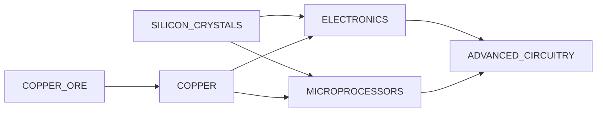

## AI_MAINFRAMES

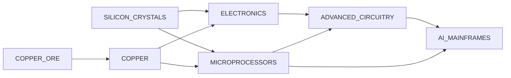

## ALUMINUM

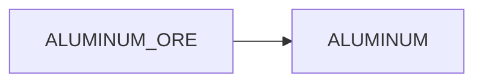

## AMMUNITION

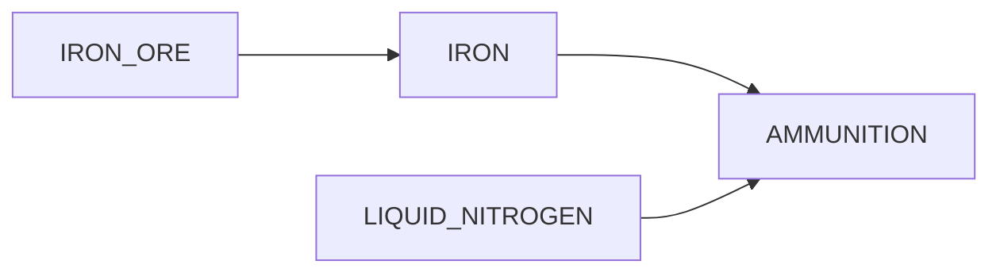

## ANTIMATTER

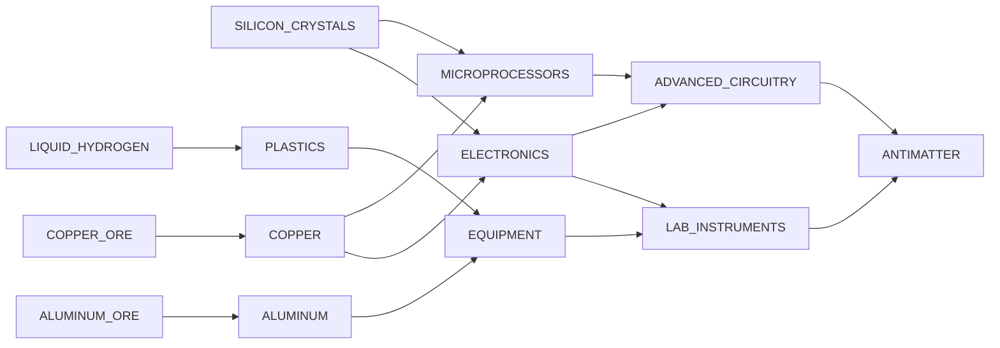

## ASSAULT_RIFLES

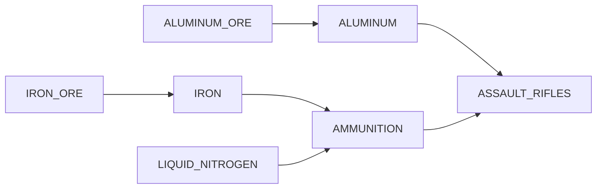

## BIOCOMPOSITES

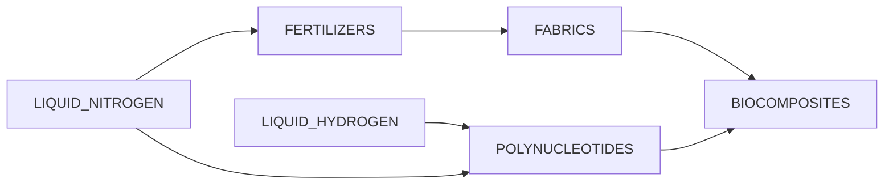

## BOTANICAL_SPECIMENS

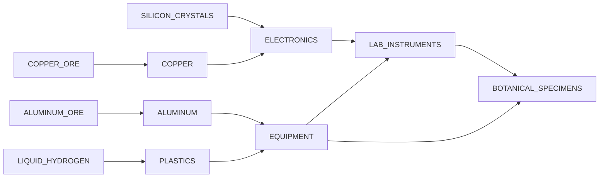

## CLOTHING

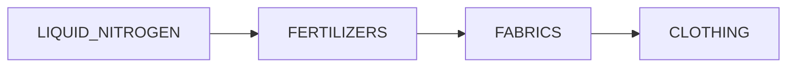

## COPPER

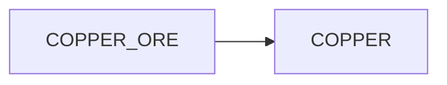

## CULTURAL_ARTIFACTS

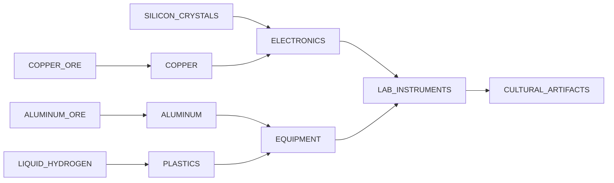

## CYBER_IMPLANTS

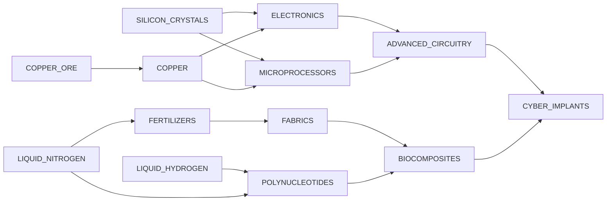

## DRUGS

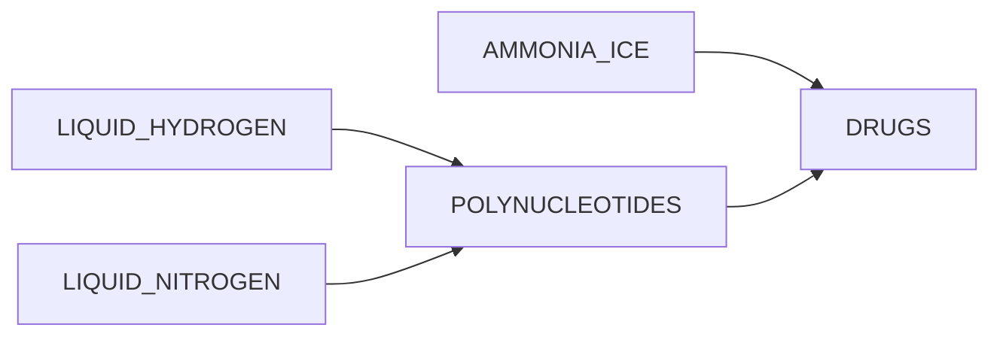

## ELECTRONICS

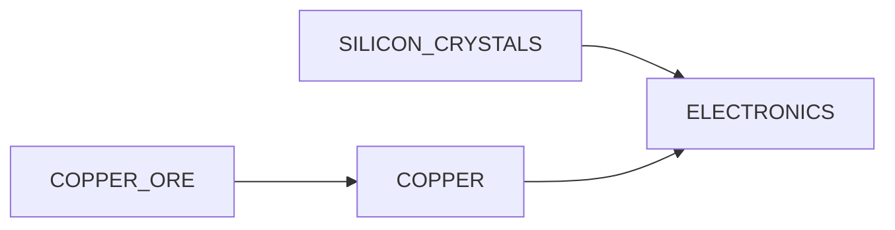

## ENGINE_HYPER_DRIVE_I

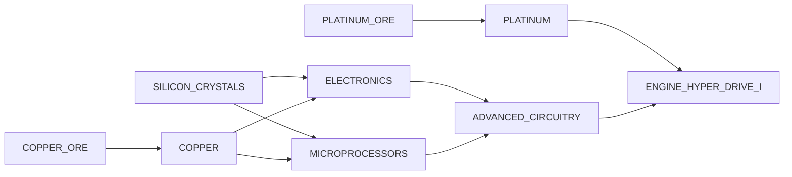

## ENGINE_IMPULSE_DRIVE_I

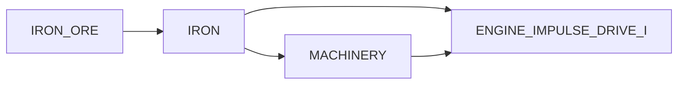

## ENGINE_ION_DRIVE_I

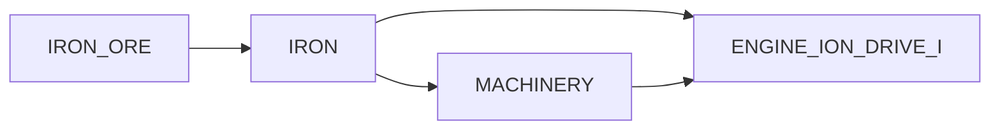

## ENGINE_ION_DRIVE_II


## EQUIPMENT

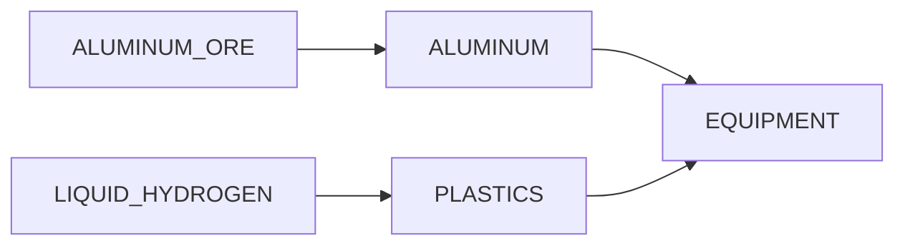

## EXOTIC_MATTER

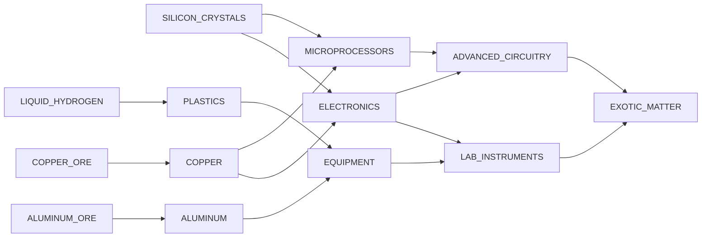

## EXPLOSIVES

```mermaid

graph LR;
  LIQUID_HYDROGEN --> EXPLOSIVES
  LIQUID_NITROGEN --> EXPLOSIVES

```

## FABRICS

```mermaid

graph LR;
  FERTILIZERS --> FABRICS
  LIQUID_NITROGEN --> FERTILIZERS

```

## FAB_MATS

```mermaid

graph LR;
  IRON --> FAB_MATS
  QUARTZ_SAND --> FAB_MATS
  IRON_ORE --> IRON

```

## FERTILIZERS

```mermaid

graph LR;
  LIQUID_NITROGEN --> FERTILIZERS

```

## FIREARMS

```mermaid

graph LR;
  IRON --> FIREARMS
  AMMUNITION --> FIREARMS
  IRON_ORE --> IRON
  IRON --> AMMUNITION
  LIQUID_NITROGEN --> AMMUNITION

```

## FOOD

```mermaid

graph LR;
  FERTILIZERS --> FOOD
  LIQUID_NITROGEN --> FERTILIZERS

```

## FUEL

```mermaid

graph LR;
  HYDROCARBON --> FUEL

```

## GENE_THERAPEUTICS

```mermaid

graph LR;
  POLYNUCLEOTIDES --> GENE_THERAPEUTICS
  LAB_INSTRUMENTS --> GENE_THERAPEUTICS
  LIQUID_HYDROGEN --> POLYNUCLEOTIDES
  LIQUID_NITROGEN --> POLYNUCLEOTIDES
  ELECTRONICS --> LAB_INSTRUMENTS
  EQUIPMENT --> LAB_INSTRUMENTS
  SILICON_CRYSTALS --> ELECTRONICS
  COPPER --> ELECTRONICS
  ALUMINUM --> EQUIPMENT
  PLASTICS --> EQUIPMENT
  COPPER_ORE --> COPPER
  ALUMINUM_ORE --> ALUMINUM
  LIQUID_HYDROGEN --> PLASTICS

```

## GOLD

```mermaid

graph LR;
  GOLD_ORE --> GOLD

```

## GRAVITON_EMITTERS

```mermaid

graph LR;
  ADVANCED_CIRCUITRY --> GRAVITON_EMITTERS
  GOLD --> GRAVITON_EMITTERS
  ELECTRONICS --> ADVANCED_CIRCUITRY
  MICROPROCESSORS --> ADVANCED_CIRCUITRY
  GOLD_ORE --> GOLD
  SILICON_CRYSTALS --> ELECTRONICS
  COPPER --> ELECTRONICS
  SILICON_CRYSTALS --> MICROPROCESSORS
  COPPER --> MICROPROCESSORS
  COPPER_ORE --> COPPER

```

## HOLOGRAPHICS

```mermaid

graph LR;
  GOLD --> HOLOGRAPHICS
  SILVER --> HOLOGRAPHICS
  ADVANCED_CIRCUITRY --> HOLOGRAPHICS
  GOLD_ORE --> GOLD
  SILVER_ORE --> SILVER
  ELECTRONICS --> ADVANCED_CIRCUITRY
  MICROPROCESSORS --> ADVANCED_CIRCUITRY
  SILICON_CRYSTALS --> ELECTRONICS
  COPPER --> ELECTRONICS
  SILICON_CRYSTALS --> MICROPROCESSORS
  COPPER --> MICROPROCESSORS
  COPPER_ORE --> COPPER

```

## IRON

```mermaid

graph LR;
  IRON_ORE --> IRON

```

## JEWELRY

```mermaid

graph LR;
  GOLD --> JEWELRY
  SILVER --> JEWELRY
  PRECIOUS_STONES --> JEWELRY
  DIAMONDS --> JEWELRY
  GOLD_ORE --> GOLD
  SILVER_ORE --> SILVER

```

## LAB_INSTRUMENTS

```mermaid

graph LR;
  ELECTRONICS --> LAB_INSTRUMENTS
  EQUIPMENT --> LAB_INSTRUMENTS
  SILICON_CRYSTALS --> ELECTRONICS
  COPPER --> ELECTRONICS
  ALUMINUM --> EQUIPMENT
  PLASTICS --> EQUIPMENT
  COPPER_ORE --> COPPER
  ALUMINUM_ORE --> ALUMINUM
  LIQUID_HYDROGEN --> PLASTICS

```

## LASER_RIFLES

```mermaid

graph LR;
  DIAMONDS --> LASER_RIFLES
  PLATINUM --> LASER_RIFLES
  ADVANCED_CIRCUITRY --> LASER_RIFLES
  PLATINUM_ORE --> PLATINUM
  ELECTRONICS --> ADVANCED_CIRCUITRY
  MICROPROCESSORS --> ADVANCED_CIRCUITRY
  SILICON_CRYSTALS --> ELECTRONICS
  COPPER --> ELECTRONICS
  SILICON_CRYSTALS --> MICROPROCESSORS
  COPPER --> MICROPROCESSORS
  COPPER_ORE --> COPPER

```

## MACHINERY

```mermaid

graph LR;
  IRON --> MACHINERY
  IRON_ORE --> IRON

```

## MEDICINE

```mermaid

graph LR;
  FABRICS --> MEDICINE
  POLYNUCLEOTIDES --> MEDICINE
  FERTILIZERS --> FABRICS
  LIQUID_HYDROGEN --> POLYNUCLEOTIDES
  LIQUID_NITROGEN --> POLYNUCLEOTIDES
  LIQUID_NITROGEN --> FERTILIZERS

```

## MERITIUM

```mermaid

graph LR;
  MERITIUM_ORE --> MERITIUM

```

## MICROPROCESSORS

```mermaid

graph LR;
  SILICON_CRYSTALS --> MICROPROCESSORS
  COPPER --> MICROPROCESSORS
  COPPER_ORE --> COPPER

```

## MICRO_FUSION_GENERATORS

```mermaid

graph LR;
  ADVANCED_CIRCUITRY --> MICRO_FUSION_GENERATORS
  PLATINUM --> MICRO_FUSION_GENERATORS
  DIAMONDS --> MICRO_FUSION_GENERATORS
  ELECTRONICS --> ADVANCED_CIRCUITRY
  MICROPROCESSORS --> ADVANCED_CIRCUITRY
  PLATINUM_ORE --> PLATINUM
  SILICON_CRYSTALS --> ELECTRONICS
  COPPER --> ELECTRONICS
  SILICON_CRYSTALS --> MICROPROCESSORS
  COPPER --> MICROPROCESSORS
  COPPER_ORE --> COPPER

```

## MILITARY_EQUIPMENT

```mermaid

graph LR;
  ALUMINUM --> MILITARY_EQUIPMENT
  ELECTRONICS --> MILITARY_EQUIPMENT
  ALUMINUM_ORE --> ALUMINUM
  SILICON_CRYSTALS --> ELECTRONICS
  COPPER --> ELECTRONICS
  COPPER_ORE --> COPPER

```

## MODULE_CARGO_HOLD_I

```mermaid

graph LR;
  IRON --> MODULE_CARGO_HOLD_I
  MACHINERY --> MODULE_CARGO_HOLD_I
  IRON_ORE --> IRON
  IRON --> MACHINERY

```

## MODULE_CARGO_HOLD_II

```mermaid

graph LR;
  ALUMINUM --> MODULE_CARGO_HOLD_II
  MACHINERY --> MODULE_CARGO_HOLD_II
  ALUMINUM_ORE --> ALUMINUM
  IRON --> MACHINERY
  IRON_ORE --> IRON

```

## MODULE_CARGO_HOLD_III

```mermaid

graph LR;
  PLATINUM --> MODULE_CARGO_HOLD_III
  MACHINERY --> MODULE_CARGO_HOLD_III
  ADVANCED_CIRCUITRY --> MODULE_CARGO_HOLD_III
  PLATINUM_ORE --> PLATINUM
  IRON --> MACHINERY
  ELECTRONICS --> ADVANCED_CIRCUITRY
  MICROPROCESSORS --> ADVANCED_CIRCUITRY
  IRON_ORE --> IRON
  SILICON_CRYSTALS --> ELECTRONICS
  COPPER --> ELECTRONICS
  SILICON_CRYSTALS --> MICROPROCESSORS
  COPPER --> MICROPROCESSORS
  COPPER_ORE --> COPPER

```

## MODULE_CREW_QUARTERS_I

```mermaid

graph LR;
  IRON --> MODULE_CREW_QUARTERS_I
  MACHINERY --> MODULE_CREW_QUARTERS_I
  FABRICS --> MODULE_CREW_QUARTERS_I
  IRON_ORE --> IRON
  IRON --> MACHINERY
  FERTILIZERS --> FABRICS
  LIQUID_NITROGEN --> FERTILIZERS

```

## MODULE_ENVOY_QUARTERS_I

```mermaid

graph LR;
  IRON --> MODULE_ENVOY_QUARTERS_I
  MACHINERY --> MODULE_ENVOY_QUARTERS_I
  FABRICS --> MODULE_ENVOY_QUARTERS_I
  IRON_ORE --> IRON
  IRON --> MACHINERY
  FERTILIZERS --> FABRICS
  LIQUID_NITROGEN --> FERTILIZERS

```

## MODULE_FUEL_REFINERY_I

```mermaid

graph LR;
  PLATINUM --> MODULE_FUEL_REFINERY_I
  MACHINERY --> MODULE_FUEL_REFINERY_I
  PLATINUM_ORE --> PLATINUM
  IRON --> MACHINERY
  IRON_ORE --> IRON

```

## MODULE_GAS_PROCESSOR_I

```mermaid

graph LR;
  IRON --> MODULE_GAS_PROCESSOR_I
  MACHINERY --> MODULE_GAS_PROCESSOR_I
  IRON_ORE --> IRON
  IRON --> MACHINERY

```

## MODULE_JUMP_DRIVE_I

```mermaid

graph LR;
  IRON --> MODULE_JUMP_DRIVE_I
  ADVANCED_CIRCUITRY --> MODULE_JUMP_DRIVE_I
  IRON_ORE --> IRON
  ELECTRONICS --> ADVANCED_CIRCUITRY
  MICROPROCESSORS --> ADVANCED_CIRCUITRY
  SILICON_CRYSTALS --> ELECTRONICS
  COPPER --> ELECTRONICS
  SILICON_CRYSTALS --> MICROPROCESSORS
  COPPER --> MICROPROCESSORS
  COPPER_ORE --> COPPER

```

## MODULE_JUMP_DRIVE_II

```mermaid

graph LR;
  PLATINUM --> MODULE_JUMP_DRIVE_II
  ADVANCED_CIRCUITRY --> MODULE_JUMP_DRIVE_II
  GOLD --> MODULE_JUMP_DRIVE_II
  PLATINUM_ORE --> PLATINUM
  ELECTRONICS --> ADVANCED_CIRCUITRY
  MICROPROCESSORS --> ADVANCED_CIRCUITRY
  GOLD_ORE --> GOLD
  SILICON_CRYSTALS --> ELECTRONICS
  COPPER --> ELECTRONICS
  SILICON_CRYSTALS --> MICROPROCESSORS
  COPPER --> MICROPROCESSORS
  COPPER_ORE --> COPPER

```

## MODULE_JUMP_DRIVE_III

```mermaid

graph LR;
  PLATINUM --> MODULE_JUMP_DRIVE_III
  ADVANCED_CIRCUITRY --> MODULE_JUMP_DRIVE_III
  GOLD --> MODULE_JUMP_DRIVE_III
  MERITIUM --> MODULE_JUMP_DRIVE_III
  PLATINUM_ORE --> PLATINUM
  ELECTRONICS --> ADVANCED_CIRCUITRY
  MICROPROCESSORS --> ADVANCED_CIRCUITRY
  GOLD_ORE --> GOLD
  MERITIUM_ORE --> MERITIUM
  SILICON_CRYSTALS --> ELECTRONICS
  COPPER --> ELECTRONICS
  SILICON_CRYSTALS --> MICROPROCESSORS
  COPPER --> MICROPROCESSORS
  COPPER_ORE --> COPPER

```

## MODULE_MICRO_REFINERY_I

```mermaid

graph LR;
  PLATINUM --> MODULE_MICRO_REFINERY_I
  MACHINERY --> MODULE_MICRO_REFINERY_I
  PLATINUM_ORE --> PLATINUM
  IRON --> MACHINERY
  IRON_ORE --> IRON

```

## MODULE_MINERAL_PROCESSOR_I

```mermaid

graph LR;
  IRON --> MODULE_MINERAL_PROCESSOR_I
  MACHINERY --> MODULE_MINERAL_PROCESSOR_I
  IRON_ORE --> IRON
  IRON --> MACHINERY

```

## MODULE_ORE_REFINERY_I

```mermaid

graph LR;
  PLATINUM --> MODULE_ORE_REFINERY_I
  MACHINERY --> MODULE_ORE_REFINERY_I
  PLATINUM_ORE --> PLATINUM
  IRON --> MACHINERY
  IRON_ORE --> IRON

```

## MODULE_PASSENGER_CABIN_I

```mermaid

graph LR;
  IRON --> MODULE_PASSENGER_CABIN_I
  MACHINERY --> MODULE_PASSENGER_CABIN_I
  FABRICS --> MODULE_PASSENGER_CABIN_I
  IRON_ORE --> IRON
  IRON --> MACHINERY
  FERTILIZERS --> FABRICS
  LIQUID_NITROGEN --> FERTILIZERS

```

## MODULE_SCIENCE_LAB_I

```mermaid

graph LR;
  PLATINUM --> MODULE_SCIENCE_LAB_I
  MACHINERY --> MODULE_SCIENCE_LAB_I
  ADVANCED_CIRCUITRY --> MODULE_SCIENCE_LAB_I
  PLATINUM_ORE --> PLATINUM
  IRON --> MACHINERY
  ELECTRONICS --> ADVANCED_CIRCUITRY
  MICROPROCESSORS --> ADVANCED_CIRCUITRY
  IRON_ORE --> IRON
  SILICON_CRYSTALS --> ELECTRONICS
  COPPER --> ELECTRONICS
  SILICON_CRYSTALS --> MICROPROCESSORS
  COPPER --> MICROPROCESSORS
  COPPER_ORE --> COPPER

```

## MODULE_SHIELD_GENERATOR_I

```mermaid

graph LR;
  IRON --> MODULE_SHIELD_GENERATOR_I
  MACHINERY --> MODULE_SHIELD_GENERATOR_I
  URANITE --> MODULE_SHIELD_GENERATOR_I
  IRON_ORE --> IRON
  IRON --> MACHINERY
  URANITE_ORE --> URANITE

```

## MODULE_SHIELD_GENERATOR_II

```mermaid

graph LR;
  ALUMINUM --> MODULE_SHIELD_GENERATOR_II
  MACHINERY --> MODULE_SHIELD_GENERATOR_II
  URANITE --> MODULE_SHIELD_GENERATOR_II
  ALUMINUM_ORE --> ALUMINUM
  IRON --> MACHINERY
  URANITE_ORE --> URANITE
  IRON_ORE --> IRON

```

## MODULE_WARP_DRIVE_I

```mermaid

graph LR;
  IRON --> MODULE_WARP_DRIVE_I
  ADVANCED_CIRCUITRY --> MODULE_WARP_DRIVE_I
  IRON_ORE --> IRON
  ELECTRONICS --> ADVANCED_CIRCUITRY
  MICROPROCESSORS --> ADVANCED_CIRCUITRY
  SILICON_CRYSTALS --> ELECTRONICS
  COPPER --> ELECTRONICS
  SILICON_CRYSTALS --> MICROPROCESSORS
  COPPER --> MICROPROCESSORS
  COPPER_ORE --> COPPER

```

## MODULE_WARP_DRIVE_II

```mermaid

graph LR;
  PLATINUM --> MODULE_WARP_DRIVE_II
  ADVANCED_CIRCUITRY --> MODULE_WARP_DRIVE_II
  URANITE --> MODULE_WARP_DRIVE_II
  PLATINUM_ORE --> PLATINUM
  ELECTRONICS --> ADVANCED_CIRCUITRY
  MICROPROCESSORS --> ADVANCED_CIRCUITRY
  URANITE_ORE --> URANITE
  SILICON_CRYSTALS --> ELECTRONICS
  COPPER --> ELECTRONICS
  SILICON_CRYSTALS --> MICROPROCESSORS
  COPPER --> MICROPROCESSORS
  COPPER_ORE --> COPPER

```

## MODULE_WARP_DRIVE_III

```mermaid

graph LR;
  PLATINUM --> MODULE_WARP_DRIVE_III
  ADVANCED_CIRCUITRY --> MODULE_WARP_DRIVE_III
  MERITIUM --> MODULE_WARP_DRIVE_III
  PLATINUM_ORE --> PLATINUM
  ELECTRONICS --> ADVANCED_CIRCUITRY
  MICROPROCESSORS --> ADVANCED_CIRCUITRY
  MERITIUM_ORE --> MERITIUM
  SILICON_CRYSTALS --> ELECTRONICS
  COPPER --> ELECTRONICS
  SILICON_CRYSTALS --> MICROPROCESSORS
  COPPER --> MICROPROCESSORS
  COPPER_ORE --> COPPER

```

## MOOD_REGULATORS

```mermaid

graph LR;
  POLYNUCLEOTIDES --> MOOD_REGULATORS
  LAB_INSTRUMENTS --> MOOD_REGULATORS
  LIQUID_HYDROGEN --> POLYNUCLEOTIDES
  LIQUID_NITROGEN --> POLYNUCLEOTIDES
  ELECTRONICS --> LAB_INSTRUMENTS
  EQUIPMENT --> LAB_INSTRUMENTS
  SILICON_CRYSTALS --> ELECTRONICS
  COPPER --> ELECTRONICS
  ALUMINUM --> EQUIPMENT
  PLASTICS --> EQUIPMENT
  COPPER_ORE --> COPPER
  ALUMINUM_ORE --> ALUMINUM
  LIQUID_HYDROGEN --> PLASTICS

```

## MOUNT_GAS_SIPHON_I

```mermaid

graph LR;
  IRON --> MOUNT_GAS_SIPHON_I
  MACHINERY --> MOUNT_GAS_SIPHON_I
  IRON_ORE --> IRON
  IRON --> MACHINERY

```

## MOUNT_GAS_SIPHON_II

```mermaid

graph LR;
  ALUMINUM --> MOUNT_GAS_SIPHON_II
  MACHINERY --> MOUNT_GAS_SIPHON_II
  ALUMINUM_ORE --> ALUMINUM
  IRON --> MACHINERY
  IRON_ORE --> IRON

```

## MOUNT_GAS_SIPHON_III

```mermaid

graph LR;
  PLATINUM --> MOUNT_GAS_SIPHON_III
  MACHINERY --> MOUNT_GAS_SIPHON_III
  ADVANCED_CIRCUITRY --> MOUNT_GAS_SIPHON_III
  PLATINUM_ORE --> PLATINUM
  IRON --> MACHINERY
  ELECTRONICS --> ADVANCED_CIRCUITRY
  MICROPROCESSORS --> ADVANCED_CIRCUITRY
  IRON_ORE --> IRON
  SILICON_CRYSTALS --> ELECTRONICS
  COPPER --> ELECTRONICS
  SILICON_CRYSTALS --> MICROPROCESSORS
  COPPER --> MICROPROCESSORS
  COPPER_ORE --> COPPER

```

## MOUNT_LASER_CANNON_I

```mermaid

graph LR;
  IRON --> MOUNT_LASER_CANNON_I
  MACHINERY --> MOUNT_LASER_CANNON_I
  DIAMONDS --> MOUNT_LASER_CANNON_I
  IRON_ORE --> IRON
  IRON --> MACHINERY

```

## MOUNT_MINING_LASER_I

```mermaid

graph LR;
  IRON --> MOUNT_MINING_LASER_I
  MACHINERY --> MOUNT_MINING_LASER_I
  DIAMONDS --> MOUNT_MINING_LASER_I
  IRON_ORE --> IRON
  IRON --> MACHINERY

```

## MOUNT_MINING_LASER_II

```mermaid

graph LR;
  ALUMINUM --> MOUNT_MINING_LASER_II
  MACHINERY --> MOUNT_MINING_LASER_II
  DIAMONDS --> MOUNT_MINING_LASER_II
  ALUMINUM_ORE --> ALUMINUM
  IRON --> MACHINERY
  IRON_ORE --> IRON

```

## MOUNT_MINING_LASER_III

```mermaid

graph LR;
  PLATINUM --> MOUNT_MINING_LASER_III
  MACHINERY --> MOUNT_MINING_LASER_III
  ADVANCED_CIRCUITRY --> MOUNT_MINING_LASER_III
  URANITE --> MOUNT_MINING_LASER_III
  PLATINUM_ORE --> PLATINUM
  IRON --> MACHINERY
  ELECTRONICS --> ADVANCED_CIRCUITRY
  MICROPROCESSORS --> ADVANCED_CIRCUITRY
  URANITE_ORE --> URANITE
  IRON_ORE --> IRON
  SILICON_CRYSTALS --> ELECTRONICS
  COPPER --> ELECTRONICS
  SILICON_CRYSTALS --> MICROPROCESSORS
  COPPER --> MICROPROCESSORS
  COPPER_ORE --> COPPER

```

## MOUNT_MISSILE_LAUNCHER_I

```mermaid

graph LR;
  IRON --> MOUNT_MISSILE_LAUNCHER_I
  MACHINERY --> MOUNT_MISSILE_LAUNCHER_I
  IRON_ORE --> IRON
  IRON --> MACHINERY

```

## MOUNT_SENSOR_ARRAY_I

```mermaid

graph LR;
  IRON --> MOUNT_SENSOR_ARRAY_I
  MACHINERY --> MOUNT_SENSOR_ARRAY_I
  ELECTRONICS --> MOUNT_SENSOR_ARRAY_I
  IRON_ORE --> IRON
  IRON --> MACHINERY
  SILICON_CRYSTALS --> ELECTRONICS
  COPPER --> ELECTRONICS
  COPPER_ORE --> COPPER

```

## MOUNT_SENSOR_ARRAY_II

```mermaid

graph LR;
  ALUMINUM --> MOUNT_SENSOR_ARRAY_II
  MACHINERY --> MOUNT_SENSOR_ARRAY_II
  ELECTRONICS --> MOUNT_SENSOR_ARRAY_II
  ALUMINUM_ORE --> ALUMINUM
  IRON --> MACHINERY
  SILICON_CRYSTALS --> ELECTRONICS
  COPPER --> ELECTRONICS
  IRON_ORE --> IRON
  COPPER_ORE --> COPPER

```

## MOUNT_SENSOR_ARRAY_III

```mermaid

graph LR;
  PLATINUM --> MOUNT_SENSOR_ARRAY_III
  MACHINERY --> MOUNT_SENSOR_ARRAY_III
  ADVANCED_CIRCUITRY --> MOUNT_SENSOR_ARRAY_III
  URANITE --> MOUNT_SENSOR_ARRAY_III
  PLATINUM_ORE --> PLATINUM
  IRON --> MACHINERY
  ELECTRONICS --> ADVANCED_CIRCUITRY
  MICROPROCESSORS --> ADVANCED_CIRCUITRY
  URANITE_ORE --> URANITE
  IRON_ORE --> IRON
  SILICON_CRYSTALS --> ELECTRONICS
  COPPER --> ELECTRONICS
  SILICON_CRYSTALS --> MICROPROCESSORS
  COPPER --> MICROPROCESSORS
  COPPER_ORE --> COPPER

```

## MOUNT_SURVEYOR_I

```mermaid

graph LR;
  IRON --> MOUNT_SURVEYOR_I
  MACHINERY --> MOUNT_SURVEYOR_I
  ELECTRONICS --> MOUNT_SURVEYOR_I
  IRON_ORE --> IRON
  IRON --> MACHINERY
  SILICON_CRYSTALS --> ELECTRONICS
  COPPER --> ELECTRONICS
  COPPER_ORE --> COPPER

```

## MOUNT_SURVEYOR_II

```mermaid

graph LR;
  ALUMINUM --> MOUNT_SURVEYOR_II
  MACHINERY --> MOUNT_SURVEYOR_II
  ELECTRONICS --> MOUNT_SURVEYOR_II
  ALUMINUM_ORE --> ALUMINUM
  IRON --> MACHINERY
  SILICON_CRYSTALS --> ELECTRONICS
  COPPER --> ELECTRONICS
  IRON_ORE --> IRON
  COPPER_ORE --> COPPER

```

## MOUNT_SURVEYOR_III

```mermaid

graph LR;
  PLATINUM --> MOUNT_SURVEYOR_III
  MACHINERY --> MOUNT_SURVEYOR_III
  ADVANCED_CIRCUITRY --> MOUNT_SURVEYOR_III
  PLATINUM_ORE --> PLATINUM
  IRON --> MACHINERY
  ELECTRONICS --> ADVANCED_CIRCUITRY
  MICROPROCESSORS --> ADVANCED_CIRCUITRY
  IRON_ORE --> IRON
  SILICON_CRYSTALS --> ELECTRONICS
  COPPER --> ELECTRONICS
  SILICON_CRYSTALS --> MICROPROCESSORS
  COPPER --> MICROPROCESSORS
  COPPER_ORE --> COPPER

```

## MOUNT_TURRET_I

```mermaid

graph LR;
  IRON --> MOUNT_TURRET_I
  MACHINERY --> MOUNT_TURRET_I
  IRON_ORE --> IRON
  IRON --> MACHINERY

```

## NANOBOTS

```mermaid

graph LR;
  POLYNUCLEOTIDES --> NANOBOTS
  LAB_INSTRUMENTS --> NANOBOTS
  LIQUID_HYDROGEN --> POLYNUCLEOTIDES
  LIQUID_NITROGEN --> POLYNUCLEOTIDES
  ELECTRONICS --> LAB_INSTRUMENTS
  EQUIPMENT --> LAB_INSTRUMENTS
  SILICON_CRYSTALS --> ELECTRONICS
  COPPER --> ELECTRONICS
  ALUMINUM --> EQUIPMENT
  PLASTICS --> EQUIPMENT
  COPPER_ORE --> COPPER
  ALUMINUM_ORE --> ALUMINUM
  LIQUID_HYDROGEN --> PLASTICS

```

## NEURAL_CHIPS

```mermaid

graph LR;
  POLYNUCLEOTIDES --> NEURAL_CHIPS
  ADVANCED_CIRCUITRY --> NEURAL_CHIPS
  LIQUID_HYDROGEN --> POLYNUCLEOTIDES
  LIQUID_NITROGEN --> POLYNUCLEOTIDES
  ELECTRONICS --> ADVANCED_CIRCUITRY
  MICROPROCESSORS --> ADVANCED_CIRCUITRY
  SILICON_CRYSTALS --> ELECTRONICS
  COPPER --> ELECTRONICS
  SILICON_CRYSTALS --> MICROPROCESSORS
  COPPER --> MICROPROCESSORS
  COPPER_ORE --> COPPER

```

## NOVEL_LIFEFORMS

```mermaid

graph LR;
  LAB_INSTRUMENTS --> NOVEL_LIFEFORMS
  EQUIPMENT --> NOVEL_LIFEFORMS
  ELECTRONICS --> LAB_INSTRUMENTS
  EQUIPMENT --> LAB_INSTRUMENTS
  ALUMINUM --> EQUIPMENT
  PLASTICS --> EQUIPMENT
  SILICON_CRYSTALS --> ELECTRONICS
  COPPER --> ELECTRONICS
  ALUMINUM_ORE --> ALUMINUM
  LIQUID_HYDROGEN --> PLASTICS
  COPPER_ORE --> COPPER

```

## PLASTICS

```mermaid

graph LR;
  LIQUID_HYDROGEN --> PLASTICS

```

## PLATINUM

```mermaid

graph LR;
  PLATINUM_ORE --> PLATINUM

```

## POLYNUCLEOTIDES

```mermaid

graph LR;
  LIQUID_HYDROGEN --> POLYNUCLEOTIDES
  LIQUID_NITROGEN --> POLYNUCLEOTIDES

```

## QUANTUM_DRIVES

```mermaid

graph LR;
  ADVANCED_CIRCUITRY --> QUANTUM_DRIVES
  DIAMONDS --> QUANTUM_DRIVES
  ELECTRONICS --> ADVANCED_CIRCUITRY
  MICROPROCESSORS --> ADVANCED_CIRCUITRY
  SILICON_CRYSTALS --> ELECTRONICS
  COPPER --> ELECTRONICS
  SILICON_CRYSTALS --> MICROPROCESSORS
  COPPER --> MICROPROCESSORS
  COPPER_ORE --> COPPER

```

## QUANTUM_STABILIZERS

```mermaid

graph LR;
  PLATINUM --> QUANTUM_STABILIZERS
  ADVANCED_CIRCUITRY --> QUANTUM_STABILIZERS
  PLATINUM_ORE --> PLATINUM
  ELECTRONICS --> ADVANCED_CIRCUITRY
  MICROPROCESSORS --> ADVANCED_CIRCUITRY
  SILICON_CRYSTALS --> ELECTRONICS
  COPPER --> ELECTRONICS
  SILICON_CRYSTALS --> MICROPROCESSORS
  COPPER --> MICROPROCESSORS
  COPPER_ORE --> COPPER

```

## REACTOR_ANTIMATTER_I

```mermaid

graph LR;
  IRON --> REACTOR_ANTIMATTER_I
  MACHINERY --> REACTOR_ANTIMATTER_I
  IRON_ORE --> IRON
  IRON --> MACHINERY

```

## REACTOR_CHEMICAL_I

```mermaid

graph LR;
  IRON --> REACTOR_CHEMICAL_I
  MACHINERY --> REACTOR_CHEMICAL_I
  IRON_ORE --> IRON
  IRON --> MACHINERY

```

## REACTOR_FISSION_I

```mermaid

graph LR;
  IRON --> REACTOR_FISSION_I
  MACHINERY --> REACTOR_FISSION_I
  IRON_ORE --> IRON
  IRON --> MACHINERY

```

## REACTOR_FUSION_I

```mermaid

graph LR;
  IRON --> REACTOR_FUSION_I
  MACHINERY --> REACTOR_FUSION_I
  IRON_ORE --> IRON
  IRON --> MACHINERY

```

## REACTOR_SOLAR_I

```mermaid

graph LR;
  IRON --> REACTOR_SOLAR_I
  MACHINERY --> REACTOR_SOLAR_I
  IRON_ORE --> IRON
  IRON --> MACHINERY

```

## RELIC_TECH

```mermaid

graph LR;
  LAB_INSTRUMENTS --> RELIC_TECH
  EQUIPMENT --> RELIC_TECH
  ELECTRONICS --> LAB_INSTRUMENTS
  EQUIPMENT --> LAB_INSTRUMENTS
  ALUMINUM --> EQUIPMENT
  PLASTICS --> EQUIPMENT
  SILICON_CRYSTALS --> ELECTRONICS
  COPPER --> ELECTRONICS
  ALUMINUM_ORE --> ALUMINUM
  LIQUID_HYDROGEN --> PLASTICS
  COPPER_ORE --> COPPER

```

## ROBOTIC_DRONES

```mermaid

graph LR;
  ADVANCED_CIRCUITRY --> ROBOTIC_DRONES
  ALUMINUM --> ROBOTIC_DRONES
  ELECTRONICS --> ADVANCED_CIRCUITRY
  MICROPROCESSORS --> ADVANCED_CIRCUITRY
  ALUMINUM_ORE --> ALUMINUM
  SILICON_CRYSTALS --> ELECTRONICS
  COPPER --> ELECTRONICS
  SILICON_CRYSTALS --> MICROPROCESSORS
  COPPER --> MICROPROCESSORS
  COPPER_ORE --> COPPER

```

## SHIP_COMMAND_FRIGATE

```mermaid

graph LR;
  SHIP_PLATING --> SHIP_COMMAND_FRIGATE
  SHIP_PARTS --> SHIP_COMMAND_FRIGATE
  ALUMINUM --> SHIP_PLATING
  MACHINERY --> SHIP_PLATING
  EQUIPMENT --> SHIP_PARTS
  ELECTRONICS --> SHIP_PARTS
  ALUMINUM_ORE --> ALUMINUM
  IRON --> MACHINERY
  ALUMINUM --> EQUIPMENT
  PLASTICS --> EQUIPMENT
  SILICON_CRYSTALS --> ELECTRONICS
  COPPER --> ELECTRONICS
  IRON_ORE --> IRON
  LIQUID_HYDROGEN --> PLASTICS
  COPPER_ORE --> COPPER

```

## SHIP_EXPLORER

```mermaid

graph LR;
  SHIP_PLATING --> SHIP_EXPLORER
  SHIP_PARTS --> SHIP_EXPLORER
  ALUMINUM --> SHIP_PLATING
  MACHINERY --> SHIP_PLATING
  EQUIPMENT --> SHIP_PARTS
  ELECTRONICS --> SHIP_PARTS
  ALUMINUM_ORE --> ALUMINUM
  IRON --> MACHINERY
  ALUMINUM --> EQUIPMENT
  PLASTICS --> EQUIPMENT
  SILICON_CRYSTALS --> ELECTRONICS
  COPPER --> ELECTRONICS
  IRON_ORE --> IRON
  LIQUID_HYDROGEN --> PLASTICS
  COPPER_ORE --> COPPER

```

## SHIP_HEAVY_FREIGHTER

```mermaid

graph LR;
  SHIP_PLATING --> SHIP_HEAVY_FREIGHTER
  SHIP_PARTS --> SHIP_HEAVY_FREIGHTER
  ALUMINUM --> SHIP_PLATING
  MACHINERY --> SHIP_PLATING
  EQUIPMENT --> SHIP_PARTS
  ELECTRONICS --> SHIP_PARTS
  ALUMINUM_ORE --> ALUMINUM
  IRON --> MACHINERY
  ALUMINUM --> EQUIPMENT
  PLASTICS --> EQUIPMENT
  SILICON_CRYSTALS --> ELECTRONICS
  COPPER --> ELECTRONICS
  IRON_ORE --> IRON
  LIQUID_HYDROGEN --> PLASTICS
  COPPER_ORE --> COPPER

```

## SHIP_INTERCEPTOR

```mermaid

graph LR;
  SHIP_PLATING --> SHIP_INTERCEPTOR
  SHIP_PARTS --> SHIP_INTERCEPTOR
  ALUMINUM --> SHIP_PLATING
  MACHINERY --> SHIP_PLATING
  EQUIPMENT --> SHIP_PARTS
  ELECTRONICS --> SHIP_PARTS
  ALUMINUM_ORE --> ALUMINUM
  IRON --> MACHINERY
  ALUMINUM --> EQUIPMENT
  PLASTICS --> EQUIPMENT
  SILICON_CRYSTALS --> ELECTRONICS
  COPPER --> ELECTRONICS
  IRON_ORE --> IRON
  LIQUID_HYDROGEN --> PLASTICS
  COPPER_ORE --> COPPER

```

## SHIP_LIGHT_HAULER

```mermaid

graph LR;
  SHIP_PLATING --> SHIP_LIGHT_HAULER
  SHIP_PARTS --> SHIP_LIGHT_HAULER
  ALUMINUM --> SHIP_PLATING
  MACHINERY --> SHIP_PLATING
  EQUIPMENT --> SHIP_PARTS
  ELECTRONICS --> SHIP_PARTS
  ALUMINUM_ORE --> ALUMINUM
  IRON --> MACHINERY
  ALUMINUM --> EQUIPMENT
  PLASTICS --> EQUIPMENT
  SILICON_CRYSTALS --> ELECTRONICS
  COPPER --> ELECTRONICS
  IRON_ORE --> IRON
  LIQUID_HYDROGEN --> PLASTICS
  COPPER_ORE --> COPPER

```

## SHIP_LIGHT_SHUTTLE

```mermaid

graph LR;
  SHIP_PLATING --> SHIP_LIGHT_SHUTTLE
  SHIP_PARTS --> SHIP_LIGHT_SHUTTLE
  ALUMINUM --> SHIP_PLATING
  MACHINERY --> SHIP_PLATING
  EQUIPMENT --> SHIP_PARTS
  ELECTRONICS --> SHIP_PARTS
  ALUMINUM_ORE --> ALUMINUM
  IRON --> MACHINERY
  ALUMINUM --> EQUIPMENT
  PLASTICS --> EQUIPMENT
  SILICON_CRYSTALS --> ELECTRONICS
  COPPER --> ELECTRONICS
  IRON_ORE --> IRON
  LIQUID_HYDROGEN --> PLASTICS
  COPPER_ORE --> COPPER

```

## SHIP_MINING_DRONE

```mermaid

graph LR;
  SHIP_PLATING --> SHIP_MINING_DRONE
  SHIP_PARTS --> SHIP_MINING_DRONE
  ALUMINUM --> SHIP_PLATING
  MACHINERY --> SHIP_PLATING
  EQUIPMENT --> SHIP_PARTS
  ELECTRONICS --> SHIP_PARTS
  ALUMINUM_ORE --> ALUMINUM
  IRON --> MACHINERY
  ALUMINUM --> EQUIPMENT
  PLASTICS --> EQUIPMENT
  SILICON_CRYSTALS --> ELECTRONICS
  COPPER --> ELECTRONICS
  IRON_ORE --> IRON
  LIQUID_HYDROGEN --> PLASTICS
  COPPER_ORE --> COPPER

```

## SHIP_ORE_HOUND

```mermaid

graph LR;
  SHIP_PLATING --> SHIP_ORE_HOUND
  SHIP_PARTS --> SHIP_ORE_HOUND
  ALUMINUM --> SHIP_PLATING
  MACHINERY --> SHIP_PLATING
  EQUIPMENT --> SHIP_PARTS
  ELECTRONICS --> SHIP_PARTS
  ALUMINUM_ORE --> ALUMINUM
  IRON --> MACHINERY
  ALUMINUM --> EQUIPMENT
  PLASTICS --> EQUIPMENT
  SILICON_CRYSTALS --> ELECTRONICS
  COPPER --> ELECTRONICS
  IRON_ORE --> IRON
  LIQUID_HYDROGEN --> PLASTICS
  COPPER_ORE --> COPPER

```

## SHIP_PARTS

```mermaid

graph LR;
  EQUIPMENT --> SHIP_PARTS
  ELECTRONICS --> SHIP_PARTS
  ALUMINUM --> EQUIPMENT
  PLASTICS --> EQUIPMENT
  SILICON_CRYSTALS --> ELECTRONICS
  COPPER --> ELECTRONICS
  ALUMINUM_ORE --> ALUMINUM
  LIQUID_HYDROGEN --> PLASTICS
  COPPER_ORE --> COPPER

```

## SHIP_PLATING

```mermaid

graph LR;
  ALUMINUM --> SHIP_PLATING
  MACHINERY --> SHIP_PLATING
  ALUMINUM_ORE --> ALUMINUM
  IRON --> MACHINERY
  IRON_ORE --> IRON

```

## SHIP_PROBE

```mermaid

graph LR;
  SHIP_PLATING --> SHIP_PROBE
  SHIP_PARTS --> SHIP_PROBE
  ALUMINUM --> SHIP_PLATING
  MACHINERY --> SHIP_PLATING
  EQUIPMENT --> SHIP_PARTS
  ELECTRONICS --> SHIP_PARTS
  ALUMINUM_ORE --> ALUMINUM
  IRON --> MACHINERY
  ALUMINUM --> EQUIPMENT
  PLASTICS --> EQUIPMENT
  SILICON_CRYSTALS --> ELECTRONICS
  COPPER --> ELECTRONICS
  IRON_ORE --> IRON
  LIQUID_HYDROGEN --> PLASTICS
  COPPER_ORE --> COPPER

```

## SHIP_REFINING_FREIGHTER

```mermaid

graph LR;
  SHIP_PLATING --> SHIP_REFINING_FREIGHTER
  SHIP_PARTS --> SHIP_REFINING_FREIGHTER
  ALUMINUM --> SHIP_PLATING
  MACHINERY --> SHIP_PLATING
  EQUIPMENT --> SHIP_PARTS
  ELECTRONICS --> SHIP_PARTS
  ALUMINUM_ORE --> ALUMINUM
  IRON --> MACHINERY
  ALUMINUM --> EQUIPMENT
  PLASTICS --> EQUIPMENT
  SILICON_CRYSTALS --> ELECTRONICS
  COPPER --> ELECTRONICS
  IRON_ORE --> IRON
  LIQUID_HYDROGEN --> PLASTICS
  COPPER_ORE --> COPPER

```

## SHIP_SIPHON_DRONE

```mermaid

graph LR;
  SHIP_PLATING --> SHIP_SIPHON_DRONE
  SHIP_PARTS --> SHIP_SIPHON_DRONE
  ALUMINUM --> SHIP_PLATING
  MACHINERY --> SHIP_PLATING
  EQUIPMENT --> SHIP_PARTS
  ELECTRONICS --> SHIP_PARTS
  ALUMINUM_ORE --> ALUMINUM
  IRON --> MACHINERY
  ALUMINUM --> EQUIPMENT
  PLASTICS --> EQUIPMENT
  SILICON_CRYSTALS --> ELECTRONICS
  COPPER --> ELECTRONICS
  IRON_ORE --> IRON
  LIQUID_HYDROGEN --> PLASTICS
  COPPER_ORE --> COPPER

```

## SHIP_SURVEYOR

```mermaid

graph LR;
  SHIP_PLATING --> SHIP_SURVEYOR
  SHIP_PARTS --> SHIP_SURVEYOR
  ALUMINUM --> SHIP_PLATING
  MACHINERY --> SHIP_PLATING
  EQUIPMENT --> SHIP_PARTS
  ELECTRONICS --> SHIP_PARTS
  ALUMINUM_ORE --> ALUMINUM
  IRON --> MACHINERY
  ALUMINUM --> EQUIPMENT
  PLASTICS --> EQUIPMENT
  SILICON_CRYSTALS --> ELECTRONICS
  COPPER --> ELECTRONICS
  IRON_ORE --> IRON
  LIQUID_HYDROGEN --> PLASTICS
  COPPER_ORE --> COPPER

```

## SILVER

```mermaid

graph LR;
  SILVER_ORE --> SILVER

```

## SUPERGRAINS

```mermaid

graph LR;
  FERTILIZERS --> SUPERGRAINS
  POLYNUCLEOTIDES --> SUPERGRAINS
  LAB_INSTRUMENTS --> SUPERGRAINS
  LIQUID_NITROGEN --> FERTILIZERS
  LIQUID_HYDROGEN --> POLYNUCLEOTIDES
  LIQUID_NITROGEN --> POLYNUCLEOTIDES
  ELECTRONICS --> LAB_INSTRUMENTS
  EQUIPMENT --> LAB_INSTRUMENTS
  SILICON_CRYSTALS --> ELECTRONICS
  COPPER --> ELECTRONICS
  ALUMINUM --> EQUIPMENT
  PLASTICS --> EQUIPMENT
  COPPER_ORE --> COPPER
  ALUMINUM_ORE --> ALUMINUM
  LIQUID_HYDROGEN --> PLASTICS

```

## URANITE

```mermaid

graph LR;
  URANITE_ORE --> URANITE

```

## VIRAL_AGENTS

```mermaid

graph LR;
  POLYNUCLEOTIDES --> VIRAL_AGENTS
  LAB_INSTRUMENTS --> VIRAL_AGENTS
  LIQUID_HYDROGEN --> POLYNUCLEOTIDES
  LIQUID_NITROGEN --> POLYNUCLEOTIDES
  ELECTRONICS --> LAB_INSTRUMENTS
  EQUIPMENT --> LAB_INSTRUMENTS
  SILICON_CRYSTALS --> ELECTRONICS
  COPPER --> ELECTRONICS
  ALUMINUM --> EQUIPMENT
  PLASTICS --> EQUIPMENT
  COPPER_ORE --> COPPER
  ALUMINUM_ORE --> ALUMINUM
  LIQUID_HYDROGEN --> PLASTICS

```


## Fuel Costs

Navigating between waypoints within a system or Warping between systems incurs a Fuel Cost.  The actual cost is based on distance traveled and the flight mode.

The formula for each Flight Mode is given below.  $d$ is the distance.  There is a minimum fuel cost of 1.

| Flight Mode| Fuel Cost |
| ---- | ---- |
|  CRUISE  | $round(d)$  | 
|  DRIFT   | $1$  | 
|   BURN   | $2 * round(d)$ (minimum cost of 2)| 
| STEALTH  | $round(d)$  | 

## Travel Time

Travel Time for navigating between waypoints within a system or warping between systems is based on distance traveled, the flight mode, and the engine speed.

The formula for travel time is given as $round(round(max(1,d))*{multiplier \over speed} + 15)$ where $d$ is the distance, $speed$ is taken from `ship.engine.speed`, and $multiplier$ is taken from the table below.  Note: if the distance is zero, round this to 1.  The result is given as seconds.  This means travel speed is constant over the distance, if ignoring the 15 second addition to every flight. Shorter flights are 'penalized' more with the 15 second addition being a larger proportion of the overall flight time.

In JavaScript this would be:
```javascript
Math.round(Math.round(Math.max(1, dist)) * (multiplier / engineSpeed) + 15)
```


|  Flight Mode| Navigation multiplier | Warp multiplier |
| ------- | --- | --- |
| CRUISE  | 25 | 50 | 
| DRIFT   | 250 | 300* |
| BURN    | 12.5 (CRUISE/2) | 25* |
| STEALTH | 30* | 60* |

Note: Values with `*` have not been confirmed on 2.1 or later.

Note: Warping requires a warp-drive.  Warp-drives have a maximum range given, although you are generally limited by the amount of fuel rather than the warp range.

## Jump Cooldown

Jumping between systems is instantaneous, but incurs a Cooldown.  Any ship can jump between systems where there is a Jump Gate connection at both ends.  Ships with Jump Drives are able to jump between systems without Jump Gates, although this requires Antimatter as Fuel.

The Jump Cooldown is calculated as $round(15 + 0.3 * d)$, where $d$ is the distance between the systems.

Note: you can Navigate or Warp straight away after Jumping - but you need to wait until your Cooldown has finished before jumping again.

## Calculating Distance 

The distance between systems and waypoints can be calculated using the Euclidean distance formula.  Calculate the distance between systems when Warping or Jumping, and the distance between waypoints when Navigating

The formula is given as 
$\sqrt{(x1-x2)^2 + (y1-y2)^2}$

Generally, in the travel time and fuel calculations, this value is always rounded before it is used.

_Notes: The above has been compiled from information supplied by our discord users_


## Waypoint Trait Reference

This is a page that list all the waypoint traits and their description (if known).

## Waypoint Traits


| Symbol | Name | Description |
| :--- | :--- | :--- |
| ASH\_CLOUDS |  |  |
| BARREN | Barren | A desolate world with little to no vegetation or water, presenting unique challenges for habitation and resource extraction. |
| BLACK\_MARKET | Black Market | A hidden network of illegal trade, where outlaws and opportunists gather to exchange contraband and forbidden goods. |
| BREATHABLE\_ATMOSPHERE |  |  |
| BUREAUCRATIC | Bureaucratic | A waypoint governed by complex regulations, red tape, and layers of administration, often leading to inefficiencies and frustration. |
| CANYONS |  |  |
| COMMON\_METAL\_DEPOSITS | Common Metal Deposits | A waypoint rich in common metal ores like iron, copper, and aluminum, essential for construction and manufacturing. |
| CORROSIVE\_ATMOSPHERE | Corrosive Atmosphere | A hostile environment with an atmosphere that can rapidly degrade materials and equipment, requiring advanced engineering solutions to ensure the safety and longevity of structures and vehicles. |
| CORRUPT | Corrupt | Plagued by underhanded dealings and illicit activities, this waypoint has a reputation for its pervasive criminal element. |
| CRUSHING\_GRAVITY |  |  |
| DIVERSE\_LIFE | Diverse Life | A waypoint teeming with a wide variety of life forms, providing ample opportunities for scientific research, trade, and even tourism. |
| DRY\_SEABEDS | Dry Seabeds | Vast, desolate landscapes that once held oceans, now exposing the remnants of ancient marine life and providing opportunities for the discovery of valuable resources. |
| EXPLORATION\_OUTPOST | Exploration Outpost | A forward-operating base for explorers, scientists, and pioneers, providing support and resources for those venturing into uncharted territories. |
| EXPLOSIVE\_GASES | Explosive Gases | A volatile environment filled with highly reactive gases, posing a constant risk to those who venture too close and offering opportunities for harvesting valuable materials such as hydrocarbons. |
| EXTREME\_PRESSURE | Extreme Pressure | A location characterized by immense atmospheric pressure, demanding robust engineering solutions and innovative approaches for exploration and resource extraction. |
| EXTREME\_TEMPERATURES | Extreme Temperatures | A waypoint with scorching heat or freezing cold, requiring specialized equipment and technology to survive and thrive in these harsh environments. |
| FOSSILS |  |  |
| FROZEN | Frozen | An ice-covered world with frigid temperatures, providing unique research opportunities and resources such as ice water, ammonia ice, and other frozen compounds. |
| HIGH\_TECH | High-Tech | A center of innovation and cutting-edge technology, driving progress and attracting skilled individuals from around the galaxy. |
| ICE\_CRYSTALS |  |  |
| INDUSTRIAL | Industrial | A waypoint dominated by factories, refineries, and other heavy industries, often accompanied by pollution and a bustling workforce. |
| JOVIAN |  |  |
| JUNGLE | Jungle | A lush, tropical world with dense vegetation and a thriving ecosystem, offering a wealth of resources and unique opportunities for research and exploration. |
| MAGMA\_SEAS |  |  |
| MARKETPLACE | Marketplace | A thriving center of commerce where traders from across the galaxy gather to buy, sell, and exchange goods. |
| MEGA\_STRUCTURES | Mega Structures | Colossal feats of engineering, these structures house entire cities, industries, or even ecosystems within their vast interiors. |
| METHANE\_POOLS |  |  |
| MILITARY\_BASE | Military Base | A fortified stronghold housing armed forces, advanced weaponry, and strategic assets for defense or offense. |
| MINERAL\_DEPOSITS | Mineral Deposits | Abundant mineral resources, attracting mining operations and providing valuable materials such as silicon crystals and quartz sand for various industries. |
| MUTATED\_FLORA |  |  |
| OCEAN | Ocean | A world dominated by vast, interconnected bodies of water, presenting unique challenges for habitation and resource extraction while supporting a diverse array of marine life. |
| OUTPOST | Outpost | A small, remote settlement providing essential services and a safe haven for travelers passing through. |
| OVERCROWDED | Overcrowded | A waypoint teeming with inhabitants, leading to cramped living conditions and a high demand for resources. |
| PERPETUAL\_DAYLIGHT |  |  |
| PERPETUAL\_OVERCAST |  |  |
| PRECIOUS\_METAL\_DEPOSITS | Precious Metal Deposits | A source of valuable metals like gold, silver, and platinum, as well as their ores, prized for their rarity, beauty, and various applications. |
| RARE\_METAL\_DEPOSITS | Rare Metal Deposits | A treasure trove of scarce metal ores such as uranite and meritium, highly sought after for their unique properties and uses. |
| RESEARCH\_FACILITY | Research Facility | A state-of-the-art institution dedicated to scientific research and development, often focusing on specific areas of expertise. |
| ROCKY | Rocky | A world with a rugged, rocky landscape, rich in minerals and other resources, providing a variety of opportunities for mining, research, and exploration. |
| SALT\_FLATS |  |  |
| SCARCE\_LIFE |  |  |
| SCATTERED\_SETTLEMENTS | Scattered Settlements | A collection of dispersed communities, each independent yet connected through trade and communication networks. |
| SHIPYARD | Shipyard | A bustling hub for the construction, repair, and sale of various spacecraft, from humble shuttles to mighty warships. |
| SPRAWLING\_CITIES | Sprawling Cities | Expansive urban centers that stretch across the landscape, boasting advanced infrastructure and diverse populations. |
| STRIPPED | Stripped | A waypoint that has been heavily exploited for its resources, leaving a scarred and depleted landscape with diminished opportunities for future development. |
| STRONG\_GRAVITY | Strong Gravity | A waypoint with a powerful gravitational force, requiring specialized technology and infrastructure to support habitation and resource extraction. |
| STRONG\_MAGNETOSPHERE | Strong Magnetosphere | A waypoint enveloped in a powerful magnetic field, potentially affecting spacecraft systems, and creating unique phenomena such as the concentration of exotic matter and graviton emitters. |
| SUPERVOLCANOES |  |  |
| SURVEILLANCE\_OUTPOST | Surveillance Outpost | A covert installation tasked with monitoring and collecting intelligence on nearby regions and potential threats. |
| SWAMP | Swamp | A damp, murky world characterized by its wetlands and abundant vegetation, fostering a diverse ecosystem and offering potential resources like hydrocarbons and exotic plant life. |
| TEMPERATE | Temperate | A world with a mild climate and balanced ecosystem, providing a comfortable environment for a variety of life forms and supporting diverse industries. |
| TERRAFORMED | Terraformed | A waypoint that has been artificially transformed to support life, showcasing the engineering prowess of its inhabitants and providing a hospitable environment for colonization. |
| TOXIC\_ATMOSPHERE | Toxic Atmosphere | A waypoint with a poisonous atmosphere, necessitating the use of specialized equipment and technology to protect inhabitants and visitors from harmful substances. |
| TRADING\_HUB | Trading Hub | A critical junction in the galaxy's trade network, with countless goods and services flowing through daily. |
| UNCHARTED | Uncharted | An unexplored region of space, full of potential discoveries and hidden dangers. |
| VAST\_RUINS |  |  |
| VIBRANT\_AURORAS | Vibrant Auroras | A celestial light show caused by the interaction of charged particles with the waypoint's atmosphere, creating a mesmerizing spectacle and attracting tourists from across the galaxy. |
| VOLCANIC | Volcanic | A volatile world marked by intense volcanic activity, creating a hazardous environment with the potential for valuable resource extraction, such as rare metals and geothermal energy. |
| WEAK\_GRAVITY | Weak Gravity | A waypoint with a low gravitational pull, providing unique opportunities for research and industry while also challenging the adaptation of life forms and technology. |

